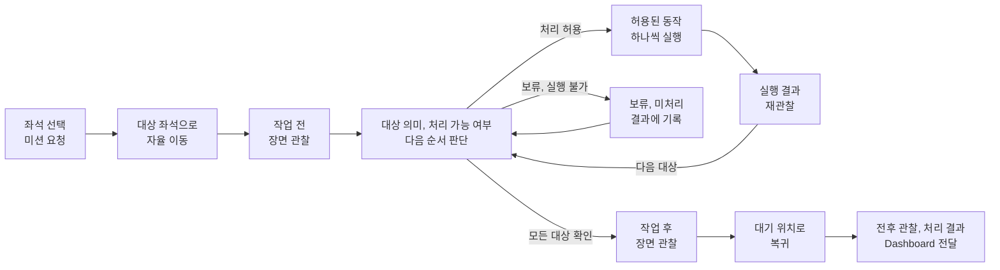

# 타깃 시나리오(Target Scenario)

## 요약

운영자가 Dashboard에서 개별 좌석을 지정하면 로봇이 사전 제작 지도를 사용해
좌석으로 이동한다. 로봇은 작업 전후 책상 상태를 관찰하고, 책상 위 여러 물체를
정한 정책과 허용된 동작 안에서 처리한 뒤 대기 위치로 복귀한다.

## 시나리오 흐름

물체별 실행은 한 번에 끝나는 일괄 동작이 아니라 판단, 실행, 재관찰을 반복하는
폐루프다. 분실물이나 불확실한 물체는 정책을 추측해 처리하지 않고 결과에 남긴다.

## 기본 시나리오

1. 운영자가 Dashboard에서 대상 좌석을 선택해 미션을 요청한다.
2. Backend가 요청을 로봇 미션으로 전달하고 진행 상태를 표시한다.
3. 로봇은 사전에 만든 지도와 좌석 위치를 사용해 대상 책상 앞으로 자율 이동한다.
4. 로봇은 작업 전 장면을 촬영하고 책상 위 물체 후보를 확인한다.
5. 시스템은 여러 물체의 의미, 처리 가능 여부와 작업 순서를 판단한다.
6. 허용된 물체를 하나씩 처리하고 각 실행 결과를 확인한다.
7. 로봇은 작업 후 장면을 다시 관찰해 처리 결과를 남긴다.
8. 로봇은 대기 위치로 자율 복귀한다.
9. Backend와 Dashboard는 전후 관찰, 처리 결과, 실패 및 미처리 정보를 표시한다.

지도 제작 과정 자체는 데모 시나리오에 포함하지 않는다.

## 물체별 시나리오 경계

| 물체 | 현재 처리 |
|---|---|
| 쓰레기 후보 | 정책과 집기 조건을 통과하면 로봇 탑재 수거함에 투입 |
| 분실물 후보 | 인식 대상. 발견 이후의 물리적 행동은 미정 |
| 불확실하거나 실행 불가능한 물체 | 결과에 남기되 구체 사용자 흐름은 미정 |

분실물 후보를 별도 보관함으로 옮긴다고 가정하지 않는다. 행동이 정해지기 전까지
관련 데모 분기는 열린 시나리오다.

## 시연 조건

- 사람이 없는 통제된 작업 구역에서 수행한다.
- 감독자는 작업 구역 밖에서 미션을 관찰하고 비상 정지할 수 있다.
- 하나의 책상에 여러 물체를 배치해 처리 순서와 부분 실패를 확인한다.
- 주행은 Gazebo, 책상 조작은 MuJoCo에서 먼저 통합 검증할 수 있다.
- 실제 로봇 시연 범위를 줄여야 하면 별도 승인을 받은 축소 시나리오를 사용한다.

## 관련 문서

- [Success Criteria](<05 - Success Criteria.md>)
- [System Context](<../20_TECHNICAL/01 - System Context.md>)
- [Task Planning and Robot Capabilities](<../20_TECHNICAL/03 - Task Planning and Robot Capabilities.md>)
- [Navigation and Mapping](<../20_TECHNICAL/05 - Navigation and Mapping.md>)

## 출처

- [기획서 원문 요약](<../40_RAW/기획서 원문 요약.md>)

## 관련 결정

- [260708 - MVP 기능 범위](<../30_DECISIONS/Planning/260708 - MVP 기능 범위.md>)
