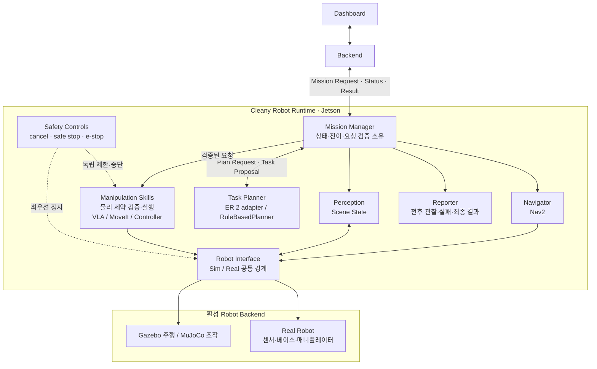

---
source_refs:
  - "[기획서]"
related_decisions:
  - "30_DECISIONS/Technical/260708 - XLeRobot 기반 플랫폼.md"
  - "30_DECISIONS/Technical/260714 - 4륜 메카넘 베이스.md"
  - "30_DECISIONS/Technical/260714 - Jetson Orin NX 16GB.md"
  - "30_DECISIONS/Technical/260806 - Task Planning과 Robot Capability 경계.md"
---

# 기술 개요(Technical Overview)

## 요약

끌리니는 Dashboard 요청을 받아 지정 좌석으로 왕복하고 책상 위 물체를 처리하는
ROS 2 기반 모바일 매니퓰레이터다. 이 문서는 전체 기술 지도를 제공하며 각 설계
세부는 한 문서에서만 설명한다.

## 전체 구조

한 실행에서는 Simulation 또는 Real backend 하나만 공통 Robot Interface의 명령과
상태를 소유한다. Safety Controls는 Planner의 판단이나 cloud 연결보다 우선한다.
MVP에서는 별도 Local Guard 컴포넌트를 두지 않고, Mission 검증은 Mission Manager가,
물리 제약 검증은 Capability와 Robot backend가 맡는다.

## 책임 지도

| 주제 | 문서 | 소유하는 질문 |
|---|---|---|
| 외부 경계 | [System Context](<01 - System Context.md>) | Dashboard·Backend·Robot은 무엇을 주고받는가? |
| 판단과 실행 | [Task Planning and Robot Capabilities](<03 - Task Planning and Robot Capabilities.md>) | 누가 작업을 고르고 어떤 Capability가 실행하는가? |
| 로봇 형태 | [Robot Platform XLeRobot](<04 - Robot Platform XLeRobot.md>) | 로봇의 신체와 subsystem 경계는 무엇인가? |
| 주행 | [Navigation and Mapping](<05 - Navigation and Mapping.md>) | 좌석까지 어떻게 왕복하는가? |
| 엣지·클라우드 | [Edge Runtime Jetson Orin](<06 - Edge Runtime Jetson Orin.md>) | 로컬과 클라우드는 무엇을 담당하는가? |
| 인식 | [Perception and Scene Understanding](<07 - Perception and Scene Understanding.md>) | 장면을 어떤 계약으로 표현하는가? |
| 안전 | [Safety and Risk](<08 - Safety and Risk.md>) | 어떤 제약이 Planner보다 우선하는가? |
| 미션 | [Mission Lifecycle](<09 - Mission Lifecycle.md>) | 미션 단계와 상태 소유자는 누구인가? |
| 로봇 계약 | [Robot ROS Contract](<10 - Robot ROS Contract.md>) | Sim과 Real이 공유하는 의미는 무엇인가? |
| 소프트웨어 | [ROS 2 Software Architecture](<11 - ROS 2 Software Architecture.md>) | 패키지 책임은 어떻게 나뉘는가? |
| 하드웨어 | [Hardware Configuration](<12 - Hardware Configuration.md>) | 실제 부품·전원·배선은 어떻게 구성되는가? |
| 검증 | [Verification and Simulation Strategy](<13 - Verification and Simulation Strategy.md>) | 단계별로 무엇을 어디서 검증하는가? |

## 현재 설계 원칙

- 제품 목표와 구현 상태를 구분한다.
- Mission 상태 전이는 Mission Manager만 소유한다.
- Planner가 제안한 행동은 Mission Manager와 Capability의 검증을 통과한 뒤에만 실행한다.
- VLM은 고정 주기가 아니라 high-level 행동 완료·실패와 장면 변화 checkpoint에서 재추론한다.
- Manipulation Skill은 VLA-backed 실행을 포함할 수 있다.
- Navigation, Manipulation과 Safety Control을 하나의 모호한 skill 목록으로 섞지 않는다.
- Gazebo는 주행, MuJoCo는 책상 조작 검증을 담당한다.
- 정확한 ROS schema, parameter와 실행 명령은 구현 코드·패키지 README가 관리한다.

## 열린 경계

ER 2가 책상 작업만 오케스트레이션할지 Navigation Capability도 호출할지,
Manipulation Skill의 VLA·규칙·motion backend 조합, 사람 존재 시 안전 행동은 아직
결정하지 않았다. [[20_TECHNICAL/99 - Questions|Technical Questions]]에서 관리한다.
