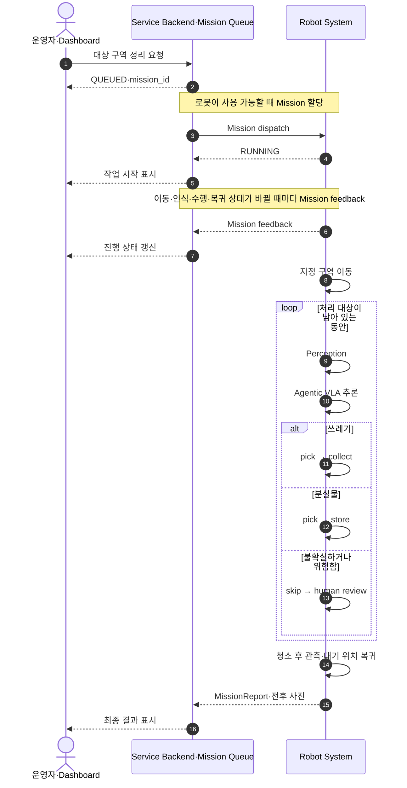

# 시스템 개념(System Concept)

## 1. 요약

끌리니 시스템은 1차 MVP에서 Dashboard·Backend의 운영자 요청을 받아 지정 구역의 사전에 정한 쓰레기와 분실물 후보를 `이동 → 인식·분류 → 집기 → 각각의 보관 위치 이동 → 복귀 → 결과 표시`하는 흐름으로 이해한다.

## 2. 기획 맥락

로봇은 무인 공간에서 사람이 상주하지 않는 시간에도 일정한 공간 품질을 유지해야 한다. 따라서 시스템 개념은 작업 시작 조건, 작업 대상 인식, 행동 선택, 주행, 조작, 결과 확인, 실패 처리까지 연결되어야 한다.

## 3. 기술 개념

### 3.1 상위 작업 흐름

1. 작업 시작: 운영자가 웹 대시보드 등으로 대상 구역 작업을 요청한다.
2. 작업 구역 이동: 사전 지도와 현장 조건이 허용하는 경우 지정 공간까지 이동한다.
3. 공간 인식: RGB-D와 카메라 기반으로 사전에 정한 물체 후보를 관찰한다.
4. 물체 분류: 쓰레기, 분실물 후보, 불확실하거나 위험한 물체로 분류한다.
5. 행동 판단: Agentic VLA가 행동 후보를 만들고, Rule Guard가 집기 가능 여부와 위험 여부를 검증한다.
6. 행동 실행: 쓰레기는 지정 수거함으로, 분실물 후보는 별도 보관함으로 이동한다. 불확실하거나 위험한 물체는 건드리지 않고 사람 검토 요청으로 남긴다.
7. 복귀 및 기록: 대기 위치로 복귀하고 Mission feedback, MissionReport, 전후 결과를 Backend와 Dashboard에 제공한다.

### 3.2 Dashboard·Backend MVP 경계

Dashboard와 Backend는 MVP에 포함한다. Dashboard는 운영자 요청과 진행 상태·전후 결과 표시를, Backend는 Mission Queue와 로봇 상태·결과 중계를 담당한다. 구체 API와 데이터 보존 방식은 추가 정의가 필요하다.

- 대상 구역 작업 요청
- QUEUED·RUNNING 등 진행 상태 표시
- Mission feedback과 최종 결과 표시
- 전후 결과 확인

### 3.3 서비스–로봇 상호작용

서비스는 작업 요청을 받아 Mission을 로봇에 전달하고, 실행 중 feedback과 최종
MissionReport를 운영자에게 전달한다. Dashboard·Mission Queue, 분실물 보관,
MissionReport의 전후 사진은 이 흐름에서 확장 가능한 구성요소이며, MVP의 포함
범위와 인터페이스는 관련 Decision에서 계속 정한다.

## 4. 인터페이스 / 경계

| 구성요소         | 책임                   | 경계                                  |
| ------------ | -------------------- | ----------------------------------- |
| 작업 트리거       | 운영자 호출과 대상 구역 지정 제공       | 자동 감지·이용 종료 이벤트는 후속 검토              |
| 로봇 상태 관리자    | 이동, 인식, 조작, 복귀 상태 전환 | 세부 상태머신 구현은 미정                      |
| Perception   | 물체 후보와 공간 상태 제공      | 분실물 최종 판단을 단독 확정하지 않음               |
| Planner/VLA  | 행동 후보 및 작업 순서 제안     | 안전 검증 없이 실행하지 않음                    |
| Navigation   | 작업 구역 이동 및 복귀        | 조작 동작을 수행하지 않음                      |
| Manipulation | 사전에 정한 쓰레기·분실물 후보 집기와 각각의 보관 위치 이동 | 분실물 분류 기준과 보관·인계 정책은 추가 정의 필요 |
| Dashboard·Backend | 운영자 호출, Mission Queue, 상태와 전후 결과 확인 | 구체 API와 데이터 보존 방식은 추가 정의 필요 |

## 5. 가정

- 운영자는 대상 구역을 지정할 수 있다.
- 작업 대상은 사전에 정한 소수의 쓰레기와 분실물 후보다.
- 분실물 후보는 별도 보관함으로 옮기되, 분류 기준과 보관·인계 정책은 추가 정의가 필요하다.
- 실패·저신뢰 결과는 사람 검토 대상으로 남기고 Dashboard에 표시한다.

## 6. 리스크

- 작업 시작 이벤트가 불명확하면 전체 흐름이 정의되지 않는다.
- 조작 실패 후 복구 정책이 없으면 데모 안정성이 떨어질 수 있다.
- 대시보드를 포함하면 범위가 빠르게 커질 수 있다.

## 7. 관련 결정

- 현재 selected Decision 없음.
