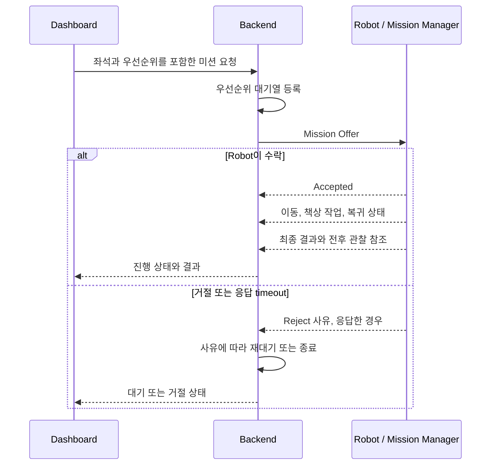

# 로봇 관제와 미션 할당(Robot Operations and Mission Dispatch)

## 요약

Cleany의 로봇 관제는 Dashboard에서 들어온 요청을 Backend가 대기열에 보존하고,
실행 가능한 Robot에 미션을 제안하며, 진행 상태와 결과를 운영자에게 전달하는
control plane이다. 저수준 motor 제어, Robot 내부 planning과 물리 안전 판단은 관제에
포함하지 않는다.

현재 MVP는 단일 Robot을 대상으로 한다. 다만 연결 상태와 미션 기록에서 Robot을
식별할 수 있게 하고, 상용 규모의 다점포 및 다중 Robot 배차는 다루지 않는다.

## MVP 범위

| 포함 | 제외 |
|---|---|
| 미션 요청과 우선순위 대기열 | 다중 Robot 최적 배차 |
| Robot 상태 확인과 미션 할당 | 원격조종과 저수준 motion command |
| 미션 수락, 거절과 운영 단계 추적 | 실행 중 임의 지점의 일시정지와 재개 |
| checkpoint 취소와 조건부 복구 요청 | 지도, 설정과 OTA 배포 |
| 작업 전후 관찰 참조와 최종 결과 전달 | 다점포 운영, 과금과 상용 fleet management |

## 책임 경계

| 구성요소 | 소유하는 책임 | 책임 밖 |
|---|---|---|
| Dashboard | 좌석 선택, 미션 요청과 취소, 진행 및 결과 표시 | 미션 배차와 Robot 내부 상태 전이 |
| Backend | 우선순위 대기열, 미션 제안, Robot 가용 상태, 외부 lifecycle과 결과 참조 관리 | Robot 내부 planning, 물리 실행과 안전 해제 |
| Robot, Mission Manager | 미션 수락과 거절, 실행 상태, checkpoint 취소, 최종 결과 생성 | 대기열 순서와 운영자 권한 정책 |
| Robot Interface, Controller | timeout, safe stop과 물리 구동 제약 | Backend 대기열과 미션 우선순위 |
| 물리 e-stop | cloud와 Planner를 거치지 않는 구동 차단 | 원격 reset과 일반 retry |

Backend는 미션을 제안하고 외부 상태를 추적하지만 Mission Manager의 내부 FSM을 직접
변경하지 않는다. Robot은 요청의 유효성과 현재 상태를 확인해 수락 또는 거절하고,
수락한 뒤에는 Mission Manager가 실행 상태와 최종 결과를 소유한다.

## 미션 할당 흐름

### 대기열 원칙

- MVP는 단일 Robot에 하나의 활성 미션만 허용한다.
- 대기 미션은 `normal`과 `high` 두 우선순위로 구분하고 같은 우선순위 안에서는 먼저
  요청한 순서로 처리한다.
- `high`는 권한 있는 운영자만 지정한다.
- 새 미션이 현재 활성 미션을 선점하지 않는다.
- Robot이 offline이어도 요청을 대기열에 둘 수 있지만, 명시한 만료 시각이 지나면
  할당하지 않는다.
- Robot이 응답하지 않거나 일시적으로 실행할 수 없으면 만료 전까지 대기열로
  되돌릴 수 있다.
- 유효하지 않은 대상, 지원하지 않는 미션과 안전 조건을 만족하지 못한 요청은
  거절하고 자동 재할당하지 않는다.
- 같은 미션이 재전달되더라도 중복 실행하지 않아야 한다. 정확한 식별자와 멱등 처리
  방식은 구현 계약에서 정한다.

## 외부 Mission lifecycle

Dashboard와 Backend는 대기, 할당 제안, 수락, 좌석 이동, 책상 작업, 복귀와 종료
결과의 운영 의미만 공유한다. 응답이 없거나 일시적으로 거절된 미션은 대기열로
돌아가고, 취소 요청은 안전한 checkpoint를 거쳐 종료 경로로 연결한다. 이 흐름은
실제 API enum이나 Mission Manager의 내부 state 이름을 확정하지 않는다.

Robot 가용 상태는 외부 Mission lifecycle과 분리해 `offline`, `idle`, `busy`, `error`
수준으로 표현한다. Perception, Planning, 개별 Skill과 retry 같은 내부 단계는 외부
관제 상태로 그대로 노출하지 않는다.

종료 결과는 성공, 부분 성공, 사람 검토 필요, 차단, 실패, 취소, 만료, 거절과 중단을
구분한다. 작업 전후 관찰은 같은 미션 결과에 참조로 연결하고 실제 저장 위치,
보관 기간과 삭제 정책은 별도로 정한다.

## 취소와 복구 요청

Backend의 취소, reset과 복귀는 Robot 상태를 강제로 바꾸는 명령이 아니라 Robot이
검증하고 수락 또는 거절하는 요청이다.

| 요청 | MVP 의미 |
|---|---|
| 활성 미션 취소 | 현재 원자 행동을 안전한 checkpoint에서 끝내거나 차단한 뒤 취소하고, 가능하면 대기 위치로 복귀한다. |
| 오류 reset | Robot이 복구 가능 오류이며 안전 조건이 충족됐다고 확인한 경우에만 수락한다. |
| 대기 위치 복귀 | 활성 미션이 없고 위치 추정과 구동 조건이 유효한 경우에만 수락한다. |

물리 e-stop과 hardware fault는 원격 reset으로 해제하지 않는다. 실행 중 임의 지점의
일시정지와 재개는 MVP 관제 계약에 포함하지 않는다.

## 연결 장애와 재시작

- Backend 연결이 끊겨도 Robot은 수락한 미션을 로컬에서 계속 실행한다.
- 재연결 뒤 현재 상태와 최종 결과를 Backend와 다시 맞춰야 한다. 정확한 heartbeat,
  확인 응답과 재전송 방식은 구현 계약에서 정한다.
- Robot 프로세스나 장치가 활성 미션 도중 재시작하면 미션을 자동 재개하지 않는다.
  외부에는 중단과 사람 확인 필요를 알린다.
- Backend 연결 실패가 Robot의 timeout, safe stop과 물리 e-stop을 막아서는 안 된다.

## 현재 구현과 차이

현재 `cleany_mission_manager` core는 외부 `MissionRequest`를 받아 내부 FSM을 실행하고
최종 `MissionReport`를 만드는 기본 경계를 제공한다. 아직 Dashboard와 Backend,
우선순위 대기열, 외부 관제 adapter, checkpoint 취소와 재연결 계약은 구현되어 있지
않다.

이 문서는 목표 관제 의미를 관리한다. 실제 transport, API endpoint, ROS interface,
message schema, heartbeat 주기, 인증 방식, database와 media 저장 구조는 구현 과정에서
정하고 관련 package README에 기록한다.

## 관련 문서

- [System Context](<01 - System Context.md>)
- [Mission Lifecycle](<09 - Mission Lifecycle.md>)
- [Safety and Risk](<08 - Safety and Risk.md>)
- [ROS 2 Software Architecture](<11 - ROS 2 Software Architecture.md>)
- [Planning Questions](<../10_PLANNING/99 - Questions.md>)
- [Technical Questions](<99 - Questions.md>)

## 출처

- [기획서 원문 요약](<../40_RAW/기획서 원문 요약.md>)
- [cleany_mission_manager README](https://github.com/asm17-moving-agent/cleany/blob/main/ros2_ws/src/cleany_mission_manager/README.md)

## 관련 결정

- [260708 - MVP 기능 범위](<../30_DECISIONS/Planning/260708 - MVP 기능 범위.md>)
- [260708 - 안전 기준과 실패 처리 정책](<../30_DECISIONS/Technical/260708 - 안전 기준과 실패 처리 정책.md>)
