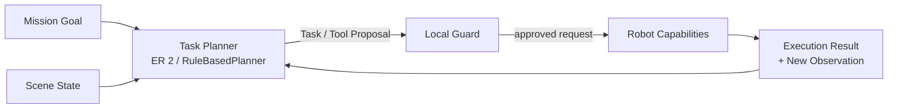

# Task Planning과 Robot Capabilities

## 요약

Cleany는 고수준 Task Planner가 책상 장면을 해석하고 처리 순서를 제안하며,
검증된 Robot Capability가 물리 동작을 실행하는 구조를 목표로 한다. 목표 AI 경로는
Gemini Robotics ER 2이며, RuleBasedPlanner는 같은 경계를 먼저 연결하는 통합
검증용 구현이다.

## 계층 구조



## Planner 책임

- 책상 위 물체와 관계의 의미 해석
- 처리 가능한 대상과 미처리 대상 구분
- 여러 대상의 작업 순서 제안
- 현재 상태에서 사용할 high-level Capability와 argument 제안
- 실행 결과와 최신 관찰을 바탕으로 다음 단계·완료 여부 판단

Planner는 grasp pose, IK, joint trajectory, motor command를 직접 만들지 않고
Mission Manager의 state를 변경하지 않는다.

## ER 2와 RuleBasedPlanner

| 구현 | 목적 | 같은 계약 | 차이 |
|---|---|---|---|
| RuleBasedPlanner | E2E 경계와 실패 흐름 통합 검증 | Scene 입력, high-level task 출력 | 사전 정의 규칙으로만 선택 |
| ER 2 adapter | 목표 AI 계획·오케스트레이션 | 같은 의미의 task·tool 제안 | 멀티모달 장면과 실행 결과를 이용한 확률적 판단 |

Rule-based 단계는 목표 아키텍처의 baseline이 아니라 AI Planner 연결 전의
`Rule-based 통합 검증 단계`다.

## Robot Capability 분류

| 분류 | 예시 | 현재 소유 |
|---|---|---|
| Navigation | 대상 좌석 이동, 대기 위치 복귀 | Navigator·Nav2 |
| Manipulation Skill | 쓰레기 집기·수거함 투입, arm reset | Skill Executor와 실행 backend |
| Observation | 작업 전후 촬영, 실행 결과 확인 | Perception |
| Safety Control | cancel, safe stop, e-stop | Mission·Robot·hardware 안전 경로 |

`Robot Capabilities`는 중립적인 상위 용어다. ER 2가 Navigation까지 직접 호출할지
책상 도착 후 Manipulation만 호출할지는 아직 정하지 않는다.

## Manipulation Skill과 VLA

Manipulation Skill은 사전 작성 trajectory만을 뜻하지 않는다. Skill 내부에서 VLA
policy가 arm action을 생성할 수 있으며, 필요에 따라 MoveIt·controller·규칙 기반
동작과 조합할 수 있다.

```text
collect_trash(object_id)
  → object / destination validation
  → VLA policy 또는 motion backend
  → workspace / collision / limit guard
  → arm·gripper execution
  → success / failed / blocked
```

정확한 VLA 모델, Skill별 backend 조합과 fallback은 실험 후 결정한다.

## Local Guard

모든 Planner 출력은 실행 전에 다음을 확인한다.

- allowlist에 있는 Capability와 argument인가?
- 현재 Mission 단계에서 허용된 요청인가?
- object·destination ID가 현재 관찰과 일치하는가?
- workspace, joint, collision과 timeout 조건을 만족하는가?
- 불확실하거나 미정인 분실물 정책을 임의로 실행하지 않는가?

## Stop 경계

stop은 Planner가 선택하는 일반 skill로 보지 않는다. Mission cancel, 로컬 safe stop,
물리적 e-stop은 서로 다른 우선순위의 제어 경로이며 ER 2 응답과 독립적으로
동작해야 한다.

## 검증 순서

1. RuleBasedPlanner와 mock·deterministic Capability로 E2E 계약을 연결한다.
2. ER 2 정지 이미지 structured output으로 장면·분류·순서를 검증한다.
3. 검증된 Manipulation Skill을 tool로 노출하고 MuJoCo에서 실행한다.
4. Streaming 진행 추적과 재계획을 검증한다.
5. 실제 로봇에서 로컬 Guard와 안전 경계를 포함해 검증한다.

## 관련 문서

- [[20_TECHNICAL/07 - Perception and Scene Understanding|Perception and Scene Understanding]]
- [[20_TECHNICAL/08 - Safety and Risk|Safety and Risk]]
- [[20_TECHNICAL/09 - Mission Lifecycle|Mission Lifecycle]]
- [[30_DECISIONS/Technical/260806 - Task Planning과 Robot Capability 경계|Task Planning과 Robot Capability 경계]]
