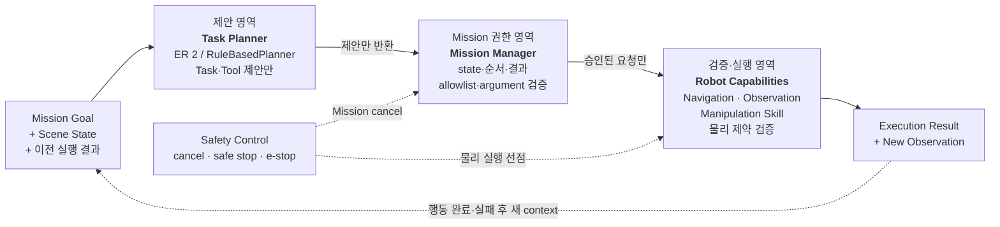

---
source_refs:
  - "40_RAW/260803 - Gemini Robotics ER 2/04 - 공식자료 검증.md"
  - "40_RAW/260806 - MVP Task Planning 책임 경계 결정.md"
related_decisions:
  - "30_DECISIONS/Technical/260806 - Task Planning과 Robot Capability 경계.md"
---

# Task Planning과 Robot Capabilities

## 요약

Cleany는 고수준 Task Planner가 책상 장면을 해석하고 처리 순서를 제안하며,
검증된 Robot Capability가 물리 동작을 실행하는 구조를 목표로 한다. 목표 AI 경로는
Gemini Robotics ER 2이며, RuleBasedPlanner는 같은 경계를 먼저 연결하는 통합
검증용 구현이다.

## 책임 경계



Planner는 행동을 제안하지만 실행 권한과 Mission state를 소유하지 않는다. Mission
Manager가 상태·allowlist·기본 argument를 검증해 Capability 호출로 바꾸고,
Capability와 Robot backend가 물리 제약을 확인한다. Safety Control은 이 경로를
독립적으로 제한하거나 중단한다.

## Planner 책임

- 책상 위 물체와 관계의 의미 해석
- 처리 가능한 대상과 미처리 대상 구분
- 여러 대상의 작업 순서 제안
- 현재 상태에서 사용할 high-level Capability와 argument 제안
- 실행 결과와 최신 관찰을 바탕으로 다음 단계·완료 여부 판단

Planner는 grasp pose, IK, joint trajectory, motor command를 직접 만들지 않고
Mission Manager의 state를 변경하지 않는다.

## ER 2와 RuleBasedPlanner

| 구현 | 목적 | 같은 계약 | 차이 |
|---|---|---|---|
| RuleBasedPlanner | E2E 경계와 실패 흐름 통합 검증 | Scene 입력, high-level task 출력 | 사전 정의 규칙으로만 선택 |
| ER 2 adapter | 목표 AI 계획·오케스트레이션 | 같은 의미의 task·tool 제안 | 멀티모달 장면과 실행 결과를 이용한 확률적 판단 |

Rule-based 단계는 목표 아키텍처의 baseline이 아니라 AI Planner 연결 전의
`Rule-based 통합 검증 단계`다.

## VLM 호출과 재추론

MVP 작업 구역은 사람이나 외부 물체가 개입하지 않는 준정적 환경이다. VLM 입력은
안전한 checkpoint의 정지 장면을 사용하지만, 로봇 행동으로 물체가 낙하·전도되거나
가려진 대상이 드러날 수 있으므로 최초 추론 결과를 끝까지 고정하지 않는다.

| Trigger | VLM 처리 |
|---|---|
| 책상 도착 후 작업 전 관찰 | 최초 장면을 해석하고 다음 high-level 행동 하나를 제안 |
| 행동 success·failed·blocked | 실행 결과와 새 장면으로 다음 행동·완료 여부 재판단 |
| 예상 밖 장면 변화 | 기존 proposal을 폐기하고 최신 Scene으로 재추론 |

VLM은 고정 주기로 호출하거나 trajectory 실행 중 활성 동작을 변경하지 않는다. 실행
중 물체 낙하·전도, controller fault와 collision에 대한 즉시 대응은 Capability와
Robot backend가 맡고, 행동이 끝나거나 중단된 뒤 VLM이 의미와 다음 행동을 판단한다.

예를 들어 보틀이 쓰러지면 기존 위치를 전제로 한 proposal을 계속 사용하지 않는다.
Capability가 실행을 종료·차단하고 새 장면을 관찰한 뒤, VLM이 재시도·보류·다른 대상
처리 중 다음 high-level 행동을 제안한다.

## Robot Capability 분류

| 분류 | 예시 | 현재 소유 |
|---|---|---|
| Navigation | 대상 좌석 이동, 대기 위치 복귀 | Navigator·Nav2 |
| Manipulation Skill | 쓰레기 집기·수거함 투입, arm reset | Skill Executor와 실행 backend |
| Observation | 작업 전후 촬영, 실행 결과 확인 | Perception |
| Safety Control | cancel, safe stop, e-stop | Mission·Robot·hardware 안전 경로 |

`Robot Capabilities`는 중립적인 상위 용어다. ER 2가 Navigation까지 직접 호출할지
책상 도착 후 Manipulation만 호출할지는 아직 정하지 않는다.

## Manipulation Skill과 VLA

Manipulation Skill은 사전 작성 trajectory만을 뜻하지 않는다. Skill 내부에서 VLA
policy가 arm action을 생성할 수 있으며, 필요에 따라 MoveIt·controller·규칙 기반
동작과 조합할 수 있다.

```text
collect_trash(object_id)
  → object / destination validation
  → VLA policy 또는 motion backend
  → workspace / collision / limit validation
  → arm·gripper execution
  → success / failed / blocked
```

정확한 VLA 모델, Skill별 backend 조합과 fallback은 실험 후 결정한다.

## MVP 실행 검증

MVP에서는 별도 `Local Guard` 컴포넌트나 package를 두지 않는다. 실행 전 검증은
기존 책임 경계에 다음처럼 나눈다.

| 검증 | 소유 위치 |
|---|---|
| 현재 Mission 단계에서 허용된 요청인가 | Mission Manager |
| allowlist에 있는 Capability와 기본 argument인가 | Mission Manager |
| object·destination ID가 현재 관찰과 일치하는가 | Mission Manager·Capability |
| workspace·joint·collision·timeout 조건을 만족하는가 | Capability·Robot backend |
| 불확실한 분실물 정책을 임의로 실행하지 않는가 | Mission Manager |

검증 정책이 중복되고 독립 lifecycle·interface가 필요해질 때 별도 컴포넌트 추출을
재검토한다.

## Stop 경계

stop은 Planner가 선택하는 일반 skill로 보지 않는다. Mission cancel, 로컬 safe stop,
물리적 e-stop은 서로 다른 우선순위의 제어 경로이며 ER 2 응답과 독립적으로
동작해야 한다.

## 검증 순서

1. RuleBasedPlanner와 mock·deterministic Capability로 E2E 계약을 연결한다.
2. ER 2 정지 이미지 structured output으로 장면·분류·순서를 검증한다.
3. 검증된 Manipulation Skill을 tool로 노출하고 MuJoCo에서 실행한다.
4. Streaming 진행 추적과 재계획을 검증한다.
5. 실제 로봇에서 Mission·Capability 검증과 독립 안전 경계를 포함해 검증한다.

## 관련 문서

- [[20_TECHNICAL/07 - Perception and Scene Understanding|Perception and Scene Understanding]]
- [[20_TECHNICAL/08 - Safety and Risk|Safety and Risk]]
- [[20_TECHNICAL/09 - Mission Lifecycle|Mission Lifecycle]]
- [[30_DECISIONS/Technical/260806 - Task Planning과 Robot Capability 경계|Task Planning과 Robot Capability 경계]]
