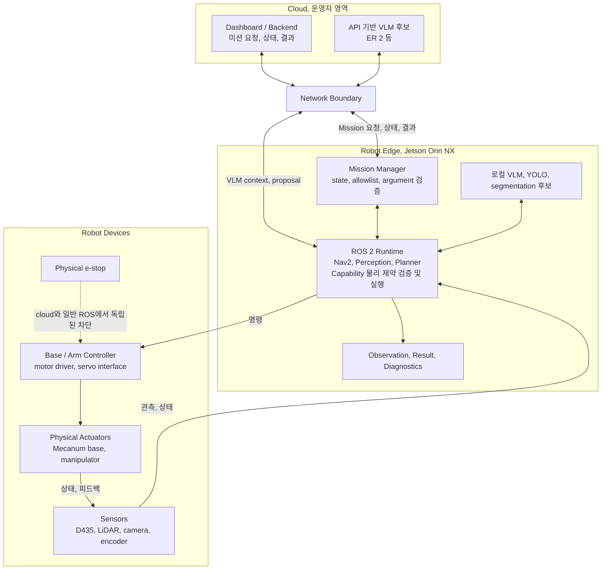

# Jetson Orin 엣지 런타임

## 요약

Jetson Orin NX 16GB는 Cleany 로봇의 ROS 2, sensor 처리, 로컬 검증, Capability
adapter와 hardware integration을 실행하는 엣지 컴퓨터다. 특정 cloud VLM을 로컬에서
실행하기 위해 정해진 장치는 아니며, 로컬 VLM과 detector, segmentation 후보도 측정 대상이다.

## 배포 구조

Cloud는 고수준 요청과 추론을 제공할 수 있지만 물리 실행과 안전 권한은 Jetson과
로봇 장치에 남는다. 네트워크가 끊겨도 새 행동을 차단하고 안전 상태를 유지할 수
있어야 한다.

## 로컬 책임

- ROS 2 node와 Mission Manager 실행
- RGB-D, LiDAR, IMU, encoder 입력 처리
- Nav2와 base adapter 실행
- SAM2, depth, 3D 위치 추정 등 선택된 Perception adapter 실행
- Manipulation Skill과 VLA, MoveIt, controller adapter 실행
- Mission 단계, Planner 출력 schema, Capability allowlist, 기본 argument 검증
- Capability adapter의 workspace, joint, collision, timeout 검증
- timeout, cancel, safe stop과 장치 상태 감시
- 실행 결과, 전후 관찰, 진단 로그 생성

## Cloud 책임 후보

API 기반 VLM을 채택하면 장면 의미 해석, 처리 순서와 tool orchestration을 API에
요청할 수 있다. ER 2는 이 후보 중 하나다. 클라우드는 하드웨어 안전, 고주기 제어와
네트워크 장애 시 정지를 담당하지 않는다. VLM 호출은 고정 주기가 아니라 작업 전 관찰과
high-level 행동의 완료, 실패, 장면 변화 checkpoint를 기준으로 한다.

## 리소스 원칙

- 동시에 필요한 모델과 node를 실제 입력으로 측정한다.
- GPU, CPU, memory, thermal, power budget을 평균이 아니라 peak 기준으로 확인한다.
- 사용하지 않는 모델을 상시 적재하지 않고 adapter별 lifecycle을 분리한다.
- cloud 응답을 기다리는 동안 base와 arm의 안전 상태는 로컬에서 유지한다.
- 모델 버전과 runtime 설치법은 구현 레포의 DEVELOPMENT_SETUP, package README가
  관리한다.

## 실패 경계

| 실패 | 로컬 기본 책임 |
|---|---|
| API VLM timeout, API 오류 | 새 물리 행동을 시작하지 않고 실패 결과 반환 |
| Perception adapter 실패 | 잘못된 scene을 Planner에 정상값으로 전달하지 않음 |
| node 중단, command timeout | backend가 안전한 정지 상태로 전환 |
| thermal, memory 부족 | 진단 기록 후 Capability 실행 차단 또는 종료 |

## 채택 판단

로컬 VLM, API 기반 VLM, YOLO와 SAM 계열, YOLO segmentation 중 어떤 경로를 사용할지
정확도, 지연, 실패 형태, 비용과 개인정보 실험 뒤 확정한다. Orin 선택 자체가
온디바이스 VLM/VLA 채택을 의미하지 않는다.

## 관련 문서

- [Perception and Scene Understanding](<07 - Perception and Scene Understanding.md>)
- [Safety and Risk](<08 - Safety and Risk.md>)
- [Hardware Configuration](<12 - Hardware Configuration.md>)

## 출처

- [260714 - Jetson Orin NX 16GB](<../30_DECISIONS/Technical/260714 - Jetson Orin NX 16GB.md>)

## 관련 결정

- [260714 - Jetson Orin NX 16GB](<../30_DECISIONS/Technical/260714 - Jetson Orin NX 16GB.md>)
- [260806 - Task Planning과 Robot Capability 경계](<../30_DECISIONS/Technical/260806 - Task Planning과 Robot Capability 경계.md>)
