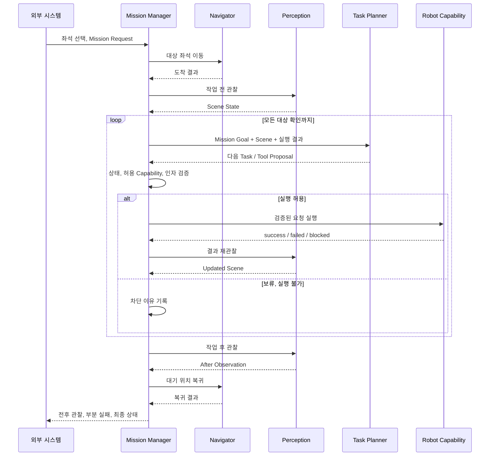

# Mission Lifecycle

## 요약

Mission Manager는 Cleany 전체 미션의 단계 전이와 최종 결과를 소유한다. Navigator,
Perception, Planner와 Skill Executor는 요청을 수행하고 결과를 반환하지만 Mission
state를 직접 바꾸지 않는다.

## 목표 제품 흐름



실패, 차단, 취소는 어느 단계에서든 보고 가능한 종료 경로로 연결되어야 한다.

## 준정적 장면과 행동 checkpoint

책상 도착 뒤의 작업 구역에는 사람이나 외부 물체가 개입하지 않는다고 가정하지만,
로봇 행동이 장면을 바꿀 수 있다. Mission Manager는 다음 경계를 소유한다.

1. 작업 전 Scene으로 Planner를 최초 호출한다.
2. Planner가 제안한 high-level 행동 하나만 검증하고 실행한다.
3. 행동이 success, failed, blocked로 끝날 때마다 결과를 기록하고 Scene을 재관찰한다.
4. 실행 결과와 최신 Scene으로 Planner를 다시 호출한다.
5. Planner가 완료를 제안하고 최종 관찰이 일치하면 책상 작업을 종료한다.

고정 시간 주기로 VLM을 호출하거나 실행 중 trajectory를 새 proposal로 교체하지
않는다. 물체의 낙하 또는 전도 같은 즉시 변화는 Capability가 동작을 종료하거나 차단하고,
Mission Manager가 이후 재관찰과 재계획을 시작한다.

## 현재 구현과 차이

현재 `cleany_mission_manager` core는 다음 흐름을 구현한다.

```text
NAVIGATE_TO_TARGET
→ PERCEIVE
→ PLAN_TASKS
→ EXECUTE_TASKS
→ RETURN_HOME
→ REPORT
```

현재 구현에는 작업 후 재관찰 단계와 Dashboard 및 Backend ROS 연동이 없다. 정확한
enum, retry 값, 결과 필드와 현재 테스트 상태는 구현 code, package README가
Source of Truth다.

## 단계별 책임

| 단계 | 호출 대상 | Mission Manager가 판단하는 것 |
|---|---|---|
| 미션 수락 | Dashboard, Backend adapter | 새 미션을 받을 수 있는가 |
| 이동, 복귀 | Navigator | 성공, 재시도, 실패, 취소 |
| 관찰 | Perception | 유효한 Scene State인가 |
| 계획 | 선택된 Planner adapter 또는 RuleBasedPlanner | 실행 가능한 task proposal인가 |
| 실행 | Skill Executor | 다음 skill, 부분 성공, 실패, 차단 |
| 보고 | Reporter | 최종 상태와 전후 결과 구성 |

## Planner와 Skill 경계

Planner는 물체별 처리 여부, 순서와 high-level Capability를 제안한다. Skill Executor는
승인된 Manipulation Skill을 VLA, MoveIt, controller backend로 실행한다. 두 모듈 모두
Mission state를 직접 전이시키지 않는다.

Navigation은 현재 별도 Navigator port다. 추후 선택된 Planner가 Navigation을 tool로
제안하게 되더라도 Mission Manager의 상태, 취소, 보고 소유권은 유지한다.

## 결과 원칙

- 성공한 대상과 실패, 미처리 대상을 구분한다.
- 부분 성공을 전체 성공으로 축약하지 않는다.
- 실패 지점과 원인이 Navigation, Perception, Planning, Manipulation 중 어디인지 남긴다.
- 작업 전후 관찰을 같은 Mission 결과에 연결한다.
- safe stop, e-stop은 일반 retry로 자동 해제하지 않는다.

## 구현 문서 경계

이 문서는 안정적인 lifecycle 의미만 관리한다. 다음 내용은 구현 레포의
`cleany_mission_manager` README와 코드에서 관리한다.

- 정확한 state enum과 transition table
- dataclass, result schema와 failure code
- retry 횟수와 parameter 기본값
- mock, test fixture와 현재 구현 완료 상태
- ROS action, service, topic 이름

## 관련 문서

- [System Context](<01 - System Context.md>)
- [Task Planning and Robot Capabilities](<03 - Task Planning and Robot Capabilities.md>)
- [ROS 2 Software Architecture](<11 - ROS 2 Software Architecture.md>)

## 출처

- [cleany_mission_manager README](https://github.com/asm17-moving-agent/cleany/blob/main/ros2_ws/src/cleany_mission_manager/README.md)
- [Mission Manager core](https://github.com/asm17-moving-agent/cleany/blob/main/ros2_ws/src/cleany_mission_manager/cleany_mission_manager/core/manager.py)

## 관련 결정

- [260708 - MVP 기능 범위](<../30_DECISIONS/Planning/260708 - MVP 기능 범위.md>)
- [260806 - Task Planning과 Robot Capability 경계](<../30_DECISIONS/Technical/260806 - Task Planning과 Robot Capability 경계.md>)
