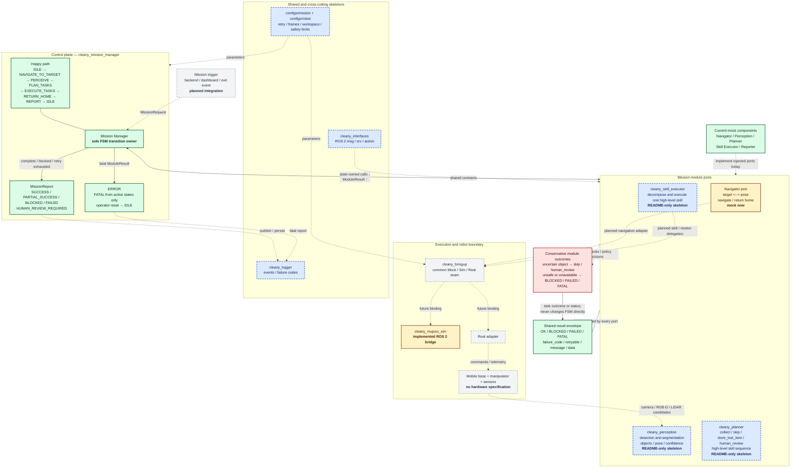

# ROS 2 소프트웨어 아키텍처

## 1. 요약

이 문서는 Cleany의 Mission Manager, Navigator, Perception, Planner, Skill Executor, robot backend와 simulation을 ROS 2 패키지 및 통신 경계로 나누는 초안이다.

핵심 원칙은 Mission Manager만 FSM 상태 전이를 소유하고, 나머지 모듈은 공통 결과와 모듈별 typed payload를 반환하는 것이다. 상위 mission stack은 Sim/Real 차이를 알지 않으며, robot backend 선택은 bringup 단계에서 수행한다.

패키지명, module action/service, TaskPlan과 Skill schema를 채택한 `selected` Decision은 아직 없다. 이 문서는 현재 구현 방향을 정렬하기 위한 `draft`이며 확정 계약은 아니다.

## 2. 기획 맥락

1차 MVP 흐름은 운영자 요청을 받아 지정 구역으로 이동하고, 사전에 정한 쓰레기 물체를 인식·분류·집기한 뒤 수거함에 투입하고 복귀하는 것이다. 분실물 후보와 저신뢰 물체는 조작하지 않고 결과에 기록하거나 사람 검토 대상으로 남긴다.

소프트웨어는 아래 경계를 유지해야 한다.

- Mission Manager만 mission lifecycle과 FSM 상태를 바꾼다.
- Perception은 객체와 공간 상태를 제공하고 최종 행동을 결정하지 않는다.
- Planner는 high-level task와 skill sequence까지만 만든다.
- Skill Executor는 high-level skill을 motion과 robot command로 분해한다.
- Navigation, manipulation, sensor 구현은 표준 ROS 2 인터페이스와 adapter 뒤에 둔다.
- 실제 hardware 사양, frame 수치, 안전 제한은 code constant가 아니라 config와 robot description에서 관리한다.

## 3. 기술 개념

### 3.1 전체 구조

```text
Dashboard / Backend / Manual CLI
               │
               │ ExecuteMission action
               ▼
       mission_manager_node
               │
       ┌───────┼────────┬──────────────┐
       ▼       ▼        ▼              ▼
 navigator  perception  planner   skill_executor
    │          │          │              │
    ▼          │          │         ┌────┴─────┐
  Nav2         │          │         ▼          ▼
    │          │          │       MoveIt   robot backend
    ▼          ▼          ▼                    │
 cmd_vel     RGB-D     TaskPlan            Sim 또는 Real
```

Mission Manager는 각 모듈의 내부 구현을 알지 않는다. 모듈이 반환한 `status`, `failure_code`, `retryable`을 해석해 retry, report, error 전이를 결정한다.

현재 구현 상태와 계획된 연결 지점은 다음과 같다. 실선은 현재 계약과 제어 흐름을, 점선은 mock 연결 또는 향후 통합 경계를 나타낸다.



### 3.2 패키지 경계 초안

| 패키지 | 주요 책임 | 경계 및 상태 |
|---|---|---|
| `cleany_interfaces` | 공통 msg, srv, action | Mission/ModuleResult의 안정된 최소 계약부터 관리 |
| `cleany_mission_manager` | FSM, retry, report, ERROR/reset | 순수 core와 ROS wrapper를 분리 |
| `cleany_navigation` | `target_id` 해석, Nav2 호출 | 신규 패키지 후보, pose map 형식 미정 |
| `cleany_perception` | sensor 입력에서 객체와 WorldState 생성 | 행동 결정을 수행하지 않음 |
| `cleany_planner` | high-level TaskPlan과 skill sequence 생성 | grasp, IK, trajectory를 만들지 않음 |
| `cleany_skill_executor` | skill 분해 및 실행 | MoveIt, Nav2, controller를 adapter로 호출 |
| `cleany_robot_interface` | Sim/Real 공통 robot port와 adapter | 실제 driver/`ros2_control` 패키지 구조와 이름은 검토 필요 |
| `cleany_mujoco_sim` | MuJoCo simulation backend | 공통 robot contract와 simulation-only hook 분리 |
| `cleany_description` | URDF/Xacro, joint/link, TF, controller 설정 | 신규 패키지 후보 |
| `cleany_logger` | event, failure, mission report 기록 | dashboard/backend 업로드와 분리 |
| `cleany_bringup` | mission stack과 Sim/Real 구성 launch | 신규 패키지 후보 |

Nav2, SLAM, MoveIt, `robot_state_publisher`, `controller_manager`는 Cleany 고유 기능으로 다시 구현하지 않고 표준 ROS 2 패키지를 사용한다.

현재 존재하는 패키지명을 이 문서가 최종 확정하지 않는다. 특히 `cleany_robot_interface`를 hardware driver 또는 `ros2_control` plugin 중심 구조로 바꾸는 경우 package boundary를 다시 검토한다.

### 3.3 통신 방식 선택 원칙

| 통신 방식 | 사용 대상 | 예시 |
|---|---|---|
| Topic | 계속 흐르며 최신 값이 중요한 데이터 | sensor, odometry, state observation |
| Service | 짧게 끝나는 request/response | reset, 단발 snapshot 또는 planning 요청 후보 |
| Action | 오래 걸리고 cancel/feedback/result가 필요한 작업 | mission, navigation, skill execution |

모든 내부 함수를 ROS topic으로 노출하지 않는다. 순수 core port와 ROS transport를 분리해 core logic을 ROS 없이 테스트할 수 있게 한다.

### 3.4 Mission ROS 2 인터페이스

FSM과 바로 연결되는 안정된 최소 인터페이스는 `cleany_interfaces`에 둔다.

```text
msg/MissionRequest.msg
msg/ModuleResult.msg
msg/MissionReport.msg
action/ExecuteMission.action
```

`ExecuteMission` mapping:

| Action 구간 | 필드 | 의미 |
|---|---|---|
| Goal | `MissionRequest request` | mission 시작에 필요한 최소 요청 |
| Feedback | `state`, `current_skill`, `message` | 현재 FSM 진행 관찰 |
| Result | `MissionReport report` | 성공, partial, blocked, failed, human review 결과 |

`MissionRequest` 최소 필드:

```text
mission_id
mission_type
target_id
requested_by
```

`MissionReport` 최소 필드:

```text
mission_id
status
failure_code
summary
completed_tasks
skipped_tasks
failed_task
needs_human_review
```

ROS message에는 Python의 `None`이 없으므로 성공 시 `failure_code`, 실패 지점이 없을 때 `failed_task`는 빈 문자열로 표현한다. 허용 상태와 failure code는 [[20_TECHNICAL/09 - Mission Manager FSM|Mission Manager FSM]]을 기준으로 한다.

### 3.5 공통 ModuleResult와 typed payload

ROS의 공통 `ModuleResult`는 다음 envelope만 가진다.

```text
ok
status
failure_code
retryable
message
```

순수 Python core의 `ModuleResult.data: Any`를 직렬화되지 않은 임의 데이터로 ROS message에 넣지 않는다. 각 operation은 공통 envelope 옆에 자기 typed payload를 둔다.

```text
NavigateTarget result
- result: ModuleResult
- target_id
- reached
- current_pose

InspectScene response
- result: ModuleResult
- objects
- snapshot_id

PlanTasks response
- result: ModuleResult
- task_plan

ExecuteSkill result
- result: ModuleResult
- skill별 검증 결과
```

정확한 `DetectedObject`, `WorldState`, `TaskPlan`, `Skill` schema가 미해결이므로 해당 srv/action 파일은 이 문서에서 확정하지 않는다. schema가 정해진 뒤 `cleany_interfaces`에 추가한다.

### 3.6 모듈 호출 경계 초안

| 인터페이스 후보 | 형식 | 호출자 | 처리자 | 상태 |
|---|---|---|---|---|
| `mission/execute` | `ExecuteMission` action | 외부 시스템 | Mission Manager | 최소 message/action 정의 |
| `mission/reset` | `std_srvs/srv/Trigger` | 운영자 | Mission Manager | ERROR reset 후보 |
| `navigation/navigate` | custom action 또는 Nav2 action adapter | Mission Manager/Skill Executor | Navigator | schema 검토 필요 |
| `perception/inspect` | service 또는 action | Mission Manager | Perception | 실행 시간 측정 후 선택 |
| `planner/plan` | service | Mission Manager | Planner | TaskPlan schema 미정 |
| `skills/execute` | action | Mission Manager | Skill Executor | Skill schema 미정 |
| `navigate_to_pose` | Nav2 action | Navigator | Nav2 | 표준 상위 navigation contract 후보 |

Mission Manager는 `skill_sequence` 전체를 Skill Executor에 한 번에 넘기지 않는다. high-level skill 하나씩 실행하고, 실패하면 해당 skill만 retry하며 완료된 앞선 skill을 다시 실행하지 않는다.

### 3.7 상태와 관찰 topic 후보

| 상대 topic 후보 | Publisher | 목적 | 상태 |
|---|---|---|---|
| `mission/state` | Mission Manager | 현재 FSM 상태 관찰 | schema 검토 필요 |
| `mission/report` | Mission Manager | 최종 결과 관찰 및 dashboard 연계 | action result와 중복 범위 검토 필요 |
| `events` | Cleany node | 구조화된 event/failure 기록 | Event schema 미정 |
| `perception/objects` | Perception | 인식 결과 관찰·디버깅 | 요청 응답의 snapshot과 구분 필요 |
| `/diagnostics` | node와 driver | runtime/hardware 진단 | ROS 표준 사용 후보 |

Mission Manager가 특정 시점의 일관된 WorldState를 요청할 때는 continuous observation topic만 읽지 않고 service/action response의 snapshot을 사용한다.

### 3.8 Sim/Real과 launch 구조

```text
mission_stack.launch.py
  mission_manager
  navigator
  perception
  planner
  skill_executor

sim_bringup.launch.py
  MuJoCo backend
  simulation config

real_bringup.launch.py
  hardware drivers/controllers
  real robot config
```

mission stack은 재사용하고 bringup이 backend를 선택한다. 공통 robot topic과 frame 의미는 [[20_TECHNICAL/10 - Robot ROS Contract|Robot ROS Contract]]를 따른다. 한 실행에서 Sim과 Real이 같은 canonical robot state와 TF를 동시에 발행하지 않는다.

common parameter와 backend-specific parameter를 분리한다.

- common: mission retry, frame name, logical joint mapping 후보
- sim-only: model path, timestep, render/headless 설정, simulation sensor noise
- real-only: device path, serial/CAN 설정, hardware limit, calibration

### 3.9 Safety와 상태 전이 소유권

MVP에서는 독립 Safety Supervisor를 두지 않는다. 각 모듈은 자기 책임 범위의 기본 safety check를 수행하고 `ModuleResult`를 반환한다.

```text
OK       다음 상태 진행
BLOCKED  정책 또는 조건상 실행하지 않고 REPORT
FAILED   실행 실패, retryable이면 제한 내 재시도
FATAL    mission 중단 후 ERROR
```

모듈은 Mission Manager의 state를 직접 변경하지 않는다. e-stop과 hardware fault처럼 계속 진행하면 안 되는 결과는 `FATAL`로 반환하되, 실제 motor 정지 자체는 해당 hardware/controller 계층이 즉시 수행해야 한다.

### 3.10 단계적 구현 순서

1. Mission/ModuleResult의 안정된 최소 ROS interface를 생성하고 빌드한다.
2. Mission Manager core를 감싸는 ROS action wrapper를 구현한다.
3. mock Navigator, Perception, Planner, Skill Executor adapter로 end-to-end FSM을 검증한다.
4. robot description과 TF ownership을 정리한다.
5. MuJoCo backend를 공통 base contract에 연결한다.
6. Navigator를 Nav2와 연결한다.
7. RGB-D Perception, TaskPlan, Skill typed schema를 검토 후 추가한다.
8. MoveIt/arm/gripper와 실제 robot backend를 같은 계약 뒤에 연결한다.

각 단계는 순수 core test와 ROS integration test를 분리한다.

## 4. 인터페이스 / 경계

| 구성요소                | 책임                                  | 경계                                          |
| ------------------- | ----------------------------------- | ------------------------------------------- |
| Mission Manager     | FSM, retry, report, reset           | perception, planning, motion 내부 로직을 수행하지 않음 |
| Navigator           | target 해석과 navigation action 조정     | motor command를 직접 구현하지 않음                   |
| Perception          | typed WorldState 생성                 | 최종 task와 FSM 전이를 결정하지 않음                    |
| Planner             | high-level task/skill sequence 생성   | grasp, IK, trajectory를 생성하지 않음              |
| Skill Executor      | skill을 motion/robot operation으로 분해  | mission state를 변경하지 않음                      |
| Robot backend       | 표준 command와 state를 hardware/sim에 연결 | mission 의미를 해석하지 않음                         |
| `cleany_interfaces` | package 경계를 넘는 stable schema        | 구현 내부 dataclass 전체를 노출하지 않음                 |

## 5. 가정

- `target_id -> pose` 변환은 MVP에서 Navigator 내부 책임으로 둔다.
- Dashboard/backend는 Mission action client 중 하나이며 FSM source of truth가 아니다.
- TaskPlan과 Skill schema는 해당 core 구현과 함께 검토한다.
- ROS 배포판, XLeRobot 상세 hardware, controller 구조는 selected Decision이 아니다.
- package 구현은 Python/C++ 선택과 무관하게 같은 ROS interface를 사용할 수 있다.

## 6. 리스크

- 불안정한 internal model을 너무 일찍 ROS message로 고정하면 package 간 변경 비용이 커진다.
- 모든 결과를 문자열 또는 JSON으로 넘기면 type safety와 tooling 이점을 잃는다.
- action/service 경계가 실제 처리 시간과 cancel 요구를 반영하지 않으면 runtime 제어가 어려워진다.
- Mission Manager와 각 모듈이 모두 retry하면 같은 동작이 중복 실행될 수 있다.
- Sim/Real backend 선택과 TF ownership이 분명하지 않으면 topic 및 transform 충돌이 발생한다.

## 7. 관련 결정

- 현재 selected Decision 없음.
- package naming, module transport, TaskPlan/Skill schema, Sim/Real bringup 채택은 팀 검토가 필요하다.
- 공통 robot I/O 후보는 [[20_TECHNICAL/10 - Robot ROS Contract|Robot ROS Contract]]에 분리한다.
- FSM의 상태와 결과 의미는 [[20_TECHNICAL/09 - Mission Manager FSM|Mission Manager FSM]]을 기준으로 한다.
- 미해결 계약은 [[20_TECHNICAL/99 - Questions|Technical Questions]]에서 관리한다.
