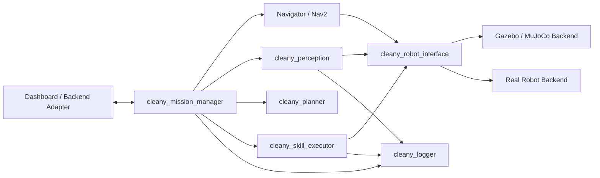

---
source_refs:
  - "20_TECHNICAL/09 - Mission Lifecycle.md"
related_decisions:
  - "30_DECISIONS/Technical/260714 - 4륜 메카넘 베이스.md"
---

# ROS 2 소프트웨어 아키텍처

## 요약

Cleany ROS 2 workspace는 Mission orchestration, 장면 인식, task planning, physical
execution과 robot backend를 분리한다. 이 문서는 package 책임과 의존 방향만
관리하며 정확한 ROS interface는 구현 code·package README가 관리한다.

## 구성도

```mermaid
flowchart LR
    external["Dashboard / Backend Adapter"]
    mission["cleany_mission_manager"]
    nav["Navigator / Nav2"]
    perception["cleany_perception"]
    planner["cleany_planner"]
    skills["cleany_skill_executor"]
    interface["cleany_robot_interface"]
    sim["Gazebo / MuJoCo Backend"]
    real["Real Robot Backend"]
    logger["cleany_logger"]

    external <--> mission
    mission --> nav
    mission --> perception
    mission --> planner
    mission --> skills
    nav --> interface
    perception --> interface
    skills --> interface
    interface --> sim
    interface --> real
    mission --> logger
    perception --> logger
    skills --> logger
```

## Package 책임

| Package·경계 | 책임 | 소유하지 않는 것 |
|---|---|---|
| `cleany_mission_manager` | lifecycle, 상태 전이, retry·report | 센서 처리와 motor 제어 |
| Navigator adapter | 좌석 ID→pose, Nav2 action 조정 | 책상 task 순서 |
| `cleany_perception` | sensor→Scene State | Mission 전이와 task 정책 |
| `cleany_planner` | RuleBasedPlanner·ER 2 adapter | trajectory·hardware safety |
| `cleany_skill_executor` | Manipulation Skill 실행 | Mission state 직접 변경 |
| `cleany_robot_interface` | Sim·Real 공통 robot port | 작업 의미 재해석 |
| `cleany_interfaces` | package 간 공유 ROS type | business·실행 logic |
| `cleany_logger` | event·observation·MissionResult 기록 | state Source of Truth |
| Sim package | Gazebo 주행, MuJoCo 조작 backend | 제품 정책 |

현재 일부 package는 scaffold다. 구현 완료 여부는 각 package README를 확인한다.

## 의존 방향

- Mission core는 ROS node·hardware SDK에 직접 의존하지 않는 순수 logic을 유지한다.
- 상위 package는 구체 Sim·Real backend 대신 port·ROS interface에 의존한다.
- Nav2, MoveIt, controller와 VLA adapter는 Cleany package 뒤에서 호출한다.
- Perception과 Planner는 자유 형식 dict보다 검증 가능한 typed boundary를 지향한다.
- hardware limit과 safe stop은 cloud Planner dependency보다 아래에 둔다.

## 통신 선택 원칙

| 형태 | 사용 |
|---|---|
| Topic | 지속 sensor·state·observation stream |
| Service | 짧고 즉시 끝나는 조회·설정 |
| Action | Navigation·Manipulation처럼 feedback·cancel·result가 필요한 실행 |

정확한 이름, QoS, schema와 timeout은 실제 package 구현 문서에서 정한다. KB는
Mission·Capability·failure의 의미만 고정한다.

## Sim·Real 경계

- 한 실행에서는 하나의 backend만 canonical command·state·TF를 소유한다.
- Gazebo는 base·Nav2·sensor, MuJoCo는 tabletop arm manipulation을 우선 검증한다.
- 상위 Mission·Planner는 backend 종류를 알지 않는다.
- private simulation test hook을 공통 Robot Contract로 승격하지 않는다.

## 상태와 안전 소유권

Mission Manager만 Mission state를 바꾼다. 하위 모듈은 성공·실패·차단·취소 결과를
반환한다. hardware fault와 e-stop은 결과를 반환하기 전에 실제 구동을 우선 정지할
수 있어야 한다.

## 관련 문서

- [[20_TECHNICAL/09 - Mission Lifecycle|Mission Lifecycle]]
- [[20_TECHNICAL/10 - Robot ROS Contract|Robot ROS Contract]]
- [[20_TECHNICAL/13 - Verification and Simulation Strategy|Verification and Simulation Strategy]]
