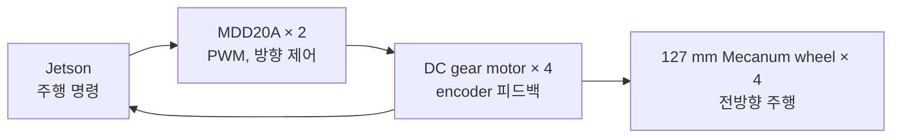
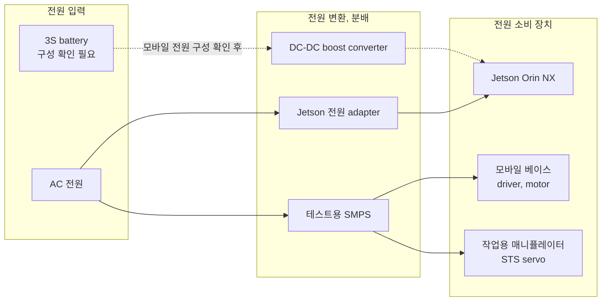
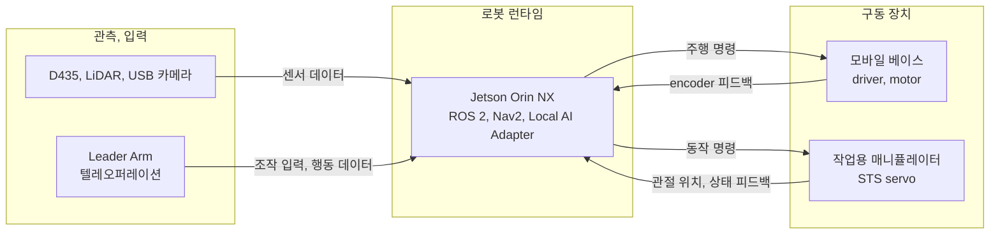

# 하드웨어 구성(Hardware Configuration)

## 1. 요약

끌리니는 XLeRobot 상부 모듈의 듀얼 매니퓰레이터와 깊이 카메라를 유지하고,
알루미늄 프로파일 프레임과 4륜 Mecanum 이동 베이스를 결합하는 모바일
매니퓰레이터다. 알루미늄 프로파일은 현재 팀이 선택한 프레임 방향이다.

이 문서는 부품의 역할, 배치 개념, 전원, 데이터 연결 관계에 대한 현재 기술 기준을
공유한다. 실제 기구 치수, 배선, 전력 정격, 통신 계약 및 실장 위치는 별도 검증이
필요하다.

| 구성부 | 담당 기능 | 대표 부품 |
| --- | --- | --- |
| 컴퓨팅, 제어부 | ROS 2, Nav2, 센서 처리, 로컬 실행 검증, VLA adapter | Jetson Orin NX 16GB, USB 3.0 hub |
| 인지, 센서부 | 주변 환경과 작업 대상 인식, 거리, 위치 추정 | RealSense D435, RPLIDAR A1M8, 매니퓰레이터 카메라 |
| 모바일 베이스 | 전후, 좌우 이동, 제자리 회전, odometry 생성 | Mecanum wheel, DC gear motor, Cytron MDD20A |
| 작업용 매니퓰레이터 | 쓰레기 접근, 파지, 운반, 투입 | Feetech STS3215, STS3250 |
| 텔레오퍼레이션 장치 | 작업자 시연 입력과 행동학습 데이터 수집 | Leader Arm servo, FE-URT2-C001, 고정 clamp |
| 전원, 시험부 | Jetson 전원 변환과 구동계 통합 시험 | 19V boost converter, RSP-500-12 SMPS |
| 배선, 제작부 | 전원, 신호 하네스와 맞춤형 기구물 제작 | 5264, JST-XH connector, PLA, TPU, crimper |

## 2. 하드웨어 구성 개념도

이미지는 부품 간 관계를 설명하기 위한 AI 생성 개념도다. 실제 조립도, 최종 BOM 또는 안전 검증 결과로 해석하지 않는다.

## 3. 컴퓨팅, 제어부

로봇 내부에서 센서 데이터를 처리하고 ROS 2 기반 자율주행과 매니퓰레이터 제어를 실행하는 중심 연산부다. 메인 엣지 컴퓨팅은 관련 Decision에 따라 Jetson Orin NX 16GB를 기준으로 둔다.

| 품목 | 모델, 세부사항 | 수량 | 사용 위치 | 역할 |
| --- | --- | ---: | --- | --- |
| 엣지 AI 개발 플랫폼 | Seeed reComputer J4012, Jetson Orin NX 16GB, 128GB NVMe SSD | 1대 | 로봇 내부 메인 컴퓨팅부 | RGB-D, LiDAR 처리, ROS 2, Nav2, 로컬 실행 검증과 VLA, Capability adapter 실행 |
| USB 3.0 hub | NEXT-704U3, 4포트, 유, 무전원 | 1개 | Jetson USB 확장부 | RGB-D 카메라, LiDAR, 서보 통신 보드 등 다수 USB 장치 연결 |

## 4. 인지, 센서부

로봇 주변의 장애물과 작업 대상 물체를 인식하고, 자율주행과 매니퓰레이션에 필요한 위치 정보를 생성한다.

| 품목 | 모델, 세부사항 | 수량 | 사용 위치 | 역할 |
| --- | --- | ---: | --- | --- |
| RGB-D 카메라 | Intel RealSense D435 | 1대 | 로봇 상부 또는 작업 공간 관측부 | RGB 영상과 깊이 정보 취득, 객체 분류, 3차원 위치와 집기 지점 산출 |
| 2D LiDAR | SLAMTEC RPLIDAR A1M8-R6, 360도, 최대 12m | 1대 | 트롤리 중간층의 모바일 베이스 상부 | 2D SLAM 지도 생성, 로봇 위치 추정, Nav2 경로 계획과 충돌 회피 |
| 매니퓰레이터 카메라 | SO-ARM100/101용 2MP USB 카메라, 30FPS, 3m 케이블 | 2대 | 매니퓰레이터 또는 gripper 주변 | 근접 시점 영상 수집, 파지 직전 정렬, 성공 여부 확인, 행동학습 데이터 기록 |

### 카메라 역할 구분

- **RealSense D435:** 작업 공간의 전역 RGB-D 관측과 물체의 3차원 위치 추정
- **매니퓰레이터 카메라:** gripper 주변의 근접 RGB 관측과 파지 상태 확인
- **LiDAR:** 바닥 평면에서의 자율주행용 거리 측정, 지도 작성, 위치 추정

## 5. 모바일 베이스

끌리니는 4륜 Mecanum 구동부를 사용해 실내 통로와 작업 위치 주변을 이동하는 방향이다. 엔코더가 포함된 DC gear motor 4개와 dual motor driver 2개를 사용한다.

| 품목 | 모델, 세부사항 | 수량 | 사용 위치 | 역할 |
| --- | --- | ---: | --- | --- |
| Mecanum wheel set | 127 mm Mecanum Wheel, Option 4, Size Option A | 1세트 | 로봇 하부 4개 휠 | 전후, 좌우 병진 이동과 제자리 회전 구현 |
| DC gear motor | PG42-4266-1270NE, 12V, 2채널 encoder, 13PPR, 1/61 감속기 | 4개 | 각 Mecanum wheel 구동축 | 휠 독립 구동, 속도 피드백, odometry 계산 |
| Dual DC motor driver | Cytron MDD20A, 6–30V, 2채널, 채널당 최대 20A | 2개 | Jetson 제어 신호와 motor 사이 | 4개 motor의 방향과 속도를 PWM으로 제어 |
| Motor mounting bracket | GMB-42M, 42파이 유성 gear motor용 | 4개 | chassis와 motor 사이 | motor 위치, 각도 고정과 축 틀어짐, odometry 오차 감소 |

### 구동 관계

> Mecanum wheel set의 실제 구성품에 좌, 우 휠 각 2개, 총 4개가 포함되는지는 발주, 실장 단계에서 확인이 필요하다.

## 6. 작업용 매니퓰레이터

로봇 본체에 장착되어 작업 대상에 접근하고, 파지한 뒤 수거 위치로 운반하는 작업용 로봇팔이다. 하중이 집중되는 관절에는 STS3250을, 나머지 관절과 카메라 Pan/Tilt 축에는 STS3215를 사용하는 구성 후보다.

| 품목 | 모델, 세부사항 | 수량 | 사용 위치 | 역할 |
| --- | --- | ---: | --- | --- |
| 매니퓰레이터 servo | Feetech STS3215 C018, 12V, 30kg, 1/345 | 8개 | 일반 관절과 카메라 Pan/Tilt 축 | 관절 자세 제어, 물체 접근, gripper 정렬 |
| 고토크 매니퓰레이터 servo | Feetech STS3250 C001, 12V, 50kg, 1/345 | 3개 | Shoulder Lift, Elbow Flex 등 고하중 관절 | 물체와 팔의 하중을 지지하고 자세를 안정적으로 유지 |

> 최종 로봇팔 자유도와 Pan/Tilt 적용 여부에 따라 관절별 servo 배치 수량은 확정해야 한다.

## 7. 텔레오퍼레이션 장치

Leader Arm은 작업자가 집기 동작을 시연하고, 실제 매니퓰레이터의 행동학습 데이터로 기록하기 위한 장치다. 로봇 본체의 작업용 팔과 구분해 관리한다.

| 품목 | 모델, 세부사항 | 수량 | 사용 위치 | 역할 |
| --- | --- | ---: | --- | --- |
| Leader Arm servo | Feetech STS3215 C046, 7.4V, 14.4kg, 1/147 | 7개 | Wrist Flex, Wrist Roll, Gripper 등 | 손목, gripper 조작 시연과 궤적 기록 |
| Leader Arm servo | Feetech STS3215 C044, 7.4V, 16kg, 1/191 | 5개 | Shoulder Pan, Elbow Flex 등 | 접근, 집기, 투입 동작의 시연 궤적 기록 |
| Leader Arm servo | Feetech STS3215 C001, 7.4V, 19.5kg, 1/345 | 3개 | Shoulder Lift | 상하 이동과 접근 높이 시연 기록 |
| Servo 통신, debug 보드 | Feetech FE-URT2-C001 | 2개 | Jetson과 Leader/Follower Arm 사이 | 관절 위치 피드백과 목표 명령 송수신, 데이터 수집과 동작 재현 |
| Leader Arm 전원 케이블 | DC 2선–barrel jack Female, 외경 5.5/내경 2.1 mm | 2개 | 5V 6A adapter와 Leader Arm 사이 | 텔레오퍼레이션 장치 전원 연결 |
| 고정 clamp | 4인치 bar clamp, 2개 구성 | 2세트 | Leader Arm과 작업대 사이 | 조작 중 흔들림과 기준 좌표 변화 방지 |

## 8. 전원, 통합 시험부

최종 배터리 전원 구성과 별개로, 개발 단계에서 컴퓨팅 장치와 motor, sensor, 제어 보드를 안정적으로 시험하기 위한 구성이다.

| 품목 | 모델, 세부사항 | 수량 | 사용 위치 | 역할 |
| --- | --- | ---: | --- | --- |
| Jetson 전원 케이블, adapter | AC 190–240V 입력, 12V 5A 출력, barrel jack | 1개 | AC 전원과 Jetson 개발 플랫폼 사이 | 통합 시험 중 Jetson과 연결 장치에 안정적인 전원 공급 |
| 테스트용 SMPS | MEAN WELL RSP-500-12 | 1개 | motor driver, sensor, 제어 보드 시험대 | 모바일 베이스와 매니퓰레이터 통합 전 12V 전원 시험 |
| DC-DC boost converter | SMG 20A 1200W 승압 converter | 1개 | 3S battery와 Jetson 전원 입력 사이 | battery 전압을 Jetson 구동용 19V로 승압 |

> 3S battery의 최종 실장 구성, 보호 회로와 배선 정격은 별도 검증이 필요하다.

## 9. 배선, 하네스 제작

motor, encoder, sensor, Jetson, servo 통신 보드를 안정적으로 연결하고, 유지보수 가능한 탈착식 배선 구조를 만드는 데 사용하는 구성이다.

| 품목 | 모델, 세부사항 | 수량 | 사용 위치 | 역할 |
| --- | --- | ---: | --- | --- |
| 5264 connector housing | Molex 호환, 2.5 mm pitch, 3핀 | 200개 | 전원, 신호 하네스 | motor, sensor, 제어 보드 배선의 모듈식 연결 |
| 5264 socket crimp terminal | Molex 0008701039, 22–28AWG | 600개 | 5264 housing 내부 | 전선과 connector 압착 결선, 진동 중 접촉 신뢰성 유지 |
| JST-XH connector housing | JST XHP-4, 4핀 | 30개 | motor encoder, sensor 신호선 | 신호선을 제어 보드에 탈착 가능하게 연결 |
| JST-XH socket crimp terminal | JST SXH-001T-P0.6 | 100개 | JST-XH housing 내부 | encoder, sensor 신호선 압착 결선 |
| Connector crimper | Engineer PA-09 정밀 압착 공구 | 1개 | 제작 작업대 | 5264와 JST 계열 terminal을 규격에 맞게 압착 |

## 10. 3D 프린팅 제작 재료

sensor, 컴퓨팅 장치 mount, 매니퓰레이터 adapter, 외장 구조물과 탄성 부품을 반복 제작하는 데 사용하는 재료다.

| 품목 | 모델, 세부사항 | 수량 | 사용 위치 | 역할 |
| --- | --- | ---: | --- | --- |
| PLA filament | Bambu Lab PLA Basic White, 1 kg refill | 4개 | sensor, Jetson, LiDAR mount, 구조물 | 형상 검증과 강성이 필요한 일반 기구물 제작 |
| TPU filament | Bambu Lab TPU 95A HF White, 1 kg | 1개 | gripper pad, cable 보호대, 완충부 | 미끄럼 방지, 대상 보호, 진동 완충과 배선 내구성 확보 |

## 11. 전원 흐름

## 12. 데이터, 제어 흐름

## 13. 확인 사항

1. **Mecanum wheel set 구성:** 1세트에 실제 구동에 필요한 4개 wheel이 모두 포함되는지 확인한다.
2. **매니퓰레이터 자유도와 servo 배치:** STS3215 8개와 STS3250 3개의 관절별 배치를 최종 기구 설계와 대조한다.
3. **Leader Arm 수량:** 7.4V STS3215의 수량이 복수 Leader Arm 또는 예비 부품을 포함하는지 확인한다.
4. **Servo 전압 분리:** 작업용 매니퓰레이터는 12V, Leader Arm은 7.4V 계열이므로 전원 계통을 혼용하지 않는다.
5. **최종 전력 예산:** Jetson, 4개 DC motor, 매니퓰레이터 servo의 최대 동시 소비전류를 기준으로 battery, 배선, fuse, converter 정격을 검증한다.
6. **USB 포트와 대역폭:** D435, LiDAR, USB 카메라 2대, servo 통신 보드 2대를 USB hub와 Jetson 포트에 어떻게 분배할지 확정한다.
7. **실제 실장 상태:** 계획 수량과 실제 실장 수량, 장착 위치와 변경 이력은 별도 조립 기록에서 관리한다.

## 14. 관련 결정

- [XLeRobot 기반 플랫폼](<../30_DECISIONS/Technical/260708 - XLeRobot 기반 플랫폼.md>): 듀얼 매니퓰레이터와 깊이 카메라를 유지한 결정이다.
- [4륜 메카넘 베이스](<../30_DECISIONS/Technical/260714 - 4륜 메카넘 베이스.md>): 4륜 Mecanum custom base를 사용한 결정이다.
- [Jetson Orin NX 16GB](<../30_DECISIONS/Technical/260714 - Jetson Orin NX 16GB.md>): 메인 엣지 컴퓨팅 장치를 정한 결정이다.
- [로봇 프레임 구조](<../30_DECISIONS/Technical/260715 - 로봇 프레임 구조.md>): 알루미늄 프로파일을 선택한 결정이다.

## 15. 출처

- 비공개 Raw 원본: 끌리니 하드웨어 구성 및 부품 목록
