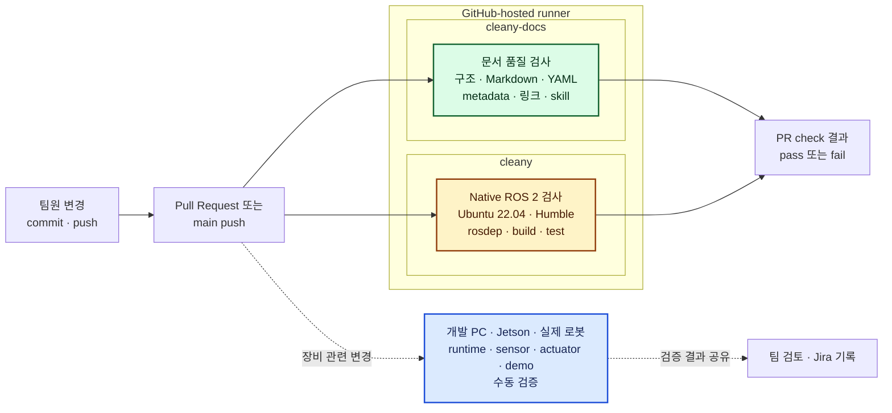
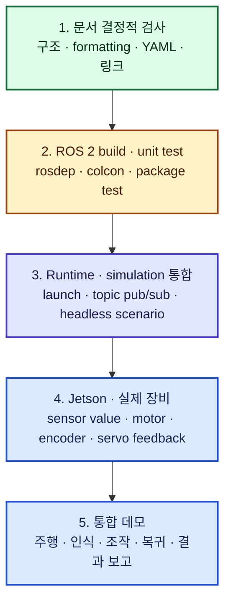
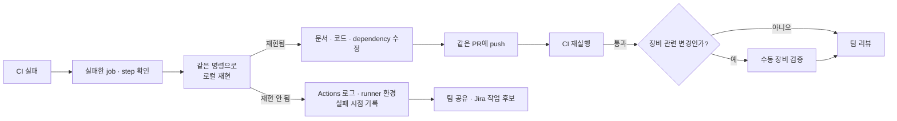

# CI와 검증 전략

## 1. 요약

Cleany의 CI는 모든 변경에 같은 최소 검증을 반복해 문서 형식 오류와 ROS 2
빌드·단위 테스트 실패를 조기에 발견하는 장치다. CI는 개발자의 로컬 테스트와 실제
장비 검증을 대체하지 않는다.

현재 `cleany-docs`는 GitHub Actions에서 결정적 문서 품질 검사를 실행한다.
`cleany`의 native ROS 2 빌드·테스트 CI는 별도 PR에서 검토 중이다. 두 CI 모두
GitHub가 제공하는 일회성 가상 머신인 GitHub-hosted runner를 사용하므로 팀원의
개인 PC나 Jetson에서 실행되지 않는다.

> [!IMPORTANT]
> 초록색 CI는 정의된 문서 검사 또는 ROS 2 빌드·단위 테스트가 통과했다는 뜻이다.
> Jetson, 센서, 모터, 서보 피드백, 실제 주행과 통합 데모의 정상 동작까지
> 보장하지 않는다.

## 2. 도입 맥락

팀원이 서로 다른 PC에서 작업하더라도 PR마다 같은 명령과 기준으로 검증할 수 있어야
한다. 특히 Cleany는 문서 KB와 ROS 2 구현 저장소의 성격이 다르고, 카메라·LiDAR,
모터와 Jetson처럼 GitHub runner에 연결할 수 없는 장비도 포함한다. 따라서 검증을
다음 세 범위로 나눈다.

1. 모든 변경에 자동 실행할 빠르고 재현 가능한 검사
2. 개발 PC에서 수행할 runtime·simulation 통합 검사
3. Jetson과 실제 로봇에서 수행할 수동 장비·시나리오 검사

CI 범위를 이 경계보다 넓게 표현하면 초록색 체크가 실제 로봇 검증을 대신했다는
오해가 생긴다. 반대로 모든 장비 검증을 PR CI에 포함하면 장비 독점, 실행시간,
네트워크와 runner 유지관리 문제가 발생한다.

## 3. 기술 개념

### 3.1 한눈에 보는 전체 흐름



- 초록색: 현재 적용된 자동 검사
- 노란색: PR에서 검토 중인 자동 검사
- 파란색: 사람이 개발환경 또는 실제 장비에서 수행하는 검사

### 3.2 현재 적용 상태

| 저장소 | 상태 | 실행 환경 | 제한 시간 | 주요 결과 |
|---|---|---|---|---|
| `cleany-docs` | `main` 적용 완료 | GitHub-hosted Ubuntu 24.04, Python 3.11 | 5분 | 결정적 KB 품질 검사와 추적 파일 무변경 확인 |
| `cleany` | [PR #20](https://github.com/asm17-moving-agent/cleany/pull/20) 검토 중 | GitHub-hosted Ubuntu 22.04, ROS 2 Humble, Python 3.10 | 30분 | rosdep 의존성 설치, native build와 전체 colcon test |

`cleany` CI의 최종 workflow 내용은 분리 전
[GitHub Actions 실행](https://github.com/asm17-moving-agent/cleany/actions/runs/30334523875)에서
성공했다. PR #20이 병합되기 전에는 적용 완료로 취급하지 않는다.

### 3.3 `cleany-docs` 문서 품질 검사

실행 조건:

- `main` 대상 PR
- `main` push
- GitHub UI의 수동 실행

실행 순서:

1. 저장소를 checkout한다.
2. 고정된 `uv`와 Python 3.11 환경을 준비한다.
3. `uv sync --locked`로 lockfile과 일치하는 의존성을 준비한다.
4. 아래 명령으로 KB의 전체 결정적 검사를 실행한다.

```bash
uv run python skills/kb-quality-checks/scripts/run_checks.py .
```

5. `git diff --exit-code`로 검사가 추적 파일을 의도치 않게 변경하지 않았는지
   확인한다.

검사 대상은 필수 폴더·파일 구조, Markdown formatting, YAML 문법과 metadata,
내부 링크, repo skill 구조다. 문서의 기술 판단이 옳은지나 사람이 검토했는지는
자동 판정하지 않는다.

### 3.4 `cleany` native ROS 2 검사

예정된 실행 조건:

- `main` 대상 PR
- `main` push
- GitHub UI의 수동 실행

실행 순서:

1. Ubuntu 22.04 runner에 ROS 2 Humble을 준비한다.
2. OS, Python, ROS와 `git`, `make`, `pip3`, `ros2`, `colcon`, `rosdep` 명령을
   검증한다.
3. Cleany custom rosdep 규칙을 runner에 등록한다.
4. `make deps`로 workspace system dependency를 설치한다.
5. `make test`로 native build와 전체 colcon test를 실행한다.

이 검사는 `docs/native-dev-workflow`에서 정한 Ubuntu 22.04, ROS 2 Humble,
Python 3.10과 Makefile 기반 개발 흐름을 따른다. Docker build는 기본 CI 경로가
아니다.

### 3.5 검증 계층

아래로 내려갈수록 실제 제품과 가까워지지만 실행시간, 장비 의존성과 운영비용이
커진다.



현재 1단계는 적용 완료, 2단계는 PR 검토 중이다. 3~5단계는 자동 CI 성공 여부와
별도로 수행한다.

## 4. 자동·수동 검증 경계

| 검증 대상 | 자동 CI | 수동 또는 별도 통합 검사 | 경계와 이유 |
|---|---|---|---|
| KB 구조, Markdown, YAML, metadata, 링크, skill | `cleany-docs` | 내용의 사실성·결정 상태는 사람 검토 | 결정적 형식만 자동 판정 |
| ROS package build와 단위 테스트 | `cleany` | 패키지 간 runtime 연결 | 빠르고 반복 가능한 검사를 CI에 포함 |
| Gazebo 구조·parameter test | `cleany`의 `make test` | 장시간 world 실행과 시나리오 완주 | 단위 수준 구조 검증과 runtime 검증을 분리 |
| ROS launch와 topic publish/subscribe | 미포함 | 개발 PC의 native ROS 2 환경 | node 간 timing과 실행 상태 확인 필요 |
| RGB-D 카메라와 LiDAR sensor value | 미포함 | Jetson 또는 실제 로봇 | GitHub runner에 장비가 없음 |
| Mecanum wheel, DC motor와 encoder | 미포함 | 실제 베이스 | 방향, slip, odometry와 물리 배선 확인 필요 |
| SO-101 계열 servo 명령과 위치 feedback | 미포함 | 실제 매니퓰레이터 | 실제 bus, servo ID, 부하와 기구 상태에 의존 |
| Jetson Orin NX 자원과 추론 성능 | 미포함 | Jetson | amd64 runner와 ARM64·JetPack 환경이 다름 |
| 통합 데모 시나리오 | 미포함 | 개발공간의 실제 로봇 | 주행·인식·조작·복귀 전체 결과를 사람이 확인 |

CI에 포함되지 않았다는 것은 중요하지 않다는 뜻이 아니다. 자동화하기 어려운 검사는
별도의 수동 검증 절차와 결과 기록이 필요하다는 뜻이다.

## 5. 팀 작업 절차

### 5.1 PR 전 로컬 최소 검사

문서 변경:

```bash
uv sync --locked
uv run python skills/kb-quality-checks/scripts/run_checks.py .
git diff --exit-code
```

ROS 2 구현 변경:

```bash
make deps
make test
```

장비 또는 runtime 변경은 해당 로컬 검사에 더해 4절의 관련 수동 항목을 확인한다.

### 5.2 PR에서 확인할 내용

1. 실패한 job과 step 이름을 먼저 확인한다.
2. CI가 실행한 것과 같은 명령으로 로컬에서 재현한다.
3. 문서·코드·dependency 문제를 수정한 뒤 같은 PR에 push한다.
4. 로컬에서 재현되지 않으면 Actions 로그, runner 환경과 실패 시점을 기록해
   팀에 공유한다.
5. CI가 통과해도 장비 관련 변경이면 수동 검증 결과를 별도로 확인한다.



### 5.3 결과 해석과 기록

- 초록색 체크는 해당 workflow에 정의된 범위만 통과했다는 뜻으로 해석한다.
- 장비 검증이 필요한 PR은 테스트 환경, 실행 절차, 관찰 결과와 실패 로그를 남긴다.
- 영구 추적이 필요한 실패와 후속 작업은 Jira issue로 관리하고, Jira에는 이 문서
  링크와 검증 결과 요약만 둔다.
- workflow의 trigger, runner, 명령 또는 자동화 범위가 바뀌면 이 문서의 상태 표와
  검증 매트릭스를 함께 갱신한다.

## 6. 가정과 리스크

### 6.1 가정

- GitHub-hosted runner는 매 실행 후 폐기되는 일회성 가상 머신이다.
- `cleany`의 공식 개발 기준은 Ubuntu 22.04 native ROS 2 Humble이다.
- 실제 장비가 필요한 검증은 팀원이 접근 가능한 개발공간에서 수행한다.
- CI workflow는 최소 읽기 권한을 사용하고 외부 action은 commit SHA로 고정한다.

### 6.2 리스크

- GitHub runner는 amd64이므로 Jetson ARM64·JetPack 환경과 완전히 같지 않다.
- apt와 rosdep 외부 다운로드 상태에 따라 일시 실패와 실행시간 편차가 생길 수 있다.
- 초록색 CI를 실제 로봇 정상 동작으로 오해하면 장비 결함과 통합 실패를 놓칠 수 있다.
- 무거운 simulation과 hardware test를 모든 PR에 넣으면 실행시간과 장비 독점 문제가
  커질 수 있다.
- self-hosted runner는 전원, 네트워크, 보안, 업데이트와 장비 상태를 팀이 직접
  관리해야 한다.
- workflow와 이 문서를 함께 갱신하지 않으면 실제 검사 범위와 문서가 달라질 수 있다.

## 7. 관련 결정과 검토 상태

CI를 `main` 병합 필수 조건으로 강제하는 정책, runtime·simulation 자동화 범위,
Jetson self-hosted runner 도입과 수동 장비 검증 기록 방식은 아직 selected
Decision이 아니다. 관련 항목은
[[20_TECHNICAL/99 - Questions|Technical Questions]]에서 중앙 관리한다.

현재 관련 selected Decision은 없다. 팀 검토 전까지 이 문서는 `draft`로 유지한다.
