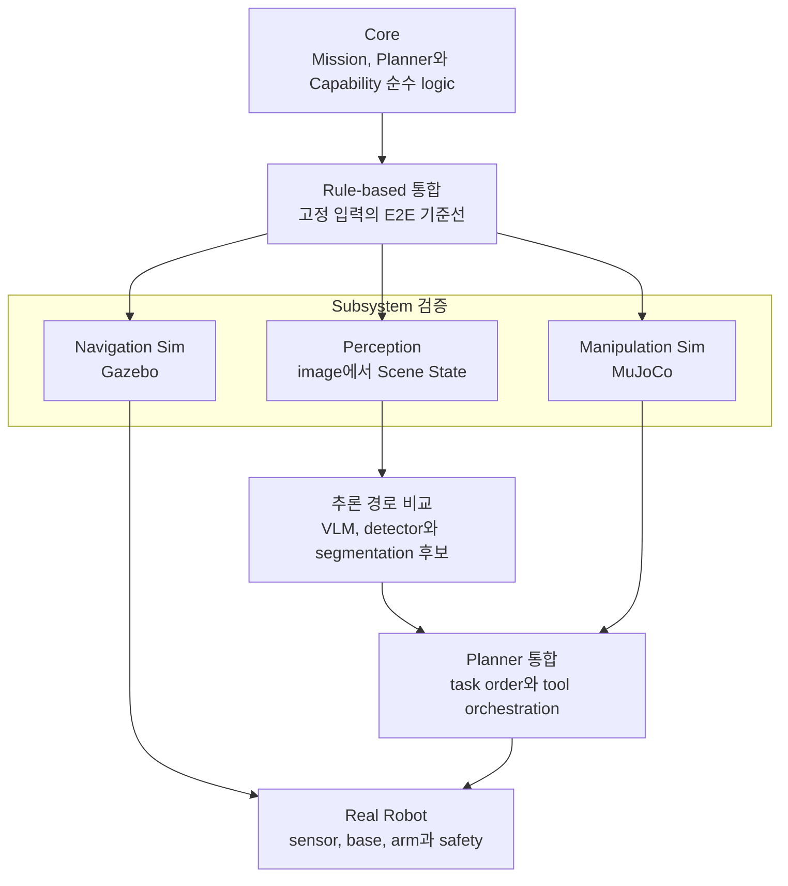
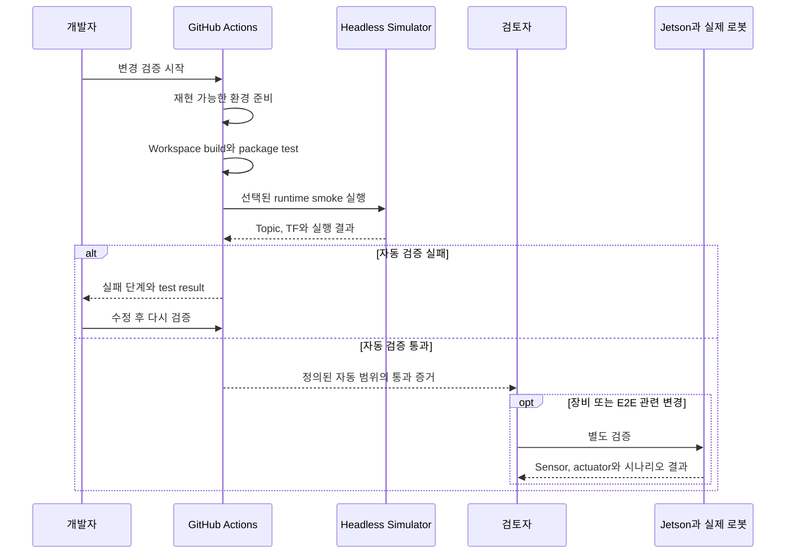

# 검증과 시뮬레이션 전략(Verification and Simulation Strategy)

## 요약

Cleany는 Rule-based E2E 통합, 후보 추론 경로 비교, physical execution, 실제 로봇 순으로
검증한다. Gazebo와 MuJoCo는 서로 대체하는 simulator가 아니라 다른 subsystem 경계를
담당한다.

## 검증 단계

| 단계 | 검증 목표 | 통과 기준 |
|---|---|---|
| Core | Mission, Planner, Capability 검증 순수 logic | 성공, 실패, 차단, 부분 결과 경로가 재현됨 |
| Rule-based 통합 | Dashboard 요청부터 report까지 E2E 경계 | 고정 입력에서 전체 lifecycle이 연결됨 |
| Perception | image→mask→3D→Scene State | 실패를 포함한 각 adapter 계약이 확인됨 |
| Navigation Sim | 좌석 왕복과 cancel, failure | Gazebo에서 Nav2, base, sensor 경계가 동작함 |
| Manipulation Sim | 여러 물체와 physical skill | MuJoCo에서 VLA, motion backend 결과가 반환됨 |
| 추론 경로 비교 | 로컬 VLM, API 기반 VLM, YOLO와 SAM 계열, YOLO segmentation | 같은 Scene State 계약에서 정확도, 지연, 실패 증거를 비교함 |
| Planner 통합 | 선택된 Planner adapter의 task order와 tool orchestration | 행동마다 허용 tool 하나만 실행되고 새 장면으로 재판단함 |
| Real Robot | 실제 sensor, base, arm, safety | 승인된 통제 시나리오를 전후 결과와 함께 수행함 |

현재는 정량 성공률보다 각 단계의 pass/fail과 실패 증거를 우선 기록한다.

## 자동 CI 검증 경계

CI는 위 검증 단계 중 반복 가능하고 자동 판정할 수 있는 범위를 담당한다. 현재 Cleany
구현 레포 CI는 GitHub-hosted Ubuntu 22.04와 ROS 2 Humble 환경에서 workspace
dependency를 설치하고 전체 build와 package test를 실행한 뒤, Gazebo Fortress의
Navigation runtime smoke test로 sensor, odometry와 TF 경계를 확인한다.

| 검증 범위 | 현재 자동 CI가 확인하는 경계 | 별도 검증이 필요한 경계 |
|---|---|---|
| Core와 Contract | 순수 logic, package, interface와 설정 계약 | 실제 장비 timing과 물리 동작 |
| ROS build와 integration | 전체 workspace build, package test와 headless ROS runtime | Jetson ARM64와 JetPack 고유 환경 |
| Navigation Sim runtime | Gazebo의 LiDAR, IMU, odometry, TF와 base 이동 | 장시간 주행, 실제 slip과 sensor 오차 |
| Real Robot | 자동 CI 범위에 포함하지 않음 | sensor, actuator, e-stop과 통합 데모 |

CI 성공은 해당 commit에서 workflow가 정의한 build, test와 runtime smoke가 통과했다는
뜻이다. 실제 로봇의 정상 동작이나 모든 E2E 시나리오의 완료를 보장하지 않는다.
정확한 workflow, 명령, package별 test와 현재 구현 범위는 Cleany 구현 레포에서
관리한다.

## Simulator 책임

### Gazebo

- 4륜 Mecanum base와 `cmd_vel` 의미
- odometry, LiDAR, IMU, camera와 TF
- prebuilt map, localization, Nav2 goal과 복귀
- 장애물, timeout, cancel, safe stop 전달

### MuJoCo

- 좌석 도착 후 arm과 gripper의 tabletop workspace
- pick, place, collect 같은 Manipulation Skill
- VLA policy 또는 motion backend adapter
- collision, timeout, grasp 실패, 물체의 낙하 또는 전도와 결과 반환

Isaac Sim은 현재 공식 검증 구조에 역할을 배정하지 않는다. 필요하면 Raw 연구
후보로만 평가한다.

## E2E 검증 흐름

1. Dashboard가 개별 좌석 요청을 보낸다.
2. Mission Manager가 Gazebo 또는 실제 Navigator로 좌석 도착을 확인한다.
3. 작업 전 관찰을 Scene State로 변환한다.
4. RuleBasedPlanner 또는 측정 중인 Planner adapter가 다음 high-level 행동 하나를 제안한다.
5. Mission Manager가 상태, allowlist, 기본 argument를 검증한다.
6. MuJoCo 또는 실제 Manipulation backend가 물리 제약을 검증하고 skill을 실행한다.
7. success, failed, blocked 뒤 장면을 재관찰한다.
8. 실행 결과와 최신 Scene으로 다음 행동 또는 완료 여부를 재판단한다.
9. 최종 관찰을 확인한 뒤 복귀와 MissionReport를 완료한다.

Simulator 사이를 반드시 실시간으로 연결할 필요는 없다. 공통 Mission, Scene, Capability
결과 계약으로 subsystem 검증 결과를 연결한다.

## 증거와 실패 기록

- 검증한 commit, runner 환경, ROS 배포판과 simulator profile
- 입력 Mission과 환경, 모델, config 식별자
- package별 test result와 runtime에서 실제 관찰한 topic, TF와 결과
- 작업 전후 관찰
- Planner proposal과 Mission, Capability 검증의 승인, 거절 이유
- Capability별 success, failed, blocked 결과
- 행동 전후 Scene과 물체의 낙하 또는 전도 같은 예상 밖 변화
- Navigation, Perception, Planning, Manipulation 중 실패 경계
- timeout과 실패 단계, 재실행한 경우 최초 실패와 이후 결과의 구분
- 실제 로봇에서는 감독자, 작업 구역, e-stop 준비 확인

## 구현 검증 문서 경계

정확한 build, pytest, colcon, launch와 CI 명령은 구현 레포의 root, workspace, package
README가 관리한다. KB는 제품 단계와 검증 증거의 의미를 관리한다. KB 자체 Markdown
무결성 검사는 AGENTS와 repo skill 안내를 따른다.

## 관련 문서

- [Success Criteria](<../10_PLANNING/05 - Success Criteria.md>)
- [Navigation and Mapping](<05 - Navigation and Mapping.md>)
- [Perception and Scene Understanding](<07 - Perception and Scene Understanding.md>)

## 출처

- [05 - Success Criteria](<../10_PLANNING/05 - Success Criteria.md>)
- [Cleany CI workflow at 194580a](https://github.com/asm17-moving-agent/cleany/blob/194580a976844be33f520cb2ecb937d153b4d7ec/.github/workflows/ci.yml)
- [Cleany Makefile at 194580a](https://github.com/asm17-moving-agent/cleany/blob/194580a976844be33f520cb2ecb937d153b4d7ec/Makefile)
- [ROS 2 workspace README at 194580a](https://github.com/asm17-moving-agent/cleany/blob/194580a976844be33f520cb2ecb937d153b4d7ec/ros2_ws/README.md)
- [Cleany CI successful run 32808035521](https://github.com/asm17-moving-agent/cleany/actions/runs/32808035521)

## 관련 결정

- [260708 - MVP 기능 범위](<../30_DECISIONS/Planning/260708 - MVP 기능 범위.md>)
- [260806 - Task Planning과 Robot Capability 경계](<../30_DECISIONS/Technical/260806 - Task Planning과 Robot Capability 경계.md>)
