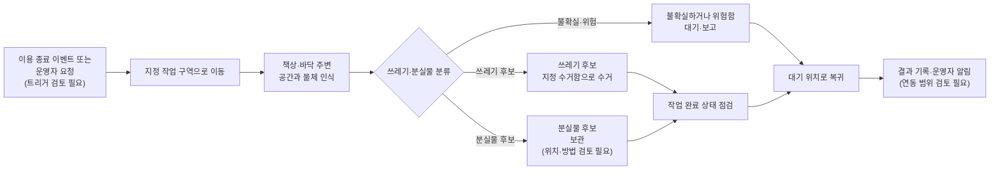

# 260708 - MVP 기능 범위

## 1. 결정

1차 MVP를 사전에 정한 소수의 쓰레기 물체 인식·분류·집기로 좁히기 위한 Planning Decision 초안이다. 분실물은 구분하되 건드리지 않으며, 공간 정돈·책상 닦기·소등·문단속은 후속 기능 후보로 둔다. 사람 검토 전이므로 아직 확정 결정이 아니다.

## 2. 이유

- Raw 요약은 여러 주요 기능을 나열하지만, 책상 닦기, 소등, 문단속, 관제 대시보드는 세부 방식 또는 MVP 포함 여부가 추가 확인 필요라고 표시되어 있다.
- 7/10 회의에서는 일반적인 모든 물체를 다루기보다 컵, 캔, 휴지 등 사전에 정한 소수 물체를 대상으로 안정적인 집기 시연을 우선하자는 방향이 논의됐다.
- 현장 공간의 지도·배치 변화와 시연 시간을 고려해 자율주행, 지도 생성, 대시보드는 핵심 집기 시연을 보강하는 요소로 다루는 방안이 논의됐다.
- MVP 범위는 성공 기준, Sprint 계획, 데모 시나리오, 기술 구현 우선순위에 직접 영향을 준다.
- 범위가 넓으면 안전 기준과 평가 지표도 함께 늘어난다.

## 3. 대안

| 대안 | 선택하지 않은 이유 |
|---|---|
| 사전에 정한 쓰레기 물체의 분류·집기만 우선 MVP로 둔다 | 7/10 회의에서 논의한 범위. 물체 목록, 성공 기준, 분실물·저신뢰 물체 처리 방식은 추가 정의가 필요하다. |
| 쓰레기 수거, 정돈, 자율 주행을 함께 우선 MVP로 둔다 | 기능 간 의존성과 현장 시연 리스크가 커질 수 있다. |
| 쓰레기 수거와 분실물 후보 보관을 함께 우선 MVP로 둔다 | 7/13·7/17 멘토링 준비에서 제안됐으나, 분실물 오분류 위험과 보관 위치·운영 책임이 정해지지 않았다. |
| Raw에 나온 모든 기능을 MVP에 포함한다 | 일정, 안전, 하드웨어 조작 범위 리스크가 커질 수 있다. |
| 관제 대시보드까지 MVP에 포함한다 | 기능 비교표에는 있으나 상세 요구사항이 부족하다. |

### 3.1 멘토링 검토용 대안 흐름

아래 그림은 7/13 멘토링 준비 문서의 제안을 재사용한 것이다. 분실물 후보를
보관하는 경로와 결과 기록·알림 범위는 검토 대상이며, 이 Decision 초안의 현재
가정(분실물 후보를 집거나 이동하지 않음)을 대체하지 않는다.

## 4. 가정

- MVP는 최종 상용 제품이 아니라 초기 데모와 검증을 위한 최소 범위로 본다.
- Raw에 명시된 기능이라도 세부 방식이 없는 항목은 검토 필요 상태로 유지한다.
- 분실물 후보와 저신뢰 물체는 1차 MVP에서 집거나 이동하지 않는다.
- 자율주행, 지도 생성, 대시보드는 현장 검증 결과에 따라 현장 시연 또는 영상 보완으로 제시할 수 있다.

## 5. 리스크

- MVP 범위를 과도하게 줄이면 프로젝트 차별성이 약해질 수 있다.
- MVP 범위를 과도하게 넓히면 데모 안정성과 일정 리스크가 커질 수 있다.
- 책상 닦기, 소등, 문단속은 물리 조작과 안전 책임이 커질 수 있다.
- 사전에 정한 물체에만 최적화하면 실제 환경 일반화가 제한될 수 있다.
- 분실물 오분류 또는 저신뢰 판단의 표시·운영자 대응이 정의되지 않으면 사용자 신뢰 리스크가 남는다.

## 6. 재검토 조건

- 실제 테스트 공간의 시설 인터페이스가 확인된다.
- 로봇 플랫폼의 조작 가능 범위와 페이로드가 확인된다.
- Sprint 일정과 팀 역할이 확정된다.
- 1차 MVP 물체 목록과 물체별 인식·집기 성공 기준이 정의된다.
- 현장 시연 공간의 지도·배치 변화에 대한 자율주행 안정성이 검증된다.

## 7. 출처

- [[40_RAW/20_Planning/기획서 원문 요약|기획서 원문 요약]]
- [[40_RAW/10_Meetings/260713 - 멘토 미팅 프로젝트 진행상황 공유 준비|멘토 미팅 프로젝트 진행상황 공유 준비]]
- [[40_RAW/10_Meetings/260717 - 신승렬 멘토님 멘토링 준비|신승렬 멘토님 멘토링 준비]]
