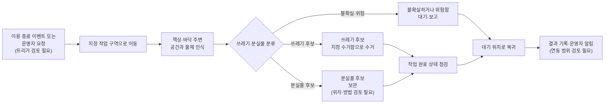

# 260708 - MVP 기능 범위

## 1. 결정

1차 MVP를 운영자 요청부터 Dashboard 결과 표시까지의 end-to-end 흐름으로 두는 Planning Decision 초안이다. 로봇은 사전에 정한 쓰레기와 분실물 후보를 구분해 각각의 보관 위치로 옮긴다. 공간 정돈·책상 닦기·소등·문단속은 후속 기능 후보로 둔다. 사람 검토 전이므로 아직 확정 결정이 아니다.

## 2. 이유

- 7/17 멘토링 준비 문서는 Dashboard·Backend의 Mission Queue를 통해 요청, 진행 상태, 결과를 연결하는 MVP 흐름을 제시한다.
- 쓰레기와 분실물 후보를 별도 보관 위치로 분리하면 사용자에게 보이는 처리 결과를 구분할 수 있다.
- 분실물의 분류 기준, 보관 기간, 운영자 인계 절차는 아직 정해지지 않아 별도 논의가 필요하다.
- MVP 범위는 성공 기준, Sprint 계획, 데모 시나리오, 기술 구현 우선순위에 직접 영향을 준다.
- 범위가 넓으면 안전 기준과 평가 지표도 함께 늘어난다.

## 3. 대안

| 대안 | 선택하지 않은 이유 |
|---|---|
| Dashboard·Backend를 포함해 쓰레기 수거와 분실물 별도 보관까지 MVP로 둔다 | 현재 MVP 초안. 분실물 분류 기준과 보관·인계 정책은 추가 정의가 필요하다. |
| 쓰레기 수거, 정돈, 자율 주행을 함께 우선 MVP로 둔다 | 기능 간 의존성과 현장 시연 리스크가 커질 수 있다. |
| 쓰레기 수거와 분실물 후보 보관만 우선 MVP로 둔다 | Dashboard·Backend를 제외하면 운영자 요청부터 결과 표시까지의 end-to-end 시연이 끊긴다. |
| Raw에 나온 모든 기능을 MVP에 포함한다 | 일정, 안전, 하드웨어 조작 범위 리스크가 커질 수 있다. |
| 관제 대시보드를 MVP에서 제외한다 | 운영자 요청, 진행 상태, 전후 결과 표시가 끊겨 end-to-end 시연 범위와 맞지 않는다. |

### 3.1 서비스 시나리오

작업은 운영자 요청 또는 이용 종료 이벤트로 시작해 지정 구역 이동, 물체 인식과
분류, 처리 결과 확인, 대기 위치 복귀와 결과 기록으로 이어진다. 쓰레기와 분실물
후보는 각각의 보관 위치로 옮기며, 분실물의 분류 기준·보관 기간·운영자 인계
절차와 결과 기록 인터페이스는 추가 정의가 필요하다.

## 4. 가정

- MVP는 최종 상용 제품이 아니라 초기 데모와 검증을 위한 최소 범위로 본다.
- Raw에 명시된 기능이라도 세부 방식이 없는 항목은 검토 필요 상태로 유지한다.
- 분실물 후보는 쓰레기 수거함과 분리된 보관함으로 이동한다. 분류 기준과 보관·인계 정책은 추가 정의가 필요하다.
- Dashboard·Backend는 운영자 요청, Mission Queue, 진행 상태, 전후 결과 표시를 담당한다.
- 현재 시연 환경은 개발센터 개발공간으로 한정한다.

## 5. 리스크

- MVP 범위를 과도하게 줄이면 프로젝트 차별성이 약해질 수 있다.
- MVP 범위를 과도하게 넓히면 데모 안정성과 일정 리스크가 커질 수 있다.
- 책상 닦기, 소등, 문단속은 물리 조작과 안전 책임이 커질 수 있다.
- 사전에 정한 물체에만 최적화하면 실제 환경 일반화가 제한될 수 있다.
- 분실물 오분류 또는 저신뢰 판단의 표시·운영자 대응이 정의되지 않으면 사용자 신뢰 리스크가 남는다.

## 6. 재검토 조건

- 실제 테스트 공간의 시설 인터페이스가 확인된다.
- 로봇 플랫폼의 조작 가능 범위와 페이로드가 확인된다.
- Sprint 일정과 팀 역할이 확정된다.
- 1차 MVP 물체 목록과 물체별 인식·집기 성공 기준이 정의된다.
- 현장 시연 공간의 지도·배치 변화에 대한 자율주행 안정성이 검증된다.

## 7. 출처

- [[40_RAW/기획서 원문 요약|기획서 원문 요약]]
- [[40_RAW/260713 - 멘토 미팅 프로젝트 진행상황 공유 준비|멘토 미팅 프로젝트 진행상황 공유 준비]]
- [[40_RAW/260717 - 신승렬 멘토님 멘토링 준비|신승렬 멘토님 멘토링 준비]]
