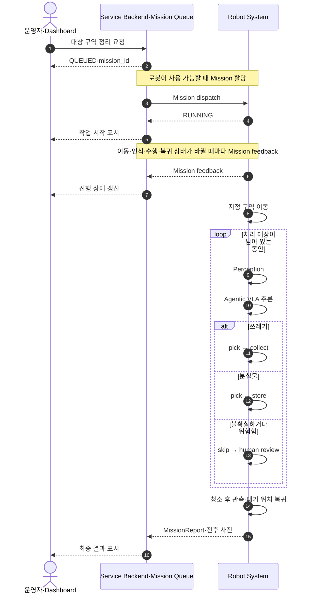
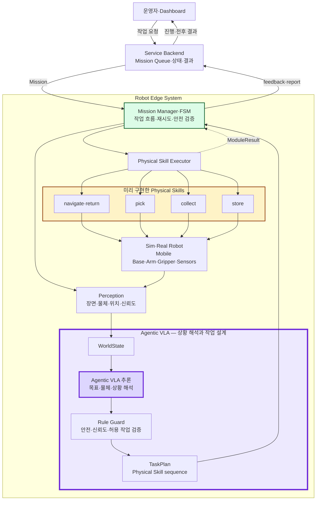
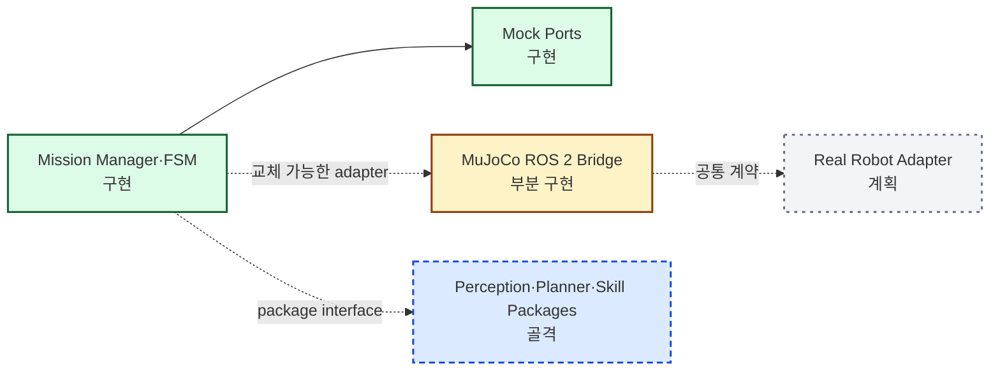

# 260717 - 신승렬 멘토님 멘토링 준비

## 1. 오늘 확인받을 내용

1. 쓰레기 수거·분실물 보관 중심의 MVP 범위가 적절한가?
2. FSM·Agentic VLA·Physical Skills의 책임 분리가 적절한가?
3. 현재 역할 분배에서 빠지거나 한 사람에게 과도하게 집중된 영역은 무엇인가?
4. 7월~11월 일정과 현장 시연·영상 보완 전략이 현실적인가?

## 2. 서비스와 MVP 범위

끌리니는 운영자가 지정한 구역으로 이동해 쓰레기와 분실물을 분류하고, 쓰레기는 수거하고 분실물은 보관한 뒤 작업 결과를 제공하는 무인 공간 관리 서비스다. 1차 타깃 후보는 무인 스터디카페다.

| 구분 | 범위 |
|---|---|
| MVP 포함 | 운영자 요청, 지정 구역 이동, 쓰레기·분실물 분류, 쓰레기 수거, 분실물 보관, 복귀, 전후 결과 제공 |
| MVP 제외 | 의자 정리, 책상 위 소형 집기 정리, 책상 닦기, 소등·문단속, 범용 물체 조작 |
| 안전 처리 | 불확실하거나 위험한 물체는 건너뛰고 사람 검토 요청 |
| 후속 확장 | 현장 설치·캘리브레이션, 운영 리포트, 다점포 관제, 임대·유지관리 |

## 3. 타깃 시나리오

- Backend는 Mission Queue와 사용자에게 보여 줄 상태를 관리한다.
- Robot System은 작업을 실행하고 Mission feedback과 최종 결과를 제공한다.

## 4. 핵심 아키텍처

- FSM은 Mission 상태와 실행 결과를 검증하되 물체별 작업 계획은 만들지 않는다.
- Agentic VLA는 Perception 결과를 해석해 안전 규칙을 통과한 TaskPlan을 만든다.
- 로봇은 미리 구현하고 검증한 Physical Skill만 실행하며 Sim·Real에서 같은 의미의 계약을 사용한다.

## 5. 역할 분배

| 팀원 | 주 담당 영역 | 핵심 산출물 |
|---|---|---|
| 이동근 | PM·서비스 플랫폼·Navigation | MVP 범위, Dashboard·Backend, Nav2 |
| 박창수 | ROS 2 Mission·Base Control·Hardware | Mission 연결, 이동 베이스, 하드웨어 통합 |
| 이정현 | Perception·Agentic VLA·Simulation | 인식, TaskPlan, MuJoCo 검증 |
| 공동 | 통합 테스트·안전 검토·현장 시연 | 전체 시나리오 검증 |
| 미정 | Manipulation·Physical Skills 최종 DRI | MoveIt, arm·gripper, 실제 집기 |

단위 테스트는 기능 구현자가 작성하고, 모듈 간 테스트는 연결된 담당자가 함께 작성한다. 전체 `요청 → 이동 → 분류 → 수거·보관 → 복귀 → 결과 표시` 시나리오는 세 명이 공동 검증한다.

## 6. 7월~11월 일정과 멘토 질문

개발은 `mock end-to-end → simulation → 부분 실기 → 전체 실기` 순서로 진행한다.

| 기간 | 목표 | 완료 기준 |
|---|---|---|
| 7월 | 범위·아키텍처·역할 확정 | MVP 범위와 ROS 2 인터페이스 기준선 합의 |
| 8월 | 플랫폼·Mock·MuJoCo 연결 | 요청부터 결과까지 simulation에서 동작 |
| 9월 | 인식·주행·집기 통합 | 핵심 기능의 simulation·부분 실기 결과 확보 |
| 10월 | 실환경 반복 검증 | 실패 처리와 안전 중단을 포함한 반복 시험 완료 |
| 11월 | 안정화·시연 | 실물 시연, 보완 영상, 보고서·발표 자료 완료 |

멘토님께 질문드릴 내용:

1. 현재 MVP에서 더 줄여야 할 기능은 무엇인가?
2. Agentic VLA와 FSM의 책임 경계가 적절한가?
3. Manipulation·Physical Skills 담당을 어떻게 나누는 것이 현실적인가?
4. 일정상 가장 큰 위험과 가장 먼저 검증할 항목은 무엇인가?

## 7. 부록: 구현 상세·근거 문서

### 7.1 현재 ROS 2 구현 현황

| 영역 | 책임 | 현재 상태 |
|---|---|---|
| 운영 UI·Backend | 작업 요청, Queue, 상태·결과 표시 | 최소 기능 정의 필요 |
| Mission Manager | FSM, 재시도, 결과 보고 | Core·Mock 구현 |
| Perception | 물체, 위치, 신뢰도 제공 | Package 골격 |
| Agentic VLA·Planner | TaskPlan과 Skill sequence 생성 | Package 골격 |
| Navigator·Skill Executor | 이동과 Physical Skill 실행 | Mock 중심 |
| Sim·Real Backend | 공통 명령·상태 계약 | MuJoCo 부분 구현, Real 계획 |

### 7.2 세부 역할 목록

| 번호 | 역할 | 주요 책임 | 주 담당 |
|---|---|---|---|
| 1 | PM·Product·Service | MVP 범위, 사용자 시나리오, 일정, 우선순위 | 이동근 |
| 2 | 운영 서비스 플랫폼 | Dashboard, Mission API, Queue, 상태·결과 저장 | 이동근 |
| 3 | ROS 2·Mission Orchestration | ROS interface, Mission Manager, Robot Gateway | 박창수 |
| 4 | Perception·Data | 탐지·분류·Segmentation, depth, 데이터셋, WorldState | 이정현 |
| 5 | Agentic VLA·Planner | Rule Guard, TaskPlan, Skill sequence | 이정현 |
| 6 | Navigation·SLAM | Mapping, localization, Nav2, 장애물 회피 | 이동근 |
| 7 | Mobile Base Control·Odometry | Mecanum 제어, encoder·IMU, odometry | 박창수 |
| 8 | Manipulation·Physical Skills | MoveIt, arm·gripper, pick·collect·store | 최종 DRI 미정 |
| 9 | Robot Hardware·Embedded Integration | 프레임, 전원, 모터, MCU, sensor, calibration | 박창수 |
| 10 | Simulation·Sim/Real | MuJoCo, 시나리오, Sim·Real 계약 검증 | 이정현 |

### 7.3 근거 문서

확정된 Technical Decision:

- [[30_DECISIONS/Technical/260708 - XLeRobot 기반 플랫폼|XLeRobot 기반 플랫폼]]
- [[30_DECISIONS/Technical/260714 - 4륜 메카넘 베이스|4륜 Mecanum 베이스]]
- [[30_DECISIONS/Technical/260714 - Jetson Orin NX 16GB|Jetson Orin NX 16GB]]

검토 중인 문서:

- [[10_PLANNING/00 - Project Brief|Project Brief]]
- [[10_PLANNING/04 - Scope and Non-Goals|Scope and Non-Goals]]
- [[20_TECHNICAL/00 - Technical Overview|Technical Overview]]
- [[20_TECHNICAL/11 - ROS 2 Software Architecture|ROS 2 Software Architecture]]
