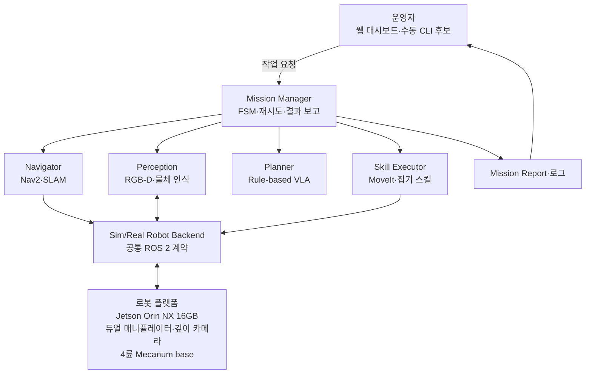
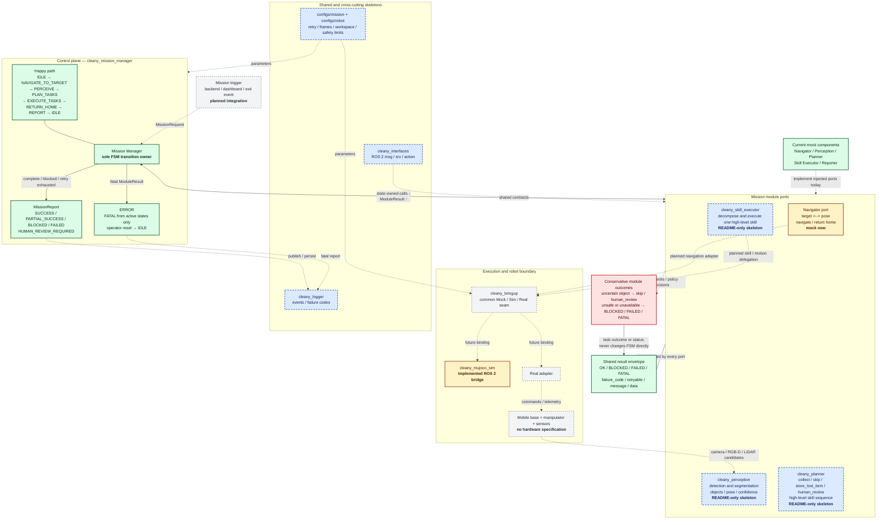
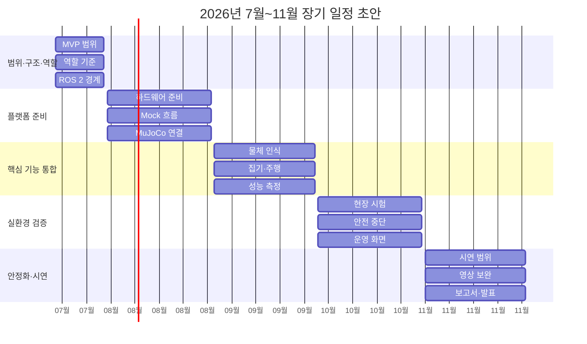

# 260717 - 신승렬 멘토님 멘토링 준비

## 1. 멘토링 맥락

- 2026년 7월 17일 신승렬 멘토님과 끌리니의 아키텍처, 역할 분배, 제공 서비스, 장기 일정을 논의하기 위해 정리한 문서다.
- 현재 KB의 `selected` Decision, `draft` 문서, Raw 기록을 한곳에 모았다. 근거가 없는 팀원별 담당과 월별 일정은 확정하지 않았다.
- 역할과 일정은 멘토링에서 의견을 나누기 위한 초안이다. 멘토링이 끝난 뒤 팀이 합의한 내용만 사람 검토를 거쳐 Planning·Technical·Decision 문서에 반영한다.

| 표기   | 의미                                  |
| ---- | ----------------------------------- |
| 확정   | `status: selected` Decision에 근거한 내용 |
| 논의 중 | 기존 문서에 있으나 아직 `draft` 또는 검토 필요인 내용  |
| 협의안  | 이번 멘토링에서 피드백을 받고 팀이 비교·수정하기 위한 제안   |

## 2. 멘토링 안건

1. 1차 MVP에서 실제로 제공할 사용자 경험과 제외 범위
2. 하드웨어·ROS 2·AI·운영 UI를 연결하는 전체 아키텍처
3. 팀원 3명의 주 책임, 공동 책임과 인수인계 경계
4. 2026년 7월부터 11월까지의 단계별 목표와 완료 기준
5. 현장 시연과 사전 영상의 역할, 멘토 피드백 이후 남길 결정과 후속 작업

## 3. 논의 내용

### 3.1 서비스 요약

끌리니의 1차 목표는 운영자가 지정한 구역의 쓰레기를 로봇이 찾아 수거하고 작업 결과를 알려 주는 것이다. 분실물로 보이거나 판단이 어려운 물체는 건드리지 않는다.

- 1차 타깃으로는 무인 스터디카페를 검토하고 있지만, 관련 Planning Decision은 아직 `draft`다.
- 1차 MVP에서 어떤 쓰레기까지 인식하고 집을지도 아직 검토 중이다.
- 자율주행, 지도 생성, 대시보드는 서비스에 필요하지만 현장 시연에서 어디까지 보여 줄지는 추가로 정해야 한다.

### 3.2 제공 서비스 구상

| 단계        | 운영자에게 제공하는 내용                                             | 의도적으로 제한하는 내용                                  | 현재 상태                         |
| --------- | --------------------------------------------------------- | ---------------------------------------------- | ----------------------------- |
| 1차 MVP·시연 | 운영자 요청, 지정 구역 이동, 사전 정의 쓰레기 인식·분류·집기·수거함 투입, 복귀, 작업 결과 확인 | 분실물 집기, 범용 물체 처리, 책상 닦기, 소등, 문단속, 상용 수준 대규모 관제 | 협의안, MVP 범위 Decision은 `draft` |
| 초기 현장 적용  | 공간 지도와 구역 등록, 로봇 호출·상태 확인, 현장 설치·캘리브레이션, 제한된 운영 리포트       | 고객이 모든 초기 세팅을 직접 수행하는 흐름, 다점포 통합 관제            | Raw에서 언급된 후보, 요구사항 추가 정의 필요   |
| 운영 상품화    | 로봇 임대, 유지관리 구독, 현장 설치·캘리브레이션 패키지                          | 가격, SLA, 장애 대응 체계는 아직 미정                       | 기획서의 장기 확장 후보                 |
| 후속 기능     | 공간 정리·정돈, 책상 닦기, 소등·문단속, 재고 관리·안전 점검                      | 1차 MVP에 동시 포함하지 않음                             | 장기 후보                         |

1차 MVP에서는 분실물로 보이거나 인식 신뢰도가 낮은 물체를 집지 않는다. 이런 물체를 작업 결과에 어떻게 기록하고 운영자에게 보여 줄지는 별도로 정해야 한다.

### 3.3 사용자 흐름 초안

1. 팀 또는 운영자가 초기 지도·구역·대기 위치를 설정한다.
2. 운영자가 웹 대시보드나 수동 인터페이스에서 정리할 구역을 지정한다.
3. 로봇이 요청을 받아 지정 구역으로 이동한다.
4. 인식 모듈이 발견한 물체를 쓰레기, 분실물 추정 물체, 판단이 어려운 물체로 구분한다.
5. Planner는 안전 규칙을 확인한 뒤 처리할 수 있는 쓰레기에만 집기 스킬을 지정한다.
6. 로봇이 쓰레기를 수거함에 투입하고 대기 위치로 복귀한다.
7. 작업 성공 여부, 건너뛴 물체, 실패 원인, 사람이 확인할 항목을 운영자에게 알려 준다.

자동 감지·호출, 분실물 보관, 범용 정리는 후속 단계에서 검토한다. 지도 생성 방식과 웹 대시보드의 최소 기능은 멘토님의 의견을 들은 뒤 팀에서 범위를 정한다.

### 3.4 전체 아키텍처 구상

구성요소별 역할과 담당 범위는 다음과 같다.

| 영역                       | 책임                                                    | 경계                                    | 상태                           |
| ------------------------ | ----------------------------------------------------- | ------------------------------------- | ---------------------------- |
| 운영 UI·Backend            | 작업 요청, 구역 선택, 상태·결과 확인                                | 로봇 내부 판단과 모터 제어를 수행하지 않음              | 최소 기능 추가 정의 필요               |
| Mission Manager          | 전체 작업 생명주기, FSM 상태, 재시도, 리포트                          | 인식·경로 계획·집기 내부 로직을 소유하지 않음            | Technical `draft`            |
| Perception               | 물체 후보, 범주, 위치와 신뢰도 제공                                 | 최종 행동을 확정하지 않음                        | Technical `draft`            |
| Rule-based VLA Planner   | high-level 작업과 스킬 순서 제안, 규칙 기반 검증                     | grasp·IK·trajectory를 직접 만들지 않음        | Decision `draft`             |
| Navigator·Skill Executor | 대상 구역 이동과 high-level 스킬 실행                            | Mission 상태를 직접 바꾸지 않음                 | Technical `draft`            |
| Sim/Real Robot Backend   | 같은 ROS 2 명령·상태 의미를 simulation과 실제 로봇에 연결              | 서비스·mission 의미를 해석하지 않음               | 계약 초안                        |
| 엣지 컴퓨팅                   | Jetson Orin NX 16GB에서 ROS 2와 온디바이스 추론 실행              | 실제 workload 성능은 benchmark 필요          | `selected`                   |
| 상부 로봇                    | XLeRobot의 듀얼 매니퓰레이터와 깊이 카메라 유지                        | 정확한 모델·페이로드·도달 범위·calibration은 추가 확인  | `selected`                   |
| 이동 베이스                   | 4륜 Mecanum, `linear.x`, `linear.y`, `angular.z` 기반 이동 | MCU 세부 계약·wheel geometry·안전 정지는 추가 정의 | `selected`                   |
| 프레임·센서 상세                | 상부와 base 연결, 작업 높이, TF, LiDAR·IMU 구성                  | 프레임과 정확한 장치 사양을 아직 확정하지 않음            | Decision `draft` 또는 추가 확인 필요 |

### 3.5 역할 분배 구조안

현재 Raw 기획서에는 이동근, 박창수, 이정현의 역할이 비어 있거나 임시 문구로 남아 있다. 각자의 전문 분야와 가용 시간, 기존 담당 업무를 확인할 수 없어 이름을 배정하지 않고 세 가지 책임 영역만 정리했다.

| 주 책임 영역         | 주요 책임                                                                                        | 1차 산출물                                    | 의존·인수인계                                | 담당자          |
| --------------- | -------------------------------------------------------------------------------------------- | ----------------------------------------- | -------------------------------------- | ------------ |
| 제품·서비스·검증       | 사용자 흐름, MVP 범위, 대시보드 최소 요구사항, 성공 기준, 테스트 시나리오, 일정·Jira 정렬                                    | 시나리오, 범위표, 평가표, 데모 운영안                    | AI·로봇 담당에게 물체 목록과 완료 기준 제공             | 멘토링 후 팀에서 확정 |
| AI 인식·판단        | 데이터와 물체 분류, Detection·Segmentation, 저신뢰 처리, Rule-based VLA·Planner, TensorRT benchmark       | WorldState 후보, 물체별 정책, 모델 비교와 성능 결과       | 제품 담당의 성공 기준을 입력받고 로봇 담당에게 typed 결과 제공 | 멘토링 후 팀에서 확정 |
| 로봇 플랫폼·ROS 2 통합 | 하드웨어 조립, frame·TF, Mecanum base, Mission Manager, navigation, manipulation, Sim/Real backend | 공통 ROS 2 계약, mock end-to-end, 실제 로봇 통합 결과 | AI 결과를 실행하고 제품 담당에게 mission report 제공  | 멘토링 후 팀에서 확정 |

안전 검토, 통합 테스트, 현장 시연, 최종 발표는 세 명이 함께 맡는다. 영역마다 담당자 한 명을 정하고, 통합 단계에서는 세 명 모두가 결과를 확인하는 방식을 제안한다.

멘토링에서는 역할을 세 영역으로 나누는 방식이 적절한지 의견을 구한다. 담당자는 다음 내용을 확인한 뒤 팀에서 정한다.

- 팀원별 주당 가용 시간과 7월 현재 진행 중인 작업
- ROS 2·하드웨어, AI 모델·데이터, 제품·UI 가운데 각자의 강점과 선호
- 혼자 결정할 수 있는 범위와 반드시 공동 리뷰할 변경
- 휴가·조달·멘토 지원처럼 일정에 영향을 주는 제약

### 3.6 2026년 7월~11월 장기 일정 협의안

기획서에는 5월부터 11월까지 할 일이 정리돼 있지만 월별 일정은 비어 있다. 아래 일정은 7월 17일 이후 남은 기간을 기준으로 잡은 초안이며, 프로젝트 마감일과 팀 가용 시간을 확인한 뒤 조정한다.

#### 일정 개요

간트차트의 날짜는 월별 작업 구간을 표시하기 위한 값이며 확정 마감일이 아니다. 실제 마감일과 팀원별 가용 시간을 확인한 뒤 작업 기간과 순서를 조정한다.

#### 단계별 완료 기준

| 기간    | 단계 목표                        | 완료 기준 초안                                                                          | 선행 결정·의존성                        |
| ----- | ---------------------------- | --------------------------------------------------------------------------------- | -------------------------------- |
| 7월 후반 | 범위·구조·역할 기준선                 | MVP 물체 후보와 제외 범위, 역할 오너, 프레임 방향, 최소 ROS 2 인터페이스, 테스트 공간 후보 합의                     | MVP 범위·역할·프레임 검토                 |
| 8월    | 플랫폼 bringup과 mock end-to-end | 하드웨어 조립 또는 조립 가능 상태 확인, Mission Manager가 mock 모듈로 요청부터 결과까지 동작, MuJoCo base 계약 연결 | 부품 조달, MCU 계약, robot description |
| 9월    | 핵심 기능 통합                     | 사전 정의 물체 인식, 집기 스킬, Nav2 또는 제한 주행을 simulation·부분 실기에서 연결하고 1차 성능 수치 확보            | 물체 목록, 성공 기준, sensor calibration |
| 10월   | 실환경 통합·반복 검증                 | 실제 후보 공간에서 반복 시험, 주요 실패 코드와 안전 중단 확인, 최소 대시보드 또는 운영 인터페이스 연결                      | 테스트 공간, 운영 UI 범위, 안전 기준          |
| 11월   | 안정화·시연·산출물                   | 현장 실물 시연 범위 확정, 불안정 기능 영상 보완, 데모 영상·결과보고서·발표자료 완료                                 | 평가 결과, 시연 장소·시간, 최종 마감일          |

일정 운영 원칙 초안:

- 개발은 `mock end-to-end → simulation → 부분 실기 → 전체 실기` 순서로 진행한다.
- 월말 목표는 기능 구현 여부가 아니라 같은 시나리오를 반복할 수 있는지와 측정 결과로 판단한다.
- 하드웨어 조달, 프레임 제작, calibration이 늦어질 가능성에 대비해 현장 시연과 사전 영상을 함께 준비한다.
- 대시보드나 장기 기능이 핵심 집기 안정화를 늦추면 1차 MVP 이후로 미룬다.

### 3.7 프로젝트 이후 확장 단계

| 단계        | 검증할 내용                                         | 다음 단계 진입 조건 후보              |
| --------- | ---------------------------------------------- | --------------------------- |
| 단일 공간 파일럿 | 설치·지도·calibration 시간, 수거 성공률, 운영자 개입 횟수, 장애 대응 | 운영자가 감당 가능한 초기 세팅과 반복 성능 확인 |
| 제한적 운영 상품 | 로봇 임대, 유지관리 구독, 현장 설치 패키지와 지원 범위               | 비용·고장률·유지관리 시간과 고객 가치 검증    |
| 다점포 확장    | 원격 상태 확인, fleet·로그, 업종별 작업 스킬                  | 단일 공간 운영 데이터와 서비스 운영 체계 확보  |

가격, SLA, 고객 지원, 다점포 운영 방식은 아직 논의할 근거가 부족하므로 이번 멘토링에서는 확정하지 않는다.

## 4. 결정 후보

| 결정 후보 | 유형 | 이번 멘토링의 기준안 | 반영 대상 | 상태 |
|---|---|---|---|---|
| 1차 MVP 제공 서비스 범위 | planning | 사전 정의 쓰레기 인식·집기·수거와 결과 보고에 집중 | [[30_DECISIONS/Planning/260708 - MVP 기능 범위]] | 사람 검토 필요 |
| 1차 타깃 | planning | 무인 스터디카페를 우선 후보로 검토 | [[30_DECISIONS/Planning/260708 - 1차 타깃 무인 스터디카페]] | 사람 검토 필요 |
| 팀 역할과 책임 경계 | planning | 제품·서비스·검증, AI 인식·판단, 로봇 플랫폼·통합의 단일 오너 구조 | [[10_PLANNING/99 - Questions]] | 담당자 확인 필요 |
| 7월~11월 단계별 일정 | planning | 기준선, bringup, 핵심 통합, 실환경 검증, 최종 시연의 5단계 | [[10_PLANNING/00 - Project Brief]] | 마감일·가용 시간 확인 필요 |
| 현장 시연과 영상 보완 | planning | 집기·분류는 실물 우선, 지도·전체 흐름은 안정성에 따라 영상 보완 | [[10_PLANNING/04 - Scope and Non-Goals]] | 사람 검토 필요 |
| 소프트웨어 책임 경계 | technical | Mission Manager만 FSM을 소유하고 Sim/Real backend를 분리 | [[20_TECHNICAL/11 - ROS 2 Software Architecture]] | Technical `draft` |

## 5. 멘토링 중 피드백과 팀 결론

아래 표에는 멘토님의 의견과 멘토링 후 팀에서 정한 내용을 나누어 기록한다.

| 안건            | 멘토 피드백   | 팀 결론     | 상태  |
| ------------- | -------- | -------- | --- |
| 1차 MVP 서비스 범위 | 멘토링 중 기록 | 멘토링 후 기록 | 미결정 |
| 팀원별 역할        | 멘토링 중 기록 | 멘토링 후 기록 | 미결정 |
| 7월~11월 일정     | 멘토링 중 기록 | 멘토링 후 기록 | 미결정 |
| 현장 시연 범위      | 멘토링 중 기록 | 멘토링 후 기록 | 미결정 |
| 후속 기술 결정      | 멘토링 중 기록 | 멘토링 후 기록 | 미결정 |

## 6. 후속 작업

| 작업                                        | 담당자          | 관련 Jira |
| ----------------------------------------- | ------------ | ------- |
| 팀원별 주 책임과 백업 담당 확정                        | 멘토링 후 팀에서 지정 |         |
| 1차 MVP 물체 종류·개수·성공 기준 정의                  | 멘토링 후 팀에서 지정 |         |
| 실제 테스트 공간과 최종 마감일 확인                      | 멘토링 후 팀에서 지정 |         |
| 월별 milestone을 Sprint와 Jira Epic/Story로 분해 | 멘토링 후 팀에서 지정 |         |
| 대시보드 최소 기능과 현장·영상 시연 경계 확정                | 멘토링 후 팀에서 지정 |         |
| 합의된 Planning·Technical·Decision 문서 갱신     | 멘토링 후 팀에서 지정 |         |

## 7. 근거 문서

### 7.1 확정된 Technical Decision

- [[30_DECISIONS/Technical/260708 - XLeRobot 기반 플랫폼|XLeRobot 기반 플랫폼]]
- [[30_DECISIONS/Technical/260714 - 4륜 메카넘 베이스|4륜 메카넘 베이스]]
- [[30_DECISIONS/Technical/260714 - Jetson Orin NX 16GB|Jetson Orin NX 16GB]]

### 7.2 검토 중인 Planning·Technical 문서

- [[10_PLANNING/00 - Project Brief|Project Brief]]
- [[10_PLANNING/04 - Scope and Non-Goals|Scope and Non-Goals]]
- [[10_PLANNING/99 - Questions|Planning Questions]]
- [[20_TECHNICAL/00 - Technical Overview|Technical Overview]]
- [[20_TECHNICAL/11 - ROS 2 Software Architecture|ROS 2 Software Architecture]]
- [[20_TECHNICAL/99 - Questions|Technical Questions]]

### 7.3 Raw 근거

- [[40_RAW/20_Planning/기획서 원문 요약|기획서 원문 요약]]
- [[40_RAW/10_Meetings/260710 - KB 운영 및 MVP 범위 회의|260710 - KB 운영 및 MVP 범위 회의]]
