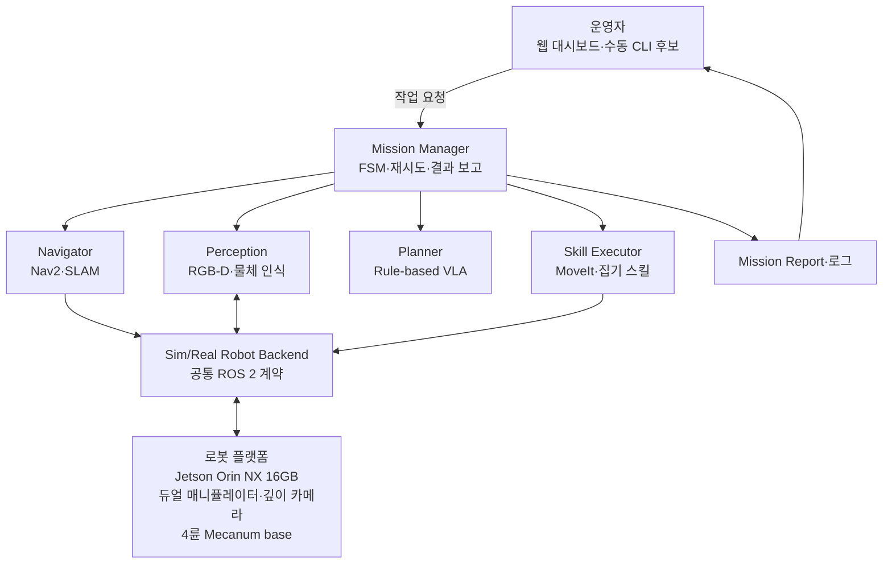

# 260717 - 신승렬 멘토님 멘토링 준비

## 1. 멘토링 맥락

- 2026년 7월 17일 신승렬 멘토님과의 멘토링에서 끌리니의 대략적인 아키텍처, 역할 분배, 제공 서비스와 장기 일정을 설명하고 피드백을 받기 위한 준비안이다.
- 현재 KB의 `selected` Decision, `draft` 문서와 Raw 기록을 한곳에 모았으며, 근거가 없는 팀원별 담당과 월별 일정은 확정하지 않았다.
- 이 문서의 역할·일정 제안은 멘토링 논의를 시작하기 위한 협의안이다. 멘토 피드백을 받은 뒤 팀이 합의한 결론만 Planning·Technical·Decision 문서에 사람 검토 후 반영한다.

| 표기   | 의미                                  |
| ---- | ----------------------------------- |
| 확정   | `status: selected` Decision에 근거한 내용 |
| 논의 중 | 기존 문서에 있으나 아직 `draft` 또는 검토 필요인 내용  |
| 협의안  | 이번 멘토링에서 피드백을 받고 팀이 비교·수정하기 위한 제안   |

## 2. 멘토링 안건

1. 1차 MVP에서 실제로 제공할 사용자 경험과 제외 범위
2. 하드웨어·ROS 2·AI·운영 UI를 연결하는 전체 아키텍처
3. 팀원 3명의 주 책임, 공동 책임과 인수인계 경계
4. 2026년 7월부터 11월까지의 단계별 목표와 완료 기준
5. 현장 시연과 사전 영상의 역할, 멘토 피드백 이후 남길 결정과 후속 작업

## 3. 논의 내용

### 3.1 한 문장 제안

끌리니는 운영자가 지정 구역의 정리를 요청하면 로봇이 해당 구역으로 이동해 사전에 정한 쓰레기를 인식·수거하고, 분실물 후보나 불확실한 물체는 건드리지 않은 채 작업 결과를 운영자에게 알려 주는 무인 공간 관리 서비스로 시작한다.

- 1차 타깃은 무인 스터디카페가 가장 구체적인 후보지만 Planning Decision은 아직 `draft`다.
- 1차 MVP의 쓰레기 인식·분류·집기 범위도 사람 검토 전인 `draft`다.
- 자율주행·지도 생성·대시보드는 핵심 가치를 연결하는 구성요소이지만 현장 시연 수준은 추가 합의가 필요하다.

### 3.2 제공 서비스 구상

| 단계 | 운영자에게 제공하는 내용 | 의도적으로 제한하는 내용 | 현재 상태 |
|---|---|---|---|
| 1차 MVP·시연 | 운영자 요청, 지정 구역 이동, 사전 정의 쓰레기 인식·분류·집기·수거함 투입, 복귀, 작업 결과 확인 | 분실물 집기, 범용 물체 처리, 책상 닦기, 소등, 문단속, 상용 수준 대규모 관제 | 협의안, MVP 범위 Decision은 `draft` |
| 초기 현장 적용 | 공간 지도와 구역 등록, 로봇 호출·상태 확인, 현장 설치·캘리브레이션, 제한된 운영 리포트 | 고객이 모든 초기 세팅을 직접 수행하는 흐름, 다점포 통합 관제 | Raw에서 언급된 후보, 요구사항 추가 정의 필요 |
| 운영 상품화 | 로봇 임대, 유지관리 구독, 현장 설치·캘리브레이션 패키지 | 가격, SLA, 장애 대응 체계는 아직 미정 | 기획서의 장기 확장 후보 |
| 후속 기능 | 공간 정리·정돈, 책상 닦기, 소등·문단속, 재고 관리·안전 점검 | 1차 MVP에 동시 포함하지 않음 | 장기 후보 |

분실물 후보와 저신뢰 물체는 1차 MVP에서 조작하지 않는다. 다만 이를 작업 결과에 어떻게 기록하고 운영자에게 어떻게 보여 줄지는 별도 정의가 필요하다.

### 3.3 사용자 흐름 초안

1. 팀 또는 운영자가 초기 지도·구역·대기 위치를 설정한다.
2. 운영자가 웹 대시보드 후보 또는 수동 인터페이스에서 대상 구역의 정리를 요청한다.
3. 로봇이 요청을 받아 지정 구역으로 이동한다.
4. 인식 모듈이 물체 후보를 쓰레기, 분실물 후보, 기타·저신뢰 물체로 구분한다.
5. Planner와 규칙 기반 검증이 안전하게 처리할 수 있는 쓰레기에 대해서만 집기 스킬을 선택한다.
6. 로봇이 쓰레기를 수거함에 투입하고 대기 위치로 복귀한다.
7. 작업 성공·건너뜀·실패·사람 검토 필요 결과를 운영자에게 제공한다.

자동 감지·자동 호출, 분실물 보관과 범용 정리는 후속 단계로 둔다. 지도 생성 방식과 웹 대시보드의 최소 입력·상태 항목은 이번 멘토링에서 의견을 구한 뒤 팀이 범위를 정해야 한다.

### 3.4 전체 아키텍처 구상

아키텍처 책임 경계는 다음과 같이 설명한다.

| 영역 | 책임 | 경계 | 상태 |
|---|---|---|---|
| 운영 UI·Backend | 작업 요청, 구역 선택, 상태·결과 확인 | 로봇 내부 판단과 모터 제어를 수행하지 않음 | 최소 기능 추가 정의 필요 |
| Mission Manager | 전체 작업 생명주기, FSM 상태, 재시도, 리포트 | 인식·경로 계획·집기 내부 로직을 소유하지 않음 | Technical `draft` |
| Perception | 물체 후보, 범주, 위치와 신뢰도 제공 | 최종 행동을 확정하지 않음 | Technical `draft` |
| Rule-based VLA Planner | high-level 작업과 스킬 순서 제안, 규칙 기반 검증 | grasp·IK·trajectory를 직접 만들지 않음 | Decision `draft` |
| Navigator·Skill Executor | 대상 구역 이동과 high-level 스킬 실행 | Mission 상태를 직접 바꾸지 않음 | Technical `draft` |
| Sim/Real Robot Backend | 같은 ROS 2 명령·상태 의미를 simulation과 실제 로봇에 연결 | 서비스·mission 의미를 해석하지 않음 | 계약 초안 |
| 엣지 컴퓨팅 | Jetson Orin NX 16GB에서 ROS 2와 온디바이스 추론 실행 | 실제 workload 성능은 benchmark 필요 | `selected` |
| 상부 로봇 | XLeRobot의 듀얼 매니퓰레이터와 깊이 카메라 유지 | 정확한 모델·페이로드·도달 범위·calibration은 추가 확인 | `selected` |
| 이동 베이스 | 4륜 Mecanum, `linear.x`, `linear.y`, `angular.z` 기반 이동 | MCU 세부 계약·wheel geometry·안전 정지는 추가 정의 | `selected` |
| 프레임·센서 상세 | 상부와 base 연결, 작업 높이, TF, LiDAR·IMU 구성 | 프레임과 정확한 장치 사양을 아직 확정하지 않음 | Decision `draft` 또는 추가 확인 필요 |

### 3.5 역할 분배 구조안

현재 Raw 기획서에는 이동근, 박창수, 이정현의 역할이 비어 있거나 placeholder로 남아 있다. 전문성, 가용 시간과 기존 담당 근거가 없으므로 이 문서에서는 이름을 임의 배정하지 않고 세 개의 주 책임 영역을 먼저 제안한다.

| 주 책임 영역 | 주요 책임 | 1차 산출물 | 의존·인수인계 | 담당자 |
|---|---|---|---|---|
| 제품·서비스·검증 | 사용자 흐름, MVP 범위, 대시보드 최소 요구사항, 성공 기준, 테스트 시나리오, 일정·Jira 정렬 | 시나리오, 범위표, 평가표, 데모 운영안 | AI·로봇 담당에게 물체 목록과 완료 기준 제공 | 멘토링 후 팀에서 확정 |
| AI 인식·판단 | 데이터와 물체 분류, Detection·Segmentation, 저신뢰 처리, Rule-based VLA·Planner, TensorRT benchmark | WorldState 후보, 물체별 정책, 모델 비교와 성능 결과 | 제품 담당의 성공 기준을 입력받고 로봇 담당에게 typed 결과 제공 | 멘토링 후 팀에서 확정 |
| 로봇 플랫폼·ROS 2 통합 | 하드웨어 조립, frame·TF, Mecanum base, Mission Manager, navigation, manipulation, Sim/Real backend | 공통 ROS 2 계약, mock end-to-end, 실제 로봇 통합 결과 | AI 결과를 실행하고 제품 담당에게 mission report 제공 | 멘토링 후 팀에서 확정 |

공동 책임은 안전 검토, 통합 테스트, 현장 데모와 최종 발표다. 각 영역에는 한 명의 최종 오너를 두되, 통합 milestone은 세 명 모두가 함께 검증하는 방식을 제안한다.

멘토링에서 역할 구조에 대한 의견을 구하고, 팀은 다음 정보를 확인한 뒤 이름을 배정한다.

- 팀원별 주당 가용 시간과 7월 현재 진행 중인 작업
- ROS 2·하드웨어, AI 모델·데이터, 제품·UI 가운데 각자의 강점과 선호
- 혼자 결정할 수 있는 범위와 반드시 공동 리뷰할 변경
- 휴가·조달·멘토 지원처럼 일정에 영향을 주는 제약

### 3.6 2026년 7월~11월 장기 일정 협의안

기획서에는 5월부터 11월까지 추진 항목이 있으나 월별 배치가 비어 있다. 아래 일정은 2026년 7월 17일 멘토링 이후 남은 기간을 기준으로 역산한 협의안이며, 실제 프로젝트 마감일과 팀 가용 시간을 확인한 뒤 조정해야 한다.

| 기간 | 단계 목표 | 완료 기준 초안 | 선행 결정·의존성 |
|---|---|---|---|
| 7월 후반 | 범위·구조·역할 기준선 | MVP 물체 후보와 제외 범위, 역할 오너, 프레임 방향, 최소 ROS 2 인터페이스, 테스트 공간 후보 합의 | MVP 범위·역할·프레임 검토 |
| 8월 | 플랫폼 bringup과 mock end-to-end | 하드웨어 조립 또는 조립 가능 상태 확인, Mission Manager가 mock 모듈로 요청부터 결과까지 동작, MuJoCo base 계약 연결 | 부품 조달, MCU 계약, robot description |
| 9월 | 핵심 기능 통합 | 사전 정의 물체 인식, 집기 스킬, Nav2 또는 제한 주행을 simulation·부분 실기에서 연결하고 1차 성능 수치 확보 | 물체 목록, 성공 기준, sensor calibration |
| 10월 | 실환경 통합·반복 검증 | 실제 후보 공간에서 반복 시험, 주요 실패 코드와 안전 중단 확인, 최소 대시보드 또는 운영 인터페이스 연결 | 테스트 공간, 운영 UI 범위, 안전 기준 |
| 11월 | 안정화·시연·산출물 | 현장 실물 시연 범위 확정, 불안정 기능 영상 보완, 데모 영상·결과보고서·발표자료 완료 | 평가 결과, 시연 장소·시간, 최종 마감일 |

일정 운영 원칙 초안:

- 1차 경로는 `mock end-to-end → simulation → 부분 실기 → 전체 실기` 순서로 둔다.
- 각 월말 milestone은 기능 존재 여부가 아니라 반복 가능한 시나리오와 측정 결과로 판정한다.
- 하드웨어 조달·프레임·calibration 지연을 고려해 현장 시연과 사전 영상 경로를 함께 준비한다.
- 대시보드나 장기 기능이 핵심 집기 안정화를 늦추면 1차 MVP 이후로 미룬다.

### 3.7 프로젝트 이후 확장 단계

| 단계 | 검증할 내용 | 다음 단계 진입 조건 후보 |
|---|---|---|
| 단일 공간 파일럿 | 설치·지도·calibration 시간, 수거 성공률, 운영자 개입 횟수, 장애 대응 | 운영자가 감당 가능한 초기 세팅과 반복 성능 확인 |
| 제한적 운영 상품 | 로봇 임대, 유지관리 구독, 현장 설치 패키지와 지원 범위 | 비용·고장률·유지관리 시간과 고객 가치 검증 |
| 다점포 확장 | 원격 상태 확인, fleet·로그, 업종별 작업 스킬 | 단일 공간 운영 데이터와 서비스 운영 체계 확보 |

가격, SLA, 고객 지원과 다점포 운영 구조는 현재 근거가 없어 이 멘토링에서 확정하지 않는다.

## 4. 결정 후보

| 결정 후보 | 유형 | 이번 멘토링의 기준안 | 반영 대상 | 상태 |
|---|---|---|---|---|
| 1차 MVP 제공 서비스 범위 | planning | 사전 정의 쓰레기 인식·집기·수거와 결과 보고에 집중 | [[30_DECISIONS/Planning/260708 - MVP 기능 범위|MVP 기능 범위]] | 사람 검토 필요 |
| 1차 타깃 | planning | 무인 스터디카페를 우선 후보로 검토 | [[30_DECISIONS/Planning/260708 - 1차 타깃 무인 스터디카페|1차 타깃 무인 스터디카페]] | 사람 검토 필요 |
| 팀 역할과 책임 경계 | planning | 제품·서비스·검증, AI 인식·판단, 로봇 플랫폼·통합의 단일 오너 구조 | [[10_PLANNING/99 - Questions|Planning Questions]] | 담당자 확인 필요 |
| 7월~11월 단계별 일정 | planning | 기준선, bringup, 핵심 통합, 실환경 검증, 최종 시연의 5단계 | [[10_PLANNING/00 - Project Brief|Project Brief]] | 마감일·가용 시간 확인 필요 |
| 현장 시연과 영상 보완 | planning | 집기·분류는 실물 우선, 지도·전체 흐름은 안정성에 따라 영상 보완 | [[10_PLANNING/04 - Scope and Non-Goals|Scope and Non-Goals]] | 사람 검토 필요 |
| 소프트웨어 책임 경계 | technical | Mission Manager만 FSM을 소유하고 Sim/Real backend를 분리 | [[20_TECHNICAL/11 - ROS 2 Software Architecture|ROS 2 Software Architecture]] | Technical `draft` |

## 5. 멘토링 중 피드백과 팀 결론

이 문서는 멘토링 전 준비안이므로 아직 멘토 피드백이나 팀 결론이 없다. 아래 표는 멘토의 의견과 그에 대한 팀의 후속 판단을 구분해 기록하기 위한 공간이다.

| 안건 | 멘토 피드백 | 팀 결론 | 상태 |
|---|---|---|---|
| 1차 MVP 서비스 범위 | 멘토링 중 기록 | 멘토링 후 기록 | 미결정 |
| 팀원별 역할 | 멘토링 중 기록 | 멘토링 후 기록 | 미결정 |
| 7월~11월 일정 | 멘토링 중 기록 | 멘토링 후 기록 | 미결정 |
| 현장 시연 범위 | 멘토링 중 기록 | 멘토링 후 기록 | 미결정 |
| 후속 기술 결정 | 멘토링 중 기록 | 멘토링 후 기록 | 미결정 |

## 6. 후속 작업

| 작업 | 담당자 | 관련 Jira |
|---|---|---|
| 팀원별 주 책임과 백업 담당 확정 | 멘토링 후 팀에서 지정 |  |
| 1차 MVP 물체 종류·개수·성공 기준 정의 | 멘토링 후 팀에서 지정 |  |
| 실제 테스트 공간과 최종 마감일 확인 | 멘토링 후 팀에서 지정 |  |
| 월별 milestone을 Sprint와 Jira Epic/Story로 분해 | 멘토링 후 팀에서 지정 |  |
| 대시보드 최소 기능과 현장·영상 시연 경계 확정 | 멘토링 후 팀에서 지정 |  |
| 합의된 Planning·Technical·Decision 문서 갱신 | 멘토링 후 팀에서 지정 |  |

## 7. 근거 문서

### 7.1 확정된 Technical Decision

- [[30_DECISIONS/Technical/260708 - XLeRobot 기반 플랫폼|XLeRobot 기반 플랫폼]]
- [[30_DECISIONS/Technical/260714 - 4륜 메카넘 베이스|4륜 메카넘 베이스]]
- [[30_DECISIONS/Technical/260714 - Jetson Orin NX 16GB|Jetson Orin NX 16GB]]

### 7.2 검토 중인 Planning·Technical 문서

- [[10_PLANNING/00 - Project Brief|Project Brief]]
- [[10_PLANNING/04 - Scope and Non-Goals|Scope and Non-Goals]]
- [[10_PLANNING/99 - Questions|Planning Questions]]
- [[20_TECHNICAL/00 - Technical Overview|Technical Overview]]
- [[20_TECHNICAL/11 - ROS 2 Software Architecture|ROS 2 Software Architecture]]
- [[20_TECHNICAL/99 - Questions|Technical Questions]]

### 7.3 Raw 근거

- [[40_RAW/20_Planning/기획서 원문 요약|기획서 원문 요약]]
- [[40_RAW/10_Meetings/260710 - KB 운영 및 MVP 범위 회의|260710 - KB 운영 및 MVP 범위 회의]]
