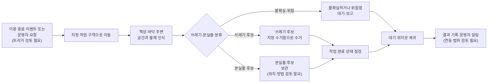
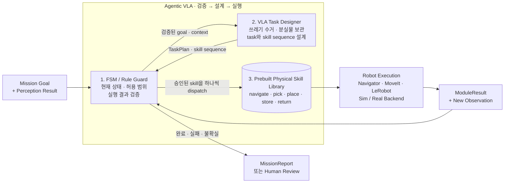

# 260713 - 멘토 미팅 프로젝트 진행상황 공유 준비

## 1. 회의 맥락

이 문서는 멘토 미팅에서 Cleany 구현 진행 상황을 짧게 공유하고, 다음 기술
우선순위에 대한 피드백을 받기 위한 준비 노트다. 회의 결과나 확정 결정이 아니며,
합의된 내용은 회의 후 Technical 문서 또는 Decision 초안에 별도로 반영한다.

### 1.1 조회 기준

| 구분 | 기준 | 해석 |
|---|---|---|
| 공식 구현 기준선 | 상위 구현 저장소 `main`의 `ba07945` | 병합 완료 상태 |
| `main`의 docs 포인터 | `cfe783e` | 상위 `main`이 참조하는 KB snapshot |
| 검토 예정 구현 | `feat/sim-mission-roundtrip` | 아직 `main`에 병합되지 않은 WIP |
| 최신 KB 초안 | docs 저장소의 draft 문서 | 검토 재료이며 확정 결정이 아님 |

이 문서에서 `완료`는 원칙적으로 상위 구현 저장소 `main`에 병합된 항목을 뜻한다.
현재 feature branch의 결과는 `WIP`로 분리하고, 자동 검증 결과도 해당 branch의
결과로 표시한다.

### 1.2 60초 공유문

> 현재 `main`에는 Docker 기반 ROS 2 Humble 개발 환경, 순수 Mission Manager
> FSM과 Mock 흐름, MuJoCo의 odom·scan·TF bridge가 병합되어 있습니다. 다만
> Mission 요청과 실제 base 이동은 아직 연결되지 않았습니다. 현재 feature
> branch에서는 ExecuteMission Action부터 `/cmd_vel`, MuJoCo, `/odom`, 원점
> 복귀, MissionReport까지 이어지는 0.5m 왕복 vertical slice를 구현하고 자동
> 검증했습니다. 이 구현은 Nav2가 아니라 integration adapter이며, 이번
> 미팅에서는 이 경계가 적절한지와 다음 우선순위를 검토받고 싶습니다.

### 1.3 타깃 시나리오



이 흐름은 `main`이 참조하는 draft Target Scenario의 핵심 흐름을 요약한 것이다.
2026-07-13 전달된 범위 결정에 따라 MVP 작업은 쓰레기 후보의 수거와 분실물
후보의 보관으로 한정한다. 의자·소형 집기 정리, 책상 닦기, 소등, 문단속은 MVP에서
제외한다. `main`이 참조하는 Target Scenario 초안에는 이 작업들이 아직 포함되어
있으므로, 회의 후 공식 Planning 또는 Decision 문서 반영이 필요하다. 관제
대시보드의 MVP 포함 여부와 분실물 보관 위치·방법은 아직 확정하지 않는다.

## 2. 안건

1. `main`에 병합된 구현 범위와 아직 연결되지 않은 경계를 공유한다.
2. `feat/sim-mission-roundtrip`의 vertical slice 구조와 검증 결과를 시연한다.
3. 시험용 `OdomTestNavigator`에서 Nav2 adapter로 넘어가는 순서를 검토한다.
4. Action lifecycle, base command, frame, 안전 정지 계약에서 추가 결정이 필요한
   항목을 확인한다.
5. 다음 Sprint의 우선순위와 PR 분리·병합 순서를 정한다.

## 3. 논의 내용

### 3.1 `main` 기준 구현 현황

| 영역 | `main`에 병합된 내용 | 아직 연결되지 않은 내용 |
|---|---|---|
| 개발 환경 | Docker 기반 ROS 2 Humble build/test wrapper | 실제 Jetson·ROS·JetPack 조합 검증 |
| Mission Manager | ROS 비의존 core FSM, module port, Mock Navigator·Perception·Planner·Skill Executor, retry·report·ERROR/reset 정책 | ROS Action node와 실제 robot backend 연결 |
| MuJoCo | XLeRobot scene load, timer step, `joint_states`, `odom`, `scan`, `tf`, `tf_static`, 시험용 `~/joint_cmd` | `/cmd_vel` base command와 Mission 연동 |
| ROS interface | `cleany_interfaces` 책임을 설명하는 README | 실제 msg/action package와 생성되는 ROS type |
| 기타 subsystem | Perception, Planner, Skill Executor, Robot Interface, Logger package 경계 README | 실행 node와 실제 adapter |
| 자동 테스트 | Mission flow 11개, MuJoCo 20개 등 test function 31개가 source에 존재 | Mission에서 MuJoCo까지의 end-to-end test |

`main`의 가장 큰 integration gap은 Mission Manager와 MuJoCo가 각각 검증되지만
서로 통신하지 않는다는 점이다. `cleany_mujoco_sim`의 README에도 `/cmd_vel`과
Mission binding이 미구현으로 명시되어 있다.

### 3.2 Agentic VLA 중심 핵심 아키텍처



이 그림에서 Agentic VLA는 단일 모델이 아니라 FSM 검증, VLA 설계, 사전 정의
Physical Skill 실행을 반복하는 상위 시스템 구조다. FSM은 mission 상태, 허용된 MVP
범위와 실행 결과를 검증한다. VLA는 쓰레기 수거 또는 분실물 보관 task와 필요한
skill sequence만 설계한다. FSM이 승인한 skill을 하나씩 실행하고 결과를 다시 받아
retry, 재설계, report 여부를 결정한다.

VLA는 joint command나 trajectory를 직접 생성하지 않고 Mission Manager의 상태도
직접 바꾸지 않는다. 실제 이동·집기·배치는 미리 구현하고 검증한 Physical Skill과
하위 robot tool이 담당한다.

이 그림은 목표 구조 초안이다. 현재 WIP에서는 Perception, VLA/Planner, Skill
Executor가 Mock이고 Navigator와 MuJoCo base의 왕복 계약만 실제로 연결되어 있다.
최신 KB는 이를 `Rule-based VLA 3 Layer` 초안으로 관리하므로 이 거시 구조와의
대응 관계, 공식 명칭과 계층별 책임은 멘토 검토가 필요하다.

### 3.3 현재 feature branch의 WIP

기능별 커밋은 다음 순서로 분리되어 있다.

| 커밋 | 내용 | 리뷰 관점 |
|---|---|---|
| `a8f145c` | MissionRequest·ModuleResult·MissionReport msg와 ExecuteMission Action | 외부 ROS 계약 |
| `5a75315` | MuJoCo `/cmd_vel` PI base controller | 방향, 제한, timeout, zero control |
| `d49b0a8` | 순수 Python `OdomTestNavigator` | home·목표 좌표, tolerance, 실패 결과 |
| `6aef7fe` | Mission Action/Reset service node | 동시성, goal 정책, feedback/result |
| `ed7b144` | simulation mission bringup과 통합 테스트 | namespace/remap, 실제 왕복 |
| `b9dfd43` | KB architecture 문서 포인터 | 구현 범위와 비목표 설명 |

### 3.4 WIP 검증 결과

| 검증 | 결과 |
|---|---|
| ROS 2 Humble 전체 `colcon build` | 성공 |
| 전체 `colcon test` | 48개 통과, 실패·오류·skip 없음 |
| Mission Action terminal state | `SUCCEEDED` |
| MissionReport | `SUCCESS` |
| 전진 거리 | 통합 테스트에서 0.35m 이상 확인 |
| 최종 home 오차 | 통합 테스트에서 0.08m 이하 확인 |
| feedback | 전체 FSM 상태와 현재 skill 확인 |
| 정지 계약 | timeout, 비정상 명령, 성공·실패·예외·종료 경로에서 zero 확인 |

GUI 데모는 미팅 전에 동일한 branch와 build 결과로 한 번 더 실행 확인한다. GUI가
실패하면 통합 테스트 assertion과 Action feedback/result를 대체 근거로 사용한다.

### 3.5 데모 순서

터미널 1에서 viewer와 mission stack을 실행한다.

```bash
./scripts/ros2 launch cleany_bringup sim_mission.launch.py headless:=false
```

터미널 2에서 고정 시험 목표를 요청한다.

```bash
./scripts/ros2 action send_goal --feedback \
  /cleany/mission/execute \
  cleany_interfaces/action/ExecuteMission \
  "{request: {mission_id: mentor_demo, mission_type: clean_seat, target_id: seat_A_12, requested_by: manual}}"
```

데모에서는 다음 순서만 짚는다.

1. Action goal 수락
2. `NAVIGATE_TO_TARGET` feedback과 0.5m 전진
3. Mock Perception·Planner·Skill 단계의 FSM feedback
4. `RETURN_HOME`과 원점 복귀
5. Action `SUCCEEDED`와 MissionReport `SUCCESS`

### 3.6 의도적으로 제외한 범위

- MVP 작업 대상은 쓰레기 후보와 분실물 후보로 한정한다.
- 의자·소형 집기 정리, 책상 닦기, 소등, 문단속은 MVP 범위에서 제외한다.
- `OdomTestNavigator`는 경로 계획, 장애물 회피, localization을 제공하지 않는다.
- `/scan`은 계속 발행하지만 이번 주행 판단에는 사용하지 않는다.
- Perception, Planner, Skill Executor는 프로세스 내부 Mock이다.
- arm과 gripper는 움직이지 않는다.
- 0.5m 거리, controller gain, 속도, tolerance, timeout은 simulation 검증값이며
  실제 로봇의 안전 한계가 아니다.
- Nav2, SLAM, camera perception, 실제 TaskPlan/Skill ROS schema는 후속 범위다.

### 3.7 추천 회의 진행 순서

| 시간 | 공유 내용 |
|---|---|
| 0~2분 | 목표와 `main` 기준선 |
| 2~5분 | main의 구현 완료·미연결 범위 |
| 5~9분 | feature branch 구조와 GUI 왕복 데모 |
| 9~12분 | 자동 검증, 안전 정지 계약, 제외 범위 |
| 이후 | 멘토 질문과 다음 우선순위 합의 |

## 4. 결정 후보

아래 항목은 아직 결정이 아니라 멘토 피드백을 받아야 할 후보 질문이다.

| 우선순위 | 질문 | 현재 WIP의 가정 |
|---|---|---|
| 1 | `/cmd_vel`을 Sim/Real 공통 하위 계약으로 두고 Nav2 Action을 상위 navigation 계약으로 둘 것인가? | 그렇다고 가정한 adapter 경계 |
| 2 | 다음 통합 우선순위를 Nav2, perception, arm/gripper 중 어디에 둘 것인가? | Nav2 adapter를 다음 후보로 둠 |
| 3 | 첫 버전에서 cancel을 거절하고 `PARTIAL_SUCCESS`·`HUMAN_REVIEW_REQUIRED`를 Action success로 처리해도 되는가? | 현재 구현 정책 |
| 4 | 실제 base kinematics와 지원 축은 무엇이며 simulation의 `linear.x`·`angular.z` 제한과 맞는가? | 두 축만 지원 |
| 5 | 실제 robot의 command timeout, 속도·가속도 제한, e-stop 우선순위를 어디에서 소유할 것인가? | 현재 값은 simulation parameter |
| 6 | 개발 기준인 ROS 2 Humble과 기획 문서의 Jetson·Ubuntu·JetPack 후보 조합을 언제 검증·확정할 것인가? | Docker Humble만 검증됨 |
| 7 | docs submodule 갱신과 구현 PR의 병합 순서를 어떻게 운영할 것인가? | docs commit을 먼저 원격에 게시해야 함 |

관련 미해결 질문은 [[20_TECHNICAL/99 - Questions|Technical Questions]]에서 계속
관리하며, 멘토 답변만으로 즉시 selected Decision으로 승격하지 않는다.

## 5. 회의 중 언급된 결론

회의 후 아래 표에 사실과 제안을 구분해 기록한다.

| 안건 | 멘토 피드백 | 결정 후보 여부 | 추가 확인 필요 |
|---|---|---|---|
| navigation 계약과 다음 adapter |  |  |  |
| Action lifecycle 정책 |  |  |  |
| 실제 base·안전 제약 |  |  |  |
| 다음 Sprint 우선순위 |  |  |  |
| PR·docs 운영 순서 |  |  |  |

## 6. 후속 작업

| 작업 | 담당자 | 관련 Jira |
|---|---|---|
| 멘토 피드백을 이 Raw note에 기록 |  |  |
| 합의된 기술 항목을 Technical 또는 Decision draft에 반영 |  |  |
| `feat/sim-mission-roundtrip` 코드 리뷰와 PR 생성 |  |  |
| 다음 integration milestone과 acceptance criteria 정의 |  |  |

## 7. 관련 문서와 구현 근거

- [[40_RAW/260710 - Docs 검증 및 ROS 2 Contract 회의 준비|이전 ROS 2 Contract 회의 준비]]
- [[20_TECHNICAL/09 - Mission Lifecycle|Mission Lifecycle]]
- [[20_TECHNICAL/10 - Robot ROS Contract|Robot ROS Contract]]
- [[20_TECHNICAL/11 - ROS 2 Software Architecture|ROS 2 Software Architecture]]
- [[20_TECHNICAL/99 - Questions|Technical Questions]]
- 구현 저장소 `main`: `ba07945`
- Mission core: `ros2_ws/src/cleany_mission_manager/`
- MuJoCo bridge: `ros2_ws/src/cleany_mujoco_sim/`
- WIP bringup: `ros2_ws/src/cleany_bringup/`
