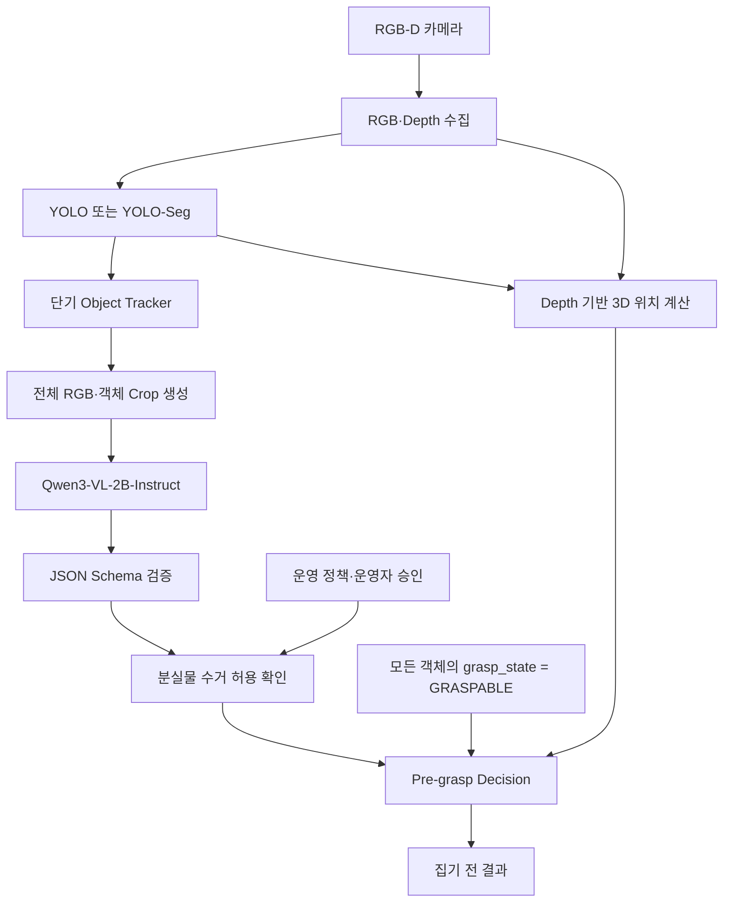

---
ingest_targets:
  - technical
  - decision
decision_candidates:
  - "객체 탐지·판단 시스템 MVP 아키텍처"
date: 2026-07-27
tool: ChatGPT
source_title: "로봇 객체 판단 시스템 설계"
related_docs:
  -
---

# 260727 - 객체 탐지·판단 시스템 MVP 아키텍처

## 출처

- [ChatGPT 공유 문서: 로봇 객체 판단 시스템 설계](https://chatgpt.com/share/6a6715c4-0474-83e8-b9ca-26b099b9fa3e)

> [!IMPORTANT]
> 이 문서의 일반 YOLO+VLM 구성은 2026-08-03의 YOLOE+VLM 검토 방향으로 대체됐다.
> 아래 내용은 이전 아키텍처의 이력이며 현재 후보 비교 문서는 작성하지 않는다.

## 1. 목표와 범위

RGB-D 카메라로 작업 공간의 객체를 찾고 의미를 분류한 뒤, 후속 집기 단계에 전달할
`PreGraspResult`를 생성한다.

| 포함 | 제외 |
| --- | --- |
| RGB-D 수집과 YOLO 객체 탐지 | 파지 가능성 평가와 Grasp Pose 생성 |
| 단기 객체 추적과 Qwen3-VL-2B-Instruct 의미 분류 | 충돌 검사와 로봇 집기 실행 |
| 분실물 수거 허용 확인과 3D 위치 계산 | 폐기·보관과 사후 검증 |
| `PreGraspResult` 생성 | 실행 결과 보고와 재시도 |

## 2. MVP 원칙

- YOLO는 **객체가 어디에 있는지** 찾는다.
- Qwen3-VL-2B-Instruct는 **탐지된 객체가 무엇을 의미하는지** 분류한다.
- YOLO의 탐지 class는 VLM 입력을 돕는 참고값이며 최종 의미 분류가 아니다.
- 파지 가능성은 평가하지 않고 모든 탐지 객체에 `GRASPABLE` 고정값을 사용한다.
- 출력은 실제 집기 명령이 아니라 후속 단계의 입력 데이터다.

## 3. 역할 경계

| 모듈                   | 답하는 질문             | 출력                                      | 하지 않는 일     |
| -------------------- | ------------------ | --------------------------------------- | ----------- |
| YOLO·YOLO-Seg        | 객체가 어디에 있는가?       | Bounding Box·Mask, 탐지 class, confidence | 최종 의미 분류    |
| Qwen3-VL-2B-Instruct | 탐지된 객체는 무엇을 의미하는가? | `category`, 객체명, 설명, 주의사항, 시각적 근거       | 위치·파지·행동 판단 |
| Depth Position       | 객체의 3D 위치는 어디인가?   | `position_xyz`                          | 파지 가능성 평가   |
| Pre-grasp Decision   | 후속 집기 단계에 전달할 것인가? | `PreGraspResult`                        | 실제 집기 실행    |

YOLO의 탐지 class와 VLM의 `category`는 서로 다른 값이다.

- 탐지 class: 객체 영역을 찾기 위한 YOLO 학습 class
- `category`: `TRASH`, `LOST_ITEM`, `UNKNOWN` 중 하나인 VLM 의미 분류

단기 Tracker는 Track ID 유지와 중복 VLM 요청 방지를, JSON Validator는 VLM 출력
형식 검증을, Permission Resolver는 분실물 수거 허용 여부 확인을 담당한다.

## 4. 처리 흐름



## 5. 모듈 간 데이터

### 5.1 YOLO 출력

YOLO·YOLO-Seg는 객체마다 다음 정보를 출력한다. (예시)

```jsonc
{
  "detection_id": "det-001",
  "detection_class": "wallet",
  "confidence": 0.91,
  "bbox": [412, 238, 590, 401],
  "mask": null
}
```

- `detection_class`는 탐지 모델의 학습 class다.
- `bbox` 또는 `mask`는 Crop 생성과 Depth 위치 계산에 사용한다.
- YOLO는 `category`를 출력하지 않는다.

### 5.2 VLM 입력

Qwen3-VL-2B-Instruct에는 다음 정보만 전달한다.

1. 작업 공간 전체 RGB 이미지
2. 탐지된 객체 Crop 이미지
3. YOLO `detection_class`
4. YOLO `confidence`

`detection_class`와 `confidence`는 참고 정보다. VLM은 RGB 이미지와 Crop에서
확인할 수 있는 시각적 근거를 중심으로 의미를 분류한다.

Depth 이미지, 3D 위치, 파지 상태, 운영 정책, 로봇 행동 정보는 VLM에 전달하지 않는다.

### 5.3 VLM 출력

```jsonc
{
  "representative_name": "지갑",
  "detailed_description": "갈색 가죽 재질의 반지갑",
  "category": "LOST_ITEM",
  "cautions": [
    "개인 소유물일 가능성이 높음",
    "자동 폐기 금지"
  ],
  "visible_evidence": [
    "접히는 형태의 가죽 물체",
    "카드 수납 형태가 보임"
  ]
}
```

허용하는 `category`는 다음 세 가지다.

| 상태 | 의미 | 처리 원칙 |
| --- | --- | --- |
| `TRASH` | 쓰레기 | 집기 전 결과 생성 |
| `LOST_ITEM` | 분실물 | 수거 허용 여부 확인 후 결과 생성 |
| `UNKNOWN` | 알 수 없음 | 집기 요청을 만들지 않음 |

VLM은 보이는 정보만 사용한다. 폐기 또는 분실물로 확신할 수 없는 객체는
`UNKNOWN`으로 보수적으로 분류한다.

## 6. 집기 전 결정

### 6.1 파지 가능성 고정값

이 단계에서는 객체 종류나 수거 허용 여부와 관계없이 파지 가능성을 계산하거나
추론하지 않는다. 모든 탐지 객체에 `grasp_state = GRASPABLE`을 입력한다.

`GRASPABLE`은 실제로 잡을 수 있다는 검증 결과가 아니라, 파지 가능성 평가를 생략하기
위한 MVP 고정값이다. 집기 허용을 의미하지 않으며, `should_request_pick`은 객체 분류와
분실물 수거 허용 여부로 별도로 결정한다. 객체 크기, 높이, 작업 영역, 그리퍼 폭,
충돌 여유는 판단하지 않는다.

실제 파지 가능성 평가와 `NOT_GRASPABLE` 처리는 후속 문서로 분리한다.

### 6.2 전달 여부

| `category` | `collection_permission` | `grasp_state` | `should_request_pick` |
| --- | --- | --- | --- |
| `TRASH` | `NOT_APPLICABLE` | `GRASPABLE` | `true` |
| `LOST_ITEM` | `ALLOWED` | `GRASPABLE` | `true` |
| `LOST_ITEM` | `PROHIBITED` | `GRASPABLE` | `false` |
| `UNKNOWN` | `NOT_APPLICABLE` | `GRASPABLE` | `false` |

분실물의 기본 수거 허용 상태는 `PROHIBITED`다. 시설 정책 또는 운영자의 명시적인
승인이 있을 때만 `ALLOWED`로 변경한다.

집기 전 결과는 다음 필드로 구성한다.

```jsonc
{
  "object_id": "obj-001",
  "track_id": "track-003",
  "category": "LOST_ITEM",
  "collection_permission": "ALLOWED",
  "grasp_state": "GRASPABLE",
  "position_xyz": [0.42, -0.18, 0.73],
  "should_request_pick": true,
  "reason": "분실물 수거가 허용되어 집기 단계로 전달"
}
```

`should_request_pick = true`는 집기 단계에 요청할 수 있다는 뜻이다. 집기 계획 수립,
충돌 검사, 그리퍼 제어 또는 집기 성공을 의미하지 않는다.

## 7. 후속 문서로 분리할 항목

다음 항목은 별도 문서로 분리해 정의한다.

- 파지 가능성 평가와 임계값
- Grasp Pose 생성과 충돌 검사
- MoveIt 2 기반 집기 계획
- 그리퍼 제어와 집기 실행
- 쓰레기 폐기와 분실물 보관
- 집기·배치 성공 검증
- 실행 결과 보고와 재시도 정책
