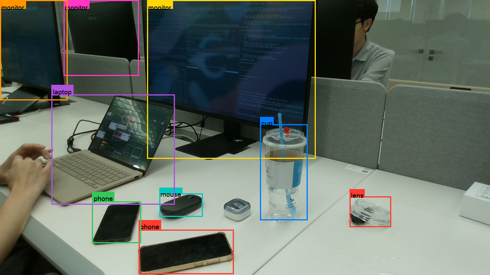

---
ingest_targets:
  - technical
decision_candidates:
  - "객체 인식·판단 아키텍처 선택"
date: 2026-08-04
source_type: user-direction
source_title: "로컬 Qwen3-VL-2B-Instruct를 ER 2 대체재로 검증"
related_docs:
  - "01 - Gemini Robotics ER 2 실측.md"
---

# 260804 - 로컬 VLM(Qwen3-VL) 실측

## 1. 배경과 목적

Gemini Robotics-ER 2(01번 문서)는 클라우드 API라 네트워크·비용·개인정보 의존성이 있다.
`Qwen/Qwen3-VL-2B-Instruct`(bf16, 약 4GB, HuggingFace 기본 캐시)로 같은 2D 탐지를 대체할 수 있는지 검증했다.
**여러 로컬 VLM을 비교해 이 모델을 선정한 것이 아니라, 특정 하나의 모델을 선택하여 활용한 것**이다 — 더 크거나 다른 로컬 VLM과의 비교는 하지 않았다.

## 2. 실행 구조

- torch·transformers가 필요해 ER 2 탐지 스크립트(시스템 Python 3.9)와 다른 venv(Python 3.14)에서 별도 스크립트로 돌렸다.
- 출력 스키마를 ER 2와 완전히 동일하게 맞췄다(`detections: [{label, box_2d}]`, 0-1000 정규화). 그래서 SAM2·3D 계산 코드는 어느 백엔드 결과인지 구분하지 않고 그대로 이어받는다.
- `sudo`로 실행해야 하는 실시간 추적(03번 문서)에서는 macOS가 `HOME`을 `/var/root`로 바꿔 이미 받아둔 4GB 캐시를 못 찾는 문제가 있어, `SUDO_USER`로 실제 사용자 홈을 찾아 `HF_HOME`을 명시적으로 지정했다.

## 3. 디코딩 전략 실측

- `--max-new-tokens`를 노출해 상한을 직접 지정할 수 있게 했다(기본값 300 — 검출 물체가 10~20개 수준일 때 충분한 것으로 실측).

## 4. 응답 파싱 견고성

2B 모델은 드물게 JSON 항목 하나의 토큰이 깨진다(중국어 문자·기호가 숫자 자리에 섞임).
응답 전체를 하나의 JSON으로 엄격 파싱하면 항목 하나만 깨져도 전체가 버려지므로, 정규식으로 개별 `{"bbox_2d": [...], "label": "..."}` 패턴만 추출하는 관대한 파서를 만들었다.

```python
_ENTRY_RE = re.compile(
    r'\{\s*"bbox_2d"\s*:\s*\[\s*(-?\d+(?:\.\d+)?)\s*,\s*(-?\d+(?:\.\d+)?)\s*,'
    r'\s*(-?\d+(?:\.\d+)?)\s*,\s*(-?\d+(?:\.\d+)?)\s*\]\s*,'
    r'\s*"label"\s*:\s*"([^"]*)"\s*\}'
)

def lenient_parse_detections(text):
    return [
        {"bbox_2d": [float(m.group(i)) for i in range(1, 5)], "label": m.group(5)}
        for m in _ENTRY_RE.finditer(text)
    ]
```

호출부는 엄격 파싱을 먼저 시도하고 실패했을 때만 이 경로로 떨어진다:

```python
try:
    raw_detections = extract_json(raw_text)
except (json.JSONDecodeError, AttributeError):
    raw_detections = lenient_parse_detections(raw_text)
    if raw_detections:
        print(f"  ! 엄격 JSON 파싱 실패 — 정규식으로 {len(raw_detections)}개 항목 복구")
    else:
        sys.exit("응답에서 유효한 bbox_2d 항목을 하나도 찾지 못했습니다.")
```

실측에서 15개 중 3~4개 항목이 깨진 응답에서도 나머지를 정상적으로 살렸다.

## 5. 실측 비교 (ER 2 vs Qwen3-VL-2B)

| | ER 2 (클라우드) | Qwen3-VL-2B (로컬) | 근거 사진 |
| --- | --- | --- | --- |
| 박스 정밀도 | 물체에 밀착, 깔끔 | 헐겁고 위치가 어긋난 박스 다수(예: 의자가 얇은 조각으로 잘못 잡힘) | **같은 사진(desk02)**, 3.3절의 박스 이중 스케일링 버그 발견 과정에서 직접 육안 대조 |
| SAM2 fill_ratio | 보통 60~90% | 대체로 20~80%, 일부 0%(모델이 리사이즈 프레임 밖 좌표를 내서 clip 후 1px로 찌그러짐) | **서로 다른 사진** — ER 2 수치는 01번 문서 5절의 소품 근접 사진, Qwen 수치는 사무실 데스크 장면(`20260803_161909`). 아래 경고 참고 |
| 응답 안정성 | 항상 완전한 JSON | 드물게 항목 하나의 토큰이 깨짐(관대한 파서로 완화) | 여러 세션에 걸친 일반 관찰 |
| 속도(M5 Pro, MPS) | 6.8~7.2초(입력→결과, 01번 문서 3절) | 모델 로드 평균 6.7초(1회) + 추론 14초(그리디, 기본 해상도) | 여러 세션에 걸친 일반 관찰 |

> [!WARNING]
> **fill_ratio 행은 같은 사진에서 나온 대조가 아니다.** ER 2의 60~90%는 desk01·desk02와 무관한 별도 소품 사진(카드·포스트잇·줄자·티슈)에서, Qwen의 20~80%/일부 0%는 다른 사무실 데스크 장면에서 나왔다.
> 동일 사진·동일 물체에 대해 ER 2와 Qwen 박스를 각각 SAM2에 넣어 fill_ratio를 나란히 측정한 적은 없다.

## 6. 입력 해상도·토큰 수 축소 실험

`--max-side`(모델에 넣기 전 이미지 축소)와 `--max-new-tokens`(생성 토큰 상한)를 줄여 추론 속도를 올릴 수 있는지 두 차례에 걸쳐 실험했다.

### 6.1 실험(좌표 버그 수정 후, 해상도+토큰 동시 축소)

좌표 버그를 고친 뒤, 입력 해상도와 `--max-new-tokens`를 함께 줄여 재실험했다.
이번에는 추론 시간이 **6.8초**까지 줄었고(ER 2의 응답 속도와 비슷한 수준), 좌표값이 프레임 밖으로 튀는 문제도 재현되지 않았다.

다만 **작은 물체(예: 마우스)를 제대로 잡지 못하는 문제**가 새로 확인됐다 — 해상도를 줄이면서 작은 물체의 시각적 디테일이 손실된 것으로 보인다.



### 7. 결론

입력 해상도·토큰 수 축소는 **속도(6.8초, ER 2와 비슷한 수준)와 정확도(작은 물체 누락) 사이의 실질적인 트레이드오프**다.
기본값은 축소 없음(전체 해상도, 추론 14초)으로 유지하고, `--max-side`· `--max-new-tokens`는 옵션으로 노출해 목표 물체 크기 분포에 따라 선택하게 했다.

## 8. 확인 필요

- 더 큰 Qwen 체크포인트(4B/8B)나 다른 로컬 VLM으로 정밀도가 개선되는지 미검증.
- Jetson Orin NX에서의 로드·추론 시간은 별도 측정이 필요하다(이 문서는 Mac M5 Pro/MPS 기준).
- 해상도·토큰 축소 시 "작은 물체를 놓치는" 정도를 정량화하지 않았다(몇 % 누락되는지, 물체 크기 임계값이 어디인지는 육안 관찰 수준).
- **동일 사진·동일 물체에서 ER 2와 Qwen의 fill_ratio를 나란히 측정한 적이 없다**.
