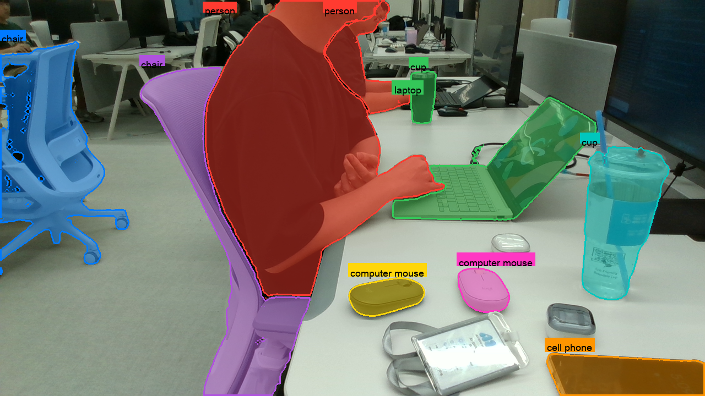

---
ingest_targets:
  - technical
decision_candidates:
  - "실시간 추적을 위한 SAM2 API 선택"
  - "객체 인식·판단 아키텍처 선택"
date: 2026-08-04
source_type: user-direction
source_title: "SAM2 프롬프트 세그멘테이션과 실시간 추적 API 실측"
related_docs:
  - "01 - Gemini Robotics ER 2 실측.md"
  - "02 - 로컬 VLM(Qwen3-VL) 실측.md"
---

# 260804 - SAM2 세그멘테이션·실시간 추적 실측

## 1. 검증 범위

두 가지를 검증했다.
(1) ER 2/Qwen3-VL이 낸 bounding box를 프롬프트로 SAM2에 넘겨 픽셀 마스크를 만드는 정지 이미지 파이프라인
(2) RealSense 라이브 영상에서 VLM을 1회만 돌리고 이후 프레임을 SAM2 메모리로 계속 추적하는 실시간 프로토타입.
`ultralytics` 패키지가 감싼 SAM2 구현(sam2.1 계열 체크포인트)을 썼다.

## 2. 정지 이미지 세그멘테이션

- 입력은 ER 2/Qwen3-VL이 낸 박스뿐이다. SAM2 자체의 "전체 자동 분할" 기능은 쓰지 않는다 — 박스 안에 있는 것을 정확히 픽셀 단위로 오려내라는 프롬프트 기반 세그멘테이션이다.
- `fill_ratio`(마스크 픽셀 수 / 박스 픽셀 수)를 박스 품질의 정량 지표로 썼다.
- 01번 문서 5절 표 참고. 곡면·불규칙 물체는 자연히 낮게 나오므로 낮은 값 자체가 오류는 아니다.
- 마스크는 `.npz`로 저장해 3D 계산 단계([[04 - 3D 좌표 추정 실측|04번 문서]])의 입력으로 재사용한다.



## 3. 실시간 추적 — SAM2 API 세 후보 중 하나만 가능

`ultralytics` 소스 코드를 직접 읽어 "라이브 스트림 + SAM2 메모리 추적"에 쓸 수 있는 API를 확인했다.

| 후보                                | 판정     | 근거                                                                                                                                                        |
| --------------------------------- | ------ | --------------------------------------------------------------------------------------------------------------------------------------------------------- |
| `SAM(...).track()`                | 못 씀    | SAM2 메모리를 쓰지 않는다. `task_map`이 `SAM2Predictor`만 매핑해서, 프레임마다 segment-everything(자동 전체 분할) 후 ByteTrack IoU 매칭으로 퇴화한다. 물체 identity를 SAM2가 아니라 ByteTrack이 만든다. |
| `SAM2VideoPredictor`              | 못 씀    | `init_state`가 `assert predictor.dataset.mode == "video"`를 걸고 유한한 프레임 수를 요구한다. 라이브 스트림은 `mode="stream"`이라 이 assert에서 죽는다. 오프라인 파일(동영상) 전용이다.               |
| `SAM2DynamicInteractivePredictor` | **채택** | 프레임 단위 호출 + 영속 `memory_bank`를 갖는다. docstring 예시(`predictor(source=img1, bboxes=..., update_memory=True)` → `predictor(source=img2)`)가 정확히 이 시나리오다.        |

### 3.1 추적이 실제로 작동하는지 검증

카메라 없이, 저장된 사진을 40px 옆으로 이동시켜 카메라 팬(pan)을 흉내낸 두 번째 프레임을 만들었다.
첫 프레임을 박스로 프롬프트한 뒤(`update_memory=True`) 두 번째 프레임을 프롬프트 없이 호출했을 때, 마스크 중심점이 정확히 −40.0px 이동했다(9개 물체 중 8~9개에서 일관).
SAM2 메모리 기반 추적이 실제로 동작함을 확인했다.

### 3.2 속도 — `imgsz`가 전부다

첫 벤치마크에서 입력 프레임 해상도(1280/960/640/480px)를 바꿔도 속도가 전혀 달라지지 않는 것을 발견했다 — SAM2가 내부적으로 어차피 `imgsz` 파라미터로 리사이즈하기 때문이다.

| `imgsz` | 속도(sam2.1_t, MPS, 객체 9개) | 마스크 품질 |
| --- | --- | --- |
| 1024 | 1.1 fps | 기준 |
| 768 | 2.9 fps | 차이 거의 없음 |
| **512** | **9.3 fps** | 육안·픽셀수 모두 1024와 거의 동일 |
| 384 | 16.4 fps | 경계가 뭉개지기 시작 |

512와 1024를 나란히 렌더링해 육안으로도 비교했고, 마스크 형태 차이가 거의 없어 512를 기본값으로 채택했다.
객체 수도 비용이다: imgsz=512에서 객체 3개는 18fps, 9개는 9fps, 15개는 6~6.4fps로 실측됐다.

### 3.3 아키텍처

- **VLM은 별도 스레드**에서 돈다. 1회 호출에 14초(02번 문서 참고)가 걸려서 메인 루프에 두면 화면이 통째로 멈춘다.
- **SAM2 추적은 메인 루프**에 남긴다. SAM2 메모리는 프레임을 순서대로 먹여야 해서 스레드로 빼면 마스크가 화면과 어긋난다.
- macOS는 `cv2.imshow`가 메인 스레드 전용이기도 하다.

시딩과 추적의 실제 호출 형태는 다음과 같다.
박스로 프롬프트할 때만 `update_memory=True`이고, 이후 추적 호출에는 아무 프롬프트도 주지 않는다.

```python
# --- 시딩: VLM이 찾은 박스를 SAM2 메모리에 주입 (탐지 직후 1회) ---
# 재탐지 시 메모리를 확실히 비우려고 predictor를 새로 만든다.
predictor = SAM2DynamicInteractivePredictor(
    overrides=dict(conf=0.01, task="segment", mode="predict",
                   imgsz=args.imgsz, model=checkpoint,
                   save=False, verbose=False, device=device),
    max_obj_num=len(boxes),      # 기본값 3 -> 탐지 개수에 맞춰야 한다
)
predictor(source=result["frame"], bboxes=boxes,
          obj_ids=list(range(len(boxes))), update_memory=True)

# --- 추적: 이후 매 프레임, 프롬프트 없이 호출 ---
res = predictor(source=frame)
masks = list(res[0].masks.data.cpu().numpy().astype(bool)) if res[0].masks else []
```
- **seed 프레임 지연 — "정지 유지"가 사실상 필수 조건**: VLM이 분석한 프레임은 (VLM 처리 시간만큼) 과거 프레임이다.
  그 프레임으로 메모리를 심고 바로 라이브 프레임 추적으로 넘어가므로, **VLM 추론이 끝나 SAM2 시딩이 완료될 때까지 카메라나 물체가 움직이면 안 된다**는 것을 실제 카메라로 확인했다.
  이 구간은 기본 설정 기준 약 14초이고, 해상도·토큰을 줄이면 6.8초까지 단축된다.
  재탐지 명령으로 다시 잡을 수 있지만, 그동안 장면이 바뀌면 다시 그만큼의 정지 구간이 필요하다.
- **중복 박스 제거**: Qwen이 그리디 디코딩으로 같은 물체를 반복해서 뱉는 경우(실측에서 모니터 3개가 통째로 두 번 나옴)를 같은 라벨 + IoU 0.85 초과 기준으로 걸렀다.
  안 그러면 SAM2 슬롯만 낭비하고 프레임당 추적 비용이 늘어난다.
- 물체별 거리는 마스크 영역 depth의 **중앙값**을 쓴다(평균은 구멍·이상치에 취약).

### 3.4 화면 이탈 후 재진입 물체 처리 (라이브 카메라 확인)

> [!note]
> 저장된 사진 재생이 아니라 **실제 RealSense 라이브 카메라**로 직접 실행해 확인했다.
> VLM 1회 탐지 → SAM2 메모리 시딩 → 프레임별 추적이 실제로 동작했고, 특히 **추적 중이던 물체가 화면 밖으로 나갔다가 다시 들어왔을 때도 SAM2가 재세그멘테이션을 정상적으로 잡는 것**을 확인했다.

`SAM2DynamicInteractivePredictor`의 영속 `memory_bank`가 프레임 중간의 공백(물체가 안 보이는 구간)을 버티고 재출현 시 다시 매칭한다는 뜻이다.
다만 이탈 시간이 얼마나 길어도 버티는지, 여러 물체가 동시에 이탈·재진입 할 때도 안정적인지는 정량화하지 않았다.

## 4. 확인 필요

- 라이브 카메라 실행 자체는 확인했지만, 단발성 확인이며 다양한 장면·조명·물체 이탈 패턴에서의 반복 검증은 아니다.
- 화면 이탈→재진입 추적이 버티는 최대 시간·물체 수는 정량화하지 않았다.
- VLM+SAM2 시딩 구간 동안 정지를 유지해야 한다는 제약이 실제 로봇 작업 흐름(물체를 옮기는 도중에도 인식이 필요한 상황)과 어떻게 충돌하는지는 검토하지 않았다.
- 속도 수치는 Mac M5 Pro(MPS) 기준이며 Jetson Orin NX 실측치가 아니다.
- SAM2 API 선정은 특정 시점의 `ultralytics` 버전 소스 코드 기준이다.
