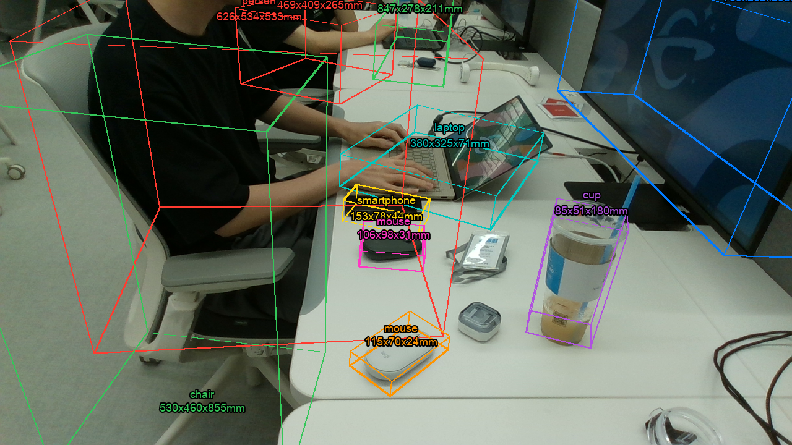

# 260804 - 3D 좌표 추정 실측

## 1. 두 가지 정밀도 등급

같은 depth 역투영 원리를 쓰지만 용도가 다른 두 방식을 구현하고 각각 검증했다.

|       | 방향성 3D bbox (정지 이미지)    | 대표 좌표 한 점 (실시간)        |
| ----- | ----------------------- | ---------------------- |
| 언제 쓰나 | 장면 전체 물체의 치수·자세가 필요할 때  | 추적 중인 물체 하나의 위치만 필요할 때 |
| 계산    | 평면 RANSAC + 최소면적사각형 OBB | 배경 혼입만 제거한 점군의 중앙값 한 점 |
| 비용    | 무거움(평면 검출 실패 시 명시적 실패)  | 가벼움(프레임당 계산 가능)        |
| 출력    | 중심·치수(L·W·H)·yaw·8꼭짓점   | X, Y, Z 한 점(카메라 좌표계)   |

## 2. 방향성 3D bbox — 계산 방식

1. 마스크 픽셀을 카메라 intrinsics로 역투영해 물체별 점군을 만든다. depth가 0인 구멍은 버린다.
2. 마스크 경계가 배경을 문 이상치를 MAD(중앙값 절대편차) 기준으로 제거한다. 표준편차 대신 MAD를 쓰는 이유는, 이상치 자체가 표준편차를 키워 스스로를 숨기기 때문이다.
3. 마스크 바깥 영역에서 RANSAC으로 평면(예: 책상 상판)을 찾는다. 물체 픽셀을 포함시키면 평면이 물체 쪽으로 딸려 올라가는 문제가 있어 제외한다.
4. 평면 법선을 위 방향으로 삼는 좌표계에서, 물체별로 최소면적 사각형을 맞춰 바닥 윤곽을, 평면 대비 높이로 물체 높이를 구한다.

변의 길이를 min/max나 백분위수가 아니라 **히스토그램 밀도 기반**으로 정한다(`robust_extent`).
이유: 비스듬히 본 표면은 카메라에 가까운 쪽에 점이 몰리고 먼 쪽은 성기다.
"점 개수의 1%를 자른다"는 규칙을 쓰면 먼 쪽에서 실제 길이의 10%가 잘려나갈 수 있다.
히스토그램에서 밀도가 충분한 bin만 남기면 밀도가 불균일해도 물체의 끝을 제대로 찾는다.
이는 초기에 백분위수 트리밍을 시도했다가, 특정 물체(카드)의 오차가 오히려 커지는 것을 실측으로 발견하고 대안을 개발한 결과다.

```python
def robust_extent(values, bins=160, density_frac=0.10):
    """1차원 점 분포에서 물체가 실제로 차지하는 구간을 찾는다."""
    lo, hi = float(values.min()), float(values.max())
    if density_frac <= 0 or hi - lo < 1e-9 or len(values) < bins:
        return lo, hi

    counts, edges = np.histogram(values, bins=bins, range=(lo, hi))
    occupied = counts[counts > 0]
    if len(occupied) == 0:
        return lo, hi
    # 밀도가 충분한 첫 bin ~ 마지막 bin. 바깥 노이즈 꼬리만 잘리고 내부 공백(가려짐·오목한 형상)은 보존된다.
    dense = np.nonzero(counts >= max(np.median(occupied) * density_frac, 1))[0]
    if len(dense) == 0:
        return lo, hi
    return float(edges[dense[0]]), float(edges[dense[-1] + 1])
```

이상치 제거에 표준편차 대신 MAD를 쓰는 부분도 같은 모듈에 있다:

```python
def filter_depth_outliers(points, k=3.0):
    """깊이 방향 이상치를 MAD 기준으로 제거한다.

    마스크 경계가 물체 너머 배경을 한두 픽셀 물면 그 점들이 수십 cm 뒤에 찍혀 박스를 크게 부풀린다.
    표준편차 대신 MAD를 쓰는 건 이상치 자체가 표준편차를 키워서 스스로를 숨기기 때문이다.
    """
    if len(points) < 3:
        return points
    z = points[:, 2]
    med = np.median(z)
    mad = np.median(np.abs(z - med))
    if mad <= 0:
        return points
    return points[np.abs(z - med) <= k * 1.4826 * mad]
```

## 3. 검증 방법 — 합성 정답 데이터

합성 RGB-D로 검증했다. 기울어진 평면 위에 알려진 크기의 상자를 놓고 레이캐스팅으로 depth를 렌더링하며, D435 수준 노이즈(σ=2mm)를 시뮬레이션했다.

- 단위 테스트 8개(`test_geometry3d.py`)로 역투영-재투영 왕복, RANSAC 평면 법선 복원, OBB 치수 복원, 노이즈 강건성, depth 구멍·배경 혼입 필터링을 각각 확인했다 — 전부 통과.
- 합성 장면에 실제 SAM2로 세그멘테이션까지 돌려 end-to-end 파이프라인 전체(마스크 생성부터 3D bbox까지)를 검증했다.

## 4. 실측 정확도

| 물체          | 정답 치수       | 측정 치수             | 오차           |
| ----------- | ----------- | ----------------- | ------------ |
| card        | 91×55×1mm   | 87.7×56.5×6.7mm   | −3.3, +1.5mm |
| sticky note | 76×76×1mm   | 80.6×78.6×5.6mm   | +4.6, +2.6mm |
| small box   | 120×80×45mm | 124.2×85.3×45.3mm | +4.2, +5.3mm |

## 5. 정확도 한계

- **가로·세로는 ±5mm가 현실적인 한계다.** 노이즈가 σ=2mm면 수천 개 점의 극단값은 3σ를 넘어 바깥으로 밀린다.
  트리밍 파라미터를 조여 줄일 수는 있어도 없앨 수는 없다.
  파라미터를 더 조이면 어떤 물체는 좋아지고 어떤 물체는 나빠지는 트레이드오프만 있어서, 최악 오차가 가장 작은 지점(`density_frac=0.10`)에 고정했다.
- **높이 5mm 이하 물체의 높이는 믿을 수 없다.** 표에서 1mm 두께 카드가 6.8mm로 측정됐다 — 노이즈 바닥에 묻힌다. 반면 45mm 상자는 46.1mm로 잘 맞았다.
- **yaw(회전각)는 180도 배수만큼 다를 수 있다.**
  직육면체는 180도 돌려도 같은 모양이라 원리상 구분이 안 된다.
  검증에서 카드는 19.9도(정답 20.0도)로 정확했고, 나머지 물체도 180도를 더하거나 빼면 정답과 일치했다.
- RANSAC 평면 검출은 inlier 비율이 10% 미만이면 **명시적으로 실패**시킨다.
  엉뚱한 평면 위에서 계산한 치수가 그럴듯해 보여서 더 위험하다고 판단했기 때문이다.
  다만 이 임계값이 실제 로봇 작업 환경(카메라 각도, 평면 가시 비율)에서 항상 만족되는지는 검증하지 않았다.
- 노이즈 모델(σ=2mm)은 D435 사양 추정치이며, 실제 센서로 재측정한 값이 아니다.

## 6. 큰 물체에서 박스가 물체를 못 감싸던 문제

### 6.1 증상

실제 촬영 장면의 큰 물체(노트북, 모니터, 사람)에 방향성 3D bbox를 계산해 RGB 위에 와이어프레임으로 겹쳐 보니, **물체 표면이 박스 밖으로 튀어나온 모습이 육안으로 보였다** — 박스가 물체를 온전히 감싸지 못했다.

### 6.2 결론

수정을 통해 문제점을 개선하였지만 육안으로 확인하였을 때 더 수정이 필요해보인다.


## 7. 대표 좌표 한 점(실시간용) — 계산 방식과 검증

실시간 추적에서는 프레임마다 평면 검출·OBB 전체를 계산하기엔 비용이 커서, 물체 하나의 위치만 필요할 때 쓰는 가벼운 버전을 별도로 만들었다.
마스크 픽셀을 역투영하고 배경 혼입만 MAD로 걸러낸 뒤(위 2번 단계와 동일 함수 재사용), 점군의 **중앙값 한 점(X, Y, Z)**만 반환한다. 평면 검출이 없어
실패할 일이 없고 프레임당 계산 비용도 거의 없다.

```python
def object_3d_point(mask, depth_m, fx, fy, cx, cy):
    """마스크 영역의 대표 3D 좌표(카메라 좌표계, m) 한 점을 구한다."""
    pts = backproject(mask, depth_m, fx, fy, cx, cy)
    if len(pts) == 0:
        return None, 0
    pts = filter_depth_outliers(pts)          # 배경 혼입만 제거
    if len(pts) < MIN_DEPTH_PIXELS:
        return None, len(pts)
    return np.median(pts, axis=0), len(pts)   # 평면 검출 없음 -> 실패할 일이 없다
```

### 7.1 방향성 bbox 중심값과의 대조

기존 정지 이미지에서 이미 계산해 둔 방향성 bbox의 `distance_m`(원점으로 부터의 거리)과, 같은 마스크에 이 가벼운 방식을 적용한 결과를 대조했다.

| 물체 | 대표점 방식 거리 | bbox 중심 거리(참조) | 비고 |
| --- | --- | --- | --- |
| computer mouse | 0.643m | 0.679m | 근접 |
| computer mouse | 0.679m | 0.679m | 일치 |
| cell phone | 0.548m | 0.559m | 근접 |
| laptop | 1.010m | 1.058m | 근접 |
| person | 0.850m | 1.19m | 차이 큼 |
| person | 0.991m | 1.19m | 차이 있음 |
| cup | 0.711m | 1.86m | 차이 매우 큼 |
| cup | 1.904m | 1.86m | 근접 |
| chair | 0.961m | 3.177m | 차이 매우 큼 |
| chair | 2.607m | 3.177m | 차이 큼 |

**작고 강체에 가까운 물체(마우스, 폰, 노트북)는 두 방식이 근접했지만,
크거나 depth 범위가 넓은 물체(사람, 의자, 일부 컵)는 두 값이 크게
갈렸다.** 두 방식이 애초에 다른 대표점을 낸다는 점을 감안해야 한다 —
대표점 방식은 마스크 depth의 중앙값(카메라에서 물체까지의 전형적 거리),
bbox 중심 거리는 물체 전체 부피의 기하학적 중심까지의 거리다. 사람·의자처럼
카메라 방향으로 깊이가 크게 걸쳐 있는 물체는 이 둘이 본질적으로 다른
값을 가리킨다.

**결론: 대표 좌표 한 점 방식은 방향성 bbox의 근사·대체재가 아니다.**
작고 얕은 물체의 대략적 위치를 빠르게 알고 싶을 때는 쓸 만하지만, 정밀한
중심 좌표나 큰/깊은 물체에는 방향성 bbox 전체 계산(무거운 방식)을 써야
한다는 것을 실측으로 확인했다.

## 8. 확인 필요

- 노이즈 모델(σ=2mm)의 실제 센서 검증.
- RANSAC 평면 검출 성공률을 실제 로봇 작업 각도·거리에서 재확인.
- 대표 좌표 한 점 방식과 bbox 중심 방식 중 어느 쪽을 실제 파지(grasp) 기준점으로 쓸지는 이 문서에서 결정하지 않았다 — 물체 형상별로 다른 기준이 필요할 수 있다.
- 이번 정확도 표는 합성 데이터(노이즈 시뮬레이션) 기준이며, 실제 D435
  하드웨어로 알려진 치수의 물체를 촬영해 재검증이 필요하다.
- **큰 물체의 3D bbox 부정확 원인 규명이 최우선 후속 과제다**(6절).
  로봇이 다루는 대상이 소품 위주라면 영향이 제한적이지만, 노트북·모니터
  급 물체도 다뤄야 한다면 이 문제부터 풀어야 한다.
