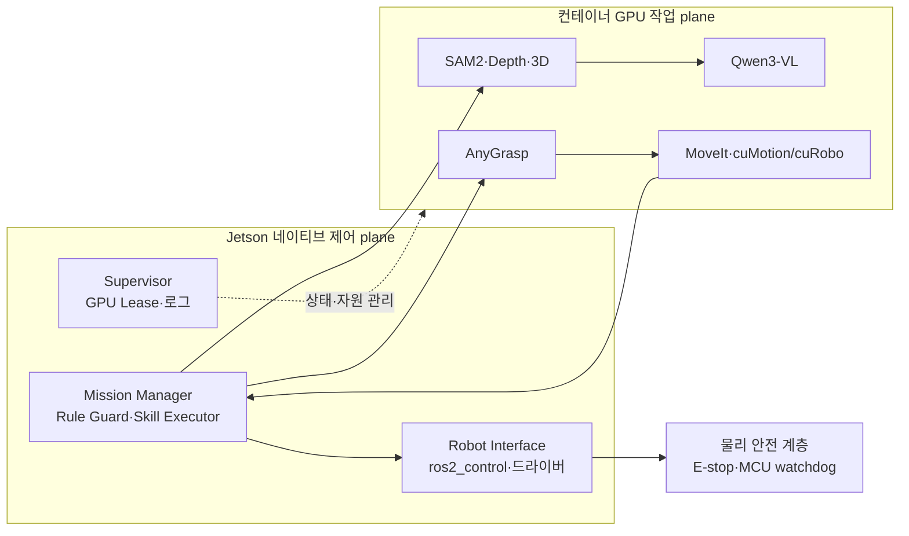

---
ingest_targets:
  - technical
  - decision
decision_candidates:
  - "Jetson 네이티브 제어 plane과 컨테이너 GPU 작업 plane의 분리"
date: 2026-08-18
source_type: ai-conversation-answer
source_title: "컨테이너 아키텍처 정리"
---

# 260818 - Jetson 네이티브·컨테이너 혼합 아키텍처

## 1. 핵심 방향

Jetson Orin NX에서는 로봇의 안전·제어 기능을 네이티브로 유지하고, 의존성이 무겁고 변경이 잦은 GPU 모델을 컨테이너로 격리하는 혼합형 구성을 사용한다.

컨테이너의 출력은 모터 명령으로 직접 연결하지 않는다. 모든 AI 결과는 네이티브
gateway, 최신 `scene_revision`, 작업 공간·충돌·도달 가능성 검증을 통과한 뒤 네이티브
Robot Interface로 전달한다.

## 2. 최상위 불변식

| 불변식 | 적용 원칙 |
| --- | --- |
| 안전 제어의 생존성 | Docker 또는 AI 컨테이너 장애 중에도 watchdog·cancel·safe stop 유지 |
| 실행 권한 분리 | AI 모델은 grasp 후보·trajectory 후보만 생성하고 직접 구동하지 않음 |
| 관측 최신성 | 결과의 `scene_revision`이 현재 장면과 다르면 실행하지 않음 |
| GPU 직렬화 | 네이티브 GPU Lease Manager가 모델 작업을 승인하고 동시 추론을 제한 |
| 고대역폭 데이터 지역성 | RGB-D·mask·dense point cloud는 가능한 한 같은 컨테이너에 유지 |
| AnyGrasp SDK ID 불변 | 재시작·재생성·업데이트·롤백에도 동일한 SDK ID를 유지 |

## 3. 문서 지도

| 문서 | 중심 내용 |
| --- | --- |
| [실행 위치와 책임 경계](01%20-%20실행%20위치와%20책임%20경계.md) | 네이티브·컨테이너 배치, 안전 경계, RGB-D profile |
| [AI 파이프라인과 데이터 통신](02%20-%20AI%20파이프라인과%20데이터%20통신.md) | Qwen·SAM2·AnyGrasp·cuMotion 흐름, 데이터·ROS 경계 |
| [AnyGrasp SDK ID와 파지 경계](03%20-%20AnyGrasp%20SDK%20ID와%20파지%20경계.md) | SDK ID 영속성, 라이선스 정보 취급, 5-DOF 필터 |
| [배포 운영과 검증](04%20-%20배포%20운영과%20검증.md) | 실행 profile, 기동·종료, 버전·자원·장애 검증 |
