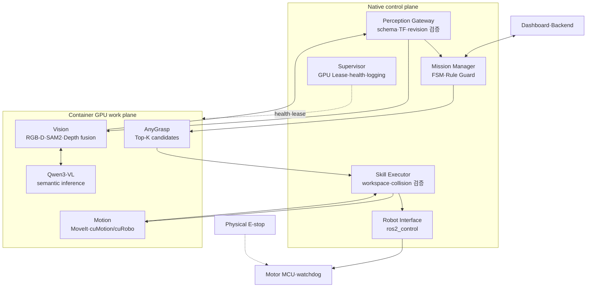

---
ingest_targets:
  - technical
  - decision
decision_candidates:
  - "Jetson 구성요소별 네이티브·컨테이너 실행 위치"
date: 2026-08-18
source_type: ai-conversation-answer
source_title: "컨테이너 아키텍처 정리"
---

# 260818 - 실행 위치와 책임 경계

## 1. 배치 원칙

| 구분 | 완전 네이티브 | 완전 컨테이너 | 혼합형 |
| --- | --- | --- | --- |
| 구조 | 모든 ROS·AI를 호스트에 설치 | 안전·제어·AI를 모두 컨테이너화 | 안전·제어는 네이티브, AI는 컨테이너 |
| 의존성 관리 | GPU 모델 간 충돌 가능성이 큼 | 이미지별로 격리하기 쉬움 | AI 의존성만 격리 |
| 하드웨어 접근 | 단순함 | 장치 mount·권한 설정 필요 | 모터·CAN은 네이티브로 단순화 |
| 장애 영향 | 프로세스 장애가 호스트 환경에 남음 | Docker 장애가 전체 런타임에 영향 | AI 장애와 로봇 제어를 분리 |
| 롤백 | 패키지 단위 복원이 복잡 | 이미지 단위 교체 가능 | 모델 컨테이너만 독립적으로 교체 |
| 권장 용도 | 초기 ROS·mock 개발 | CI·시뮬레이션·rosbag replay | 실제 Jetson 로봇 배포 |

완전 네이티브는 센서·모터 bring-up과 빠른 디버깅에 유리하지만 SAM2, Qwen3-VL, AnyGrasp, cuRobo/cuMotion의 Python·PyTorch·CUDA extension 의존성을 한 호스트에 함께 설치하면 충돌 가능성이 커진다.
완전 컨테이너는 재현성이 높지만 Docker 장애가 실제 액추에이터 제어까지 중단시키는 단일 장애점이 될 수 있다.

## 2. 권장 실행 위치

| 구성요소                            | 권장 위치         | 책임과 이유                             |
| ------------------------------- | ------------- | ---------------------------------- |
| Jetson Linux·kernel·BSP         | 네이티브 필수       | 하드웨어와 장치 드라이버 소유                   |
| NVIDIA driver·Docker runtime    | 네이티브 필수       | GPU 컨테이너 실행 기반                     |
| 물리 E-stop                       | 독립 하드웨어       | Docker·ROS·Jetson 상태와 독립           |
| Motor MCU watchdog              | MCU           | command timeout 시 물리 출력 차단         |
| Mission Manager·Rule Guard      | 네이티브          | mission 상태, cancel, 정책 검증 유지       |
| Skill Executor                  | 네이티브          | AI 후보와 실제 실행 권한 분리                 |
| Robot Interface·`ros2_control`  | 네이티브          | 액추에이터의 canonical owner와 safe stop  |
| CAN·serial·servo driver         | 네이티브          | udev·reconnect·권한 관리 단순화           |
| Nav2·LiDAR·IMU driver           | 네이티브          | AI 상태와 무관한 지속 운용                   |
| Perception Gateway              | 네이티브          | 관측 ID·TF·`scene_revision` 검증       |
| GPU Lease Manager·로그 집계         | 네이티브          | 컨테이너 자원 승인과 장애 상관관계 기록             |
| SAM2·Depth·3D fusion            | vision 컨테이너   | PyTorch·CUDA extension과 대형 데이터 격리  |
| Qwen3-VL                        | qwen 컨테이너     | 런타임·양자화·모델 교체 격리                   |
| AnyGrasp                        | anygrasp 컨테이너 | modified MinkowskiEngine·SDK 환경 격리 |
| MoveIt planning·cuMotion/cuRobo | motion 컨테이너   | GPU planning 환경과 제어 실행 분리          |
| `FollowJointTrajectory` 실행      | 네이티브          | 후보 trajectory의 최종 검증과 실행           |

## 3. 전체 책임 경계



AI 결과는 다음 경로로만 실행 권한에 접근한다.

```text
AI 후보
  → 네이티브 gateway의 schema·TF·scene revision 검증
  → Mission Manager의 상태·정책 검증
  → Skill Executor의 도달성·충돌·작업 공간 검증
  → 네이티브 Robot Interface와 controller 실행
```

## 4. RGB-D 드라이버 profile

### 안정성 우선

```text
Native RGB-D driver
  → 선택한 frame을 artifact store에 기록
  → vision 컨테이너가 해당 frame 처리
```

- USB reconnect, udev, RViz, rosbag 사용이 단순하다.
- 컨테이너 장애와 별개로 카메라 상태를 확인할 수 있다.
- 연속 영상에서는 호스트와 컨테이너 사이 복사 비용이 생긴다.

### 성능 우선

```text
Vision container
  RGB-D driver
  → alignment·preprocessing
  → SAM2·depth fusion
  → 외부에는 SceneState만 전달
```

- RGB·Depth·mask·point cloud를 컨테이너 내부에 유지해 직렬화를 줄인다.
- USB 권한과 hotplug가 복잡해지고 컨테이너 재시작 시 카메라도 다시 초기화된다.

초기에는 안정성 우선 profile을 사용하고, 실측에서 데이터 전송이 병목으로 확인된 경우에만 성능 우선 profile로 이동한다.

## 5. 장애 시 책임

| 장애                  | 네이티브 계층의 동작                                         |
| ------------------- | --------------------------------------------------- |
| Qwen timeout·형식 오류  | 결과 폐기, 정책 기반 경로 또는 `BLOCKED`                        |
| SAM2·vision 종료      | 새 perception 요청 차단, 이전 장면 결과 실행 금지                  |
| AnyGrasp timeout    | grasp 작업을 `BLOCKED` 처리하거나 허용된 geometric fallback 사용 |
| Motion container 종료 | trajectory 미생성으로 실행 차단                              |
| GPU OOM             | 새 AI 요청 중단, controller·watchdog 유지                  |
| Docker daemon 재시작   | 활성 mission 취소, 새 모터 명령 금지, safe stop 유지             |

컨테이너 재시작 정책은 가용성 수단일 뿐 안전 수단이 아니다.
물리 E-stop, MCU watchdog, controller timeout과 네이티브 safe stop이 최종 안전 경계를 담당한다.

## 6. 관련 문서

- [AI 파이프라인과 데이터 통신](02%20-%20AI%20파이프라인과%20데이터%20통신.md)
- [AnyGrasp SDK ID와 파지 경계](03%20-%20AnyGrasp%20SDK%20ID와%20파지%20경계.md)
- [배포 운영과 검증](04%20-%20배포%20운영과%20검증.md)
