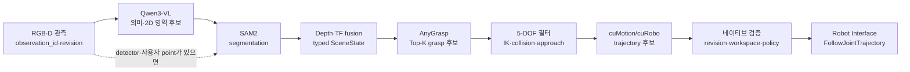
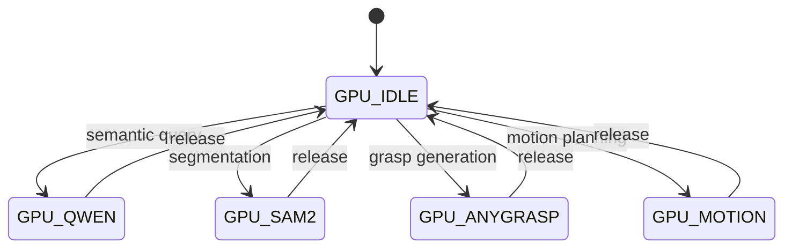

---
ingest_targets:
  - technical
  - decision
decision_candidates:
  - "컨테이너 GPU 작업 plane의 데이터·통신 경계"
date: 2026-08-18
source_type: ai-conversation-answer
source_title: "컨테이너 아키텍처 정리"
---

# 260818 - AI 파이프라인과 데이터 통신

## 1. 처리 흐름



Qwen이 SAM2 prompt를 만드는 경우 `Qwen → SAM2` 순서를 사용한다.
detector 또는 사용자 point가 이미 있으면 SAM2를 먼저 실행할 수 있고, 의미가 확정된 반복 작업에서는 Qwen을 생략할 수 있다.

## 2. 모델별 출력 한계

### Qwen3-VL

- keyframe 또는 crop 기반으로 의미 후보와 2D 영역을 반환한다.
- JSON schema 검증을 통과해야 한다.
- grasp pose, joint angle, trajectory, motor command는 반환하거나 실행하지 않는다.

### SAM2·3D Scene State

- SAM2 mask는 면적, Depth 유효 픽셀 비율, Depth 분산, 평면 분리, 이전 frame 일관성을 함께 검증한다.
- mask와 Depth를 결합해 객체 point cloud와 `base_link` 기준 위치·크기를 생성한다.
- 관측 timestamp와 `scene_revision`이 맞지 않으면 결과를 폐기한다.

권장 `SceneObject` 정보는 다음과 같다.

```text
object_id
observation_id
scene_revision
stamp
frame_id
semantic_candidates[]
semantic_confidence
mask_reference
point_cloud_reference
position_base
extent_xyz
geometry_quality
processability
rejection_reason
perception_model_versions
```

### AnyGrasp·cuMotion

- AnyGrasp에는 전체 장면이 아니라 선택된 객체의 masked point cloud만 전달한다.
- AnyGrasp는 top-K grasp 후보만 생성하며 실행 가능성을 확정하지 않는다.
- 5-DOF IK, 제한된 손목 자세, 접근 방향, self-collision과 반대편 팔 collision을
  통과한 후보만 motion planning으로 전달한다.
- cuMotion/cuRobo는 trajectory 후보를 만들며 실제 controller 실행은 네이티브가 맡는다.

## 3. 데이터 경계

컨테이너 수보다 고대역폭 데이터를 어디에 유지하는지가 중요하다.

| 가능한 한 경계 안에 유지              | 경계 밖으로 전달 가능                             |
| --------------------------- | ---------------------------------------- |
| RGB·Depth 원본 연속 스트림         | `observation_id`, `scene_revision`       |
| dense segmentation mask     | object ID, 2D box, 3D centroid·extent    |
| dense point cloud·voxel map | semantic·grasp candidate                 |
| CUDA tensor                 | trajectory와 status·error code            |
| 모델 내부 state                 | artifact reference와 model·schema version |

대형 데이터는 같은 컨테이너 또는 공유 artifact store에 유지하고, ROS action과 service에는
작은 metadata와 reference를 전달한다.

```text
GenerateGrasps.action Goal
  scene_revision: 42
  object_id: "obj_7"
  point_cloud_reference: "shm://cleany/obs_103/obj_7.pcd"
```

## 4. 통신 방식

| 용도                            | 권장 방식                            |
| ----------------------------- | -------------------------------- |
| Mission·skill·grasp·motion 요청 | ROS 2 Action                     |
| health·capability·짧은 설정 조회    | ROS 2 Service 또는 로컬 HTTP         |
| TF·joint state·연속 status      | ROS 2 Topic                      |
| Qwen 추론                       | HTTP·gRPC·Unix domain socket     |
| RGB-D·mask·point cloud        | 동일 프로세스, NITROS 또는 shared memory |
| 로그·전후 이미지                     | artifact reference와 metadata     |

같은 컨테이너 내부에서는 직접 함수 호출, ROS 2 component composition과 intra-process
communication, NITROS, 일반 topic 순으로 불필요한 복사를 줄인다.

네이티브와 컨테이너 사이에서 Fast DDS shared memory를 사용할 경우 `host` network와 IPC 공간, 동일 UID/GID, RMW·Domain ID·QoS 설정의 일관성이 필요하다.
`network_mode: host`와 `ipc: host`는 격리를 약화하므로 불필요한 장치와 host filesystem 권한을 함께 제공하지 않는다.
shared memory 사용 자체가 애플리케이션 전체의 zero-copy를 보장하지는 않는다.

## 5. 인터페이스 공통 식별자

다음 action 경계를 우선 고정한다.

```text
ObserveScene.action
QuerySemantics.action
GenerateGrasps.action
PlanMotion.action
ExecuteSkill.action
```

요청과 결과에는 목적에 맞게 다음 식별자를 공통으로 연결한다.

```text
mission_id
observation_id
scene_revision
timestamp
frame_id
model_name
model_version
schema_version
```

Mission Manager는 반환된 `scene_revision`이 현재 revision과 다르면 결과를 실행하지 않는다.
motion planning 후 장면이 바뀐 경우에도 trajectory를 취소한다.

## 6. GPU Lease

컨테이너 분리는 GPU 메모리 격리를 자동으로 제공하지 않는다.
네이티브 GPU Lease Manager가 애플리케이션 수준 mutex로 모델 작업의 admission을 제어한다.



Qwen, SAM2, AnyGrasp, cuMotion의 동시 추론은 실측 전 기본 경로로 두지 않는다.
모델별 idle·peak RAM, 최초·정상 상태 지연시간, GPU/EMC 사용량, 온도, 메모리 회수량과 장시간 반복 시 OOM 여부를 측정해 resident와 lifecycle-managed 정책을 결정한다.

## 7. 관련 문서

- [실행 위치와 책임 경계](01%20-%20실행%20위치와%20책임%20경계.md)
- [AnyGrasp SDK ID와 파지 경계](03%20-%20AnyGrasp%20SDK%20ID와%20파지%20경계.md)
- [배포 운영과 검증](04%20-%20배포%20운영과%20검증.md)
