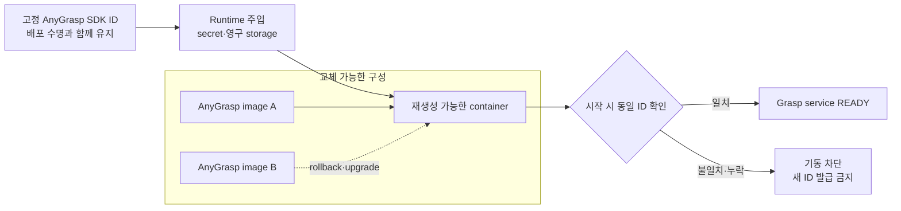
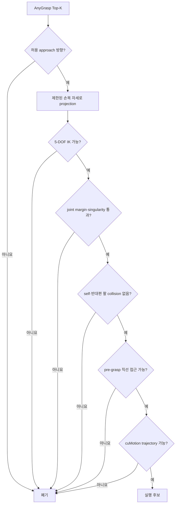

---
ingest_targets:
  - technical
  - decision
decision_candidates:
  - "AnyGrasp SDK ID 영속성과 컨테이너 배포 경계"
date: 2026-08-18
source_type: ai-conversation-answer-and-user-constraint
source_title: "컨테이너 아키텍처 정리 및 AnyGrasp SDK ID 불변 조건"
---

# 260818 - AnyGrasp SDK ID와 파지 경계

## 1. 절대 불변 조건

> [!IMPORTANT]
> AnyGrasp SDK ID는 최초 배포 이후 절대 변경하지 않는다.
> 컨테이너 재시작·재생성, 이미지 rebuild·업데이트·롤백, Docker 재시작과 Jetson 재부팅은 SDK ID의 변경 사유가 될 수 없다.

이 제약은 사용자가 개발 전제조건으로 추가했다. 공유 대화에는 실제 SDK ID 값이 없으므로
이 문서에도 값을 만들거나 기록하지 않는다.

## 2. SDK ID 생명주기

SDK ID는 컨테이너 instance의 속성이 아니라 Jetson 배포 단위의 영구 식별자로 취급한다.



| 변경 사건                 | 요구 결과                                 |
| --------------------- | ------------------------------------- |
| 컨테이너 restart·recreate | 기존 SDK ID 그대로 사용                      |
| 이미지 rebuild·tag 변경    | SDK ID와 분리하고 동일 값 주입                  |
| 이전 이미지로 rollback      | 기존 SDK ID 그대로 사용                      |
| Docker daemon restart | SDK ID 변화 없이 복구                       |
| Jetson reboot         | SDK ID 변화 없이 복구                       |
| SDK ID 누락·불일치         | AnyGrasp를 `READY`로 만들지 않고 grasp 요청 차단 |

호스트 교체, JetPack 재설치 또는 저장장치 복구에서도 새 SDK ID를 자동 생성하지 않는다.
동일 ID 보존이 확인되지 않으면 배포를 중단하고 복구 절차로 전환한다.

## 3. 보관과 노출 원칙

- SDK ID와 라이선스 정보는 Docker image layer, Git 저장소, Dockerfile, compose 기본값에 bake하지 않는다.
- 컨테이너의 writable layer에만 저장하지 않는다.
- 컨테이너에는 runtime secret 또는 영구 storage를 통해 필요한 범위만 주입한다.
- 가능하면 read-only로 제공하고 AnyGrasp 프로세스 외의 컨테이너에는 전달하지 않는다.
- 로그, crash dump, diagnostic bundle에는 실제 값을 출력하지 않는다.
- 관찰성에는 실제 값 대신 존재 여부, 일치 여부와 비민감 fingerprint만 기록한다.
- 장애 복구와 image rollback은 동일 SDK ID를 유지하는 절차를 포함해야 한다.

정확한 라이선스 파일 형식, SDK ID 생성·검증 방식과 머신 feature ID 결합 방식은 AnyGrasp SDK가 제공하는 실제 계약을 따라야 한다.
이 문서는 그 값을 추정하지 않고 “배포 생명주기 동안 동일해야 한다”는 불변식만 고정한다.

## 4. AnyGrasp 컨테이너 경계

AnyGrasp는 modified MinkowskiEngine과 CUDA extension, 머신 식별 기반 SDK 환경을 다른
모델로부터 격리하기 위해 독립 컨테이너로 둔다.

```text
Input
  selected object의 masked point cloud reference
  table 또는 floor plane
  gripper width range
  allowed approach cone·금지 방향
  arm hint
  max candidate count

Output
  Top-K GraspCandidate
    pose_base
    score_anygrasp
    gripper_width
    approach_vector
    collision_hint
    source_model_version
```

전체 장면 point cloud를 action payload로 보내지 않는다. AnyGrasp 결과는 후보이며 모터
명령, 최종 grasp 확정 또는 trajectory 실행 권한이 아니다.

## 5. 5-DOF 실행 가능성 필터

AnyGrasp의 6-DoF 후보는 현재 팔의 5-DOF 제약과 직접 일치하지 않을 수 있으므로 점수만으로
선택하지 않는다.



초기 실행 제약은 다음과 같다.

- Nav2로 base pre-positioning을 끝낸 뒤 arm planning 중에는 base를 고정한다.
- 한 번에 한 팔만 planning하고 다른 팔은 고정 obstacle로 포함한다.
- 제한된 손목 자세와 top-down grasp를 우선한다.
- side grasp와 orientation 민감 작업은 후순위로 둔다.

## 6. 실패와 fallback

| 상태 | 처리 |
| --- | --- |
| SDK ID 누락·불일치 | 컨테이너 readiness 실패, 새 SDK ID 생성 금지 |
| AnyGrasp timeout·crash | native Skill Executor가 작업을 `BLOCKED` 처리 |
| 유효한 5-DOF 후보 없음 | grasp 실행 금지 |
| 허용된 단순 형상 | 별도 정책을 통과한 geometric top-down fallback 사용 가능 |
| 오래된 `scene_revision` | 모든 grasp 후보 폐기 |

fallback은 AnyGrasp 서비스 장애 시 제한된 작업을 계속하기 위한 별도 알고리즘이다. SDK ID를
새로 만들거나 바꾸는 복구 수단으로 사용하지 않는다.

## 7. 배포 검증

다음 사건 전후에 동일한 SDK ID가 사용되는지 자동 검사하되 실제 값은 출력하지 않는다.

1. AnyGrasp 프로세스 재시작
2. 컨테이너 stop·start
3. 컨테이너 삭제 후 동일 설정으로 recreate
4. Docker daemon 재시작
5. Jetson 재부팅
6. 새 이미지 배포
7. 이전 이미지 rollback
8. persistent storage 복구

각 검사는 `동일`, `누락`, `불일치` 상태만 남긴다. `누락` 또는 `불일치`이면 AnyGrasp
action server를 준비 상태로 공개하지 않는다.

## 8. 관련 문서

- [실행 위치와 책임 경계](01%20-%20실행%20위치와%20책임%20경계.md)
- [AI 파이프라인과 데이터 통신](02%20-%20AI%20파이프라인과%20데이터%20통신.md)
- [배포 운영과 검증](04%20-%20배포%20운영과%20검증.md)
