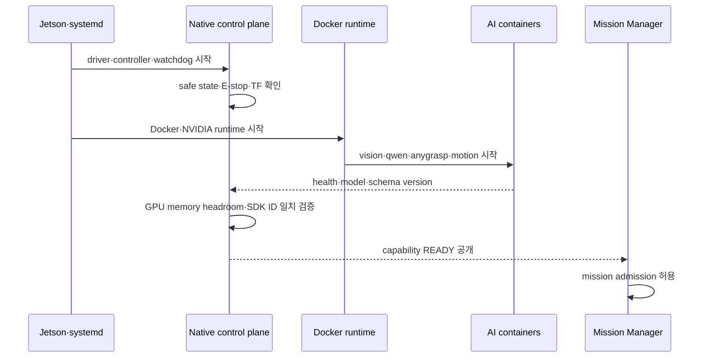

---
ingest_targets:
  - technical
  - decision
decision_candidates:
  - "Jetson 혼합형 배포 profile과 운영 검증 기준"
date: 2026-08-18
source_type: ai-conversation-answer
source_title: "컨테이너 아키텍처 정리"
---

# 260818 - 배포 운영과 검증

## 1. 실행 profile

| Profile         | 네이티브                                               | 컨테이너                           | 용도                             |
| --------------- | -------------------------------------------------- | ------------------------------ | ------------------------------ |
| `native-dev`    | core·navigation·robot IO·controller·mock adapter   | 없음                             | 초기 ROS 개발·센서/모터 bring-up       |
| `jetson-hybrid` | core·navigation·robot IO·controller·safety·logging | vision·qwen·anygrasp·motion    | 실제 Jetson 로봇 배포                |
| `container-ci`  | 없음 또는 CI runner                                    | Cleany core·mock robot·AI mock | 하드웨어 없는 CI·rosbag replay·시뮬레이션 |

실제 로봇 profile과 CI profile을 동일하게 만들 필요는 없다.
profile 사이에서 공통으로 유지할 것은 ROS interface, configuration schema, 식별자와 오류 계약이다.

## 2. 배포 기본 규칙

공유 답변은 JetPack 6.2, Ubuntu 22.04, ROS 2 Humble, Isaac ROS `release-3.2` 계열을 기준 조합으로 제안한다.
Jetson 컨테이너 이미지는 호스트 JetPack/L4T와 호환되는 `linux/arm64` 계열을 사용하고 `latest`에 의존하지 않는다.

```text
Host
  JetPack·L4T·NVIDIA driver 고정
  Docker Engine·NVIDIA Container Runtime
  systemd로 native control plane 관리
  NVMe에 image layer·model cache·artifact 저장

Container
  linux/arm64
  image digest와 model version 고정
  model·cache·log만 명시적으로 mount
  privileged: true 금지
  필요한 /dev 장치만 mount
  가능한 경우 read-only root filesystem
```

`host` network와 shared IPC는 ROS 2 shared memory 요구를 확인한 컨테이너에만 사용한다.
이 설정은 격리를 약화하므로 host filesystem과 장치 권한을 함께 넓히지 않는다.

AnyGrasp의 SDK ID와 라이선스 정보는 image에 포함하지 않고, 컨테이너 교체와 독립된
영구 생명주기로 관리한다.

## 3. 기동 순서



컨테이너 readiness는 프로세스 생존만 확인하지 않는다.

- model load와 CUDA context 초기화 완료
- 첫 warm-up 완료
- ROS action server 또는 모델 API 응답
- 필요한 TF와 controller 활성화
- GPU·system memory headroom 확보
- 온도 임계값 통과
- schema·model version 계약 일치
- AnyGrasp SDK ID 존재·동일성 확인

## 4. 종료와 장애 복구

정상 종료는 새 mission 차단, 활성 mission 취소, trajectory 중단, controller safe state, AI 컨테이너 종료, 네이티브 서비스 종료 순서로 진행한다.

```text
새 mission admission 차단
  → 활성 action cancel
  → 새 trajectory 차단
  → controller safe state 확인
  → AI container 종료
  → native control plane 종료
```

컨테이너 restart 뒤에는 이전 action을 이어서 실행하지 않는다. 새 `observation_id`와
`scene_revision`으로 다시 관측하고 capability가 준비된 뒤 새 요청을 만든다.

## 5. 자원과 관찰성

모델별로 다음을 기록한다.

| 범주 | 측정 항목 |
| --- | --- |
| 메모리 | idle RSS, load 후 RSS, peak system RAM, swap, 회수량 |
| 지연 | model load, warm-up, first inference, steady-state p50·p95 |
| GPU | GPU·EMC utilization, 동시 작업 여부, OOM |
| 열 | temperature, thermal throttling |
| ROS | message drop, action timeout, TF·QoS 오류 |
| 생명주기 | restart count, readiness 시간, image·model·schema version |
| 연속 운용 | 30분 이상 반복 시 메모리 증가와 장애 복구 |

모든 로그는 `mission_id`, `observation_id`, `scene_revision`, action request ID로 연결한다.
AnyGrasp SDK ID의 실제 값은 로그에 남기지 않고 일치 상태만 기록한다.

## 6. 구현 순서

1. ROS interface와 `observation_id`·`scene_revision` 계약을 고정한다.
2. perception·grasp·motion을 mock action server로 연결하고 AI 종료 시 safe stop을 검증한다.
3. SAM2 tiny/small과 RGB-D rosbag으로 mask·Depth·TF 기반 Scene State를 만든다.
4. AnyGrasp ARM64 컨테이너와 SDK ID 영속성을 검증하고 top-K·5-DOF 필터를 연결한다.
5. 기존 MoveIt controller를 유지한 채 cuMotion/cuRobo planning backend를 연결한다.
6. Qwen3-VL 2B 양자화 모델을 keyframe/crop 기반 structured inference로 연결한다.
7. GPU Lease, model load/unload, warm-up과 thermal·장시간 장애 검증을 통합한다.

구현 순서는 인터페이스와 장애 격리를 먼저 고정하고, 모델은 독립적으로 추가하는 흐름이다.
컨테이너 추가 자체를 완료 조건으로 삼지 않는다.

## 7. 필수 검증 시나리오

1. Qwen 컨테이너가 종료되어도 로봇이 계속 움직이지 않는다.
2. SAM2·vision이 종료되면 이전 관측 결과를 새 작업에 사용하지 않는다.
3. AnyGrasp timeout이면 Skill Executor가 `BLOCKED`로 종료한다.
4. AnyGrasp 컨테이너 재생성·이미지 교체·rollback 뒤에도 SDK ID가 바뀌지 않는다.
5. AnyGrasp SDK ID가 누락되거나 다르면 새 ID를 만들지 않고 readiness를 실패시킨다.
6. 이전 `scene_revision`의 grasp 결과를 실행하지 않는다.
7. motion planning 뒤 물체가 움직이면 trajectory를 취소한다.
8. GPU OOM 중에도 Mission Manager, Robot Interface와 watchdog이 유지된다.
9. physical E-stop은 Docker와 ROS 2 상태와 무관하게 동작한다.
10. 양쪽 팔이 동시에 같은 작업 공간에 진입하지 않는다.
11. 5-DOF 제약을 위반하는 AnyGrasp orientation은 폐기한다.
12. Qwen 결과가 없어도 허용된 제한 범위의 rule-based 동작 또는 안전한 `BLOCKED` 상태가 가능하다.
13. 30분 이상 반복 작업에서 메모리가 지속적으로 증가하지 않는다.
14. Docker daemon 재시작 뒤 활성 mission을 이어서 실행하지 않는다.

## 8. 관련 문서

- [실행 위치와 책임 경계](01%20-%20실행%20위치와%20책임%20경계.md)
- [AI 파이프라인과 데이터 통신](02%20-%20AI%20파이프라인과%20데이터%20통신.md)
- [AnyGrasp SDK ID와 파지 경계](03%20-%20AnyGrasp%20SDK%20ID와%20파지%20경계.md)
