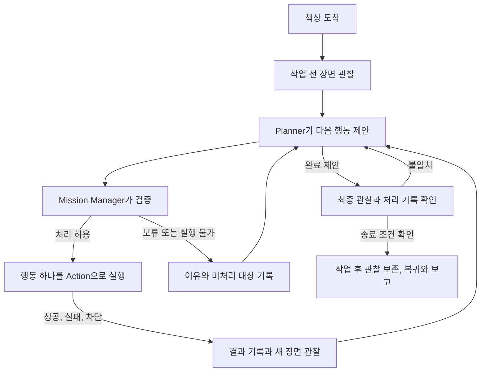

# 책상 정리 작업 흐름과 Manipulation Action 최신화

## 가장 중요한 경계

| 담당 | 맡는 일 |
|---|---|
| Mission Manager | 전체 미션, Planner 제안의 승인, 행동 호출과 재관찰, 취소와 보고 |
| Perception | 장면, 물체, 이미지 영역과 좌표를 제공 |
| Planner | 최신 장면과 이전 결과로 다음 행동이나 완료를 제안 |
| Manipulation Action | 승인받은 행동 하나의 집기, 이동, 놓기와 결과 확인 |
| Logger 또는 관측 전달 기능 | 같은 장면의 사진과 물체 정보를 묶어 상위단에 전달 |
| Backend와 Dashboard | 전후 관찰, 실패와 미처리 대상 표시 |

Action 내부의 접근, 집기, 운반 같은 세부 동작은 Mission Manager에 각각 다시
승인받는 요청으로 나누지 않는 구현안이다. 다음 대상 선택과 행동별 재판단은
Mission Manager와 Planner의 기존 책임을 유지한다.

## 책상에 도착한 뒤 일어나는 일

보류한 대상이 반복해서 같은 제안으로 돌아오지 않도록 이전 결과도 Planner에
전달한다. 빈 책상, 전부 보류된 장면과 정상적인 완료는 서로 구분한다. 첫 빈
장면을 실패 또는 성공으로 확정하는 규칙은 이 기록에서 새로 정하지 않는다.

## 첫 사진과 물체 정보를 전달하려는 요구

첫 물체를 움직이기 전에, 같은 관찰에서 얻은 원본 이미지와 bbox, 라벨, 의미 분류,
Planner의 처리 제안을 묶어서 상위단에 전달한다. 상위단이 원본 위에 상자와 라벨을
그린 화면을 만든다. 분류가 불확실한 대상도 숨기거나 확정된 쓰레기로 바꾸지 않는다.
빈 장면은 원본 사진과 빈 물체 목록으로 표현할 수 있다.

작업 후 관찰도 같은 미션에 연결한다. 중간 관찰은 다음 판단에 필요하지만 모든
사진을 상위단에 보낼지, Backend 저장 확인을 첫 조작의 조건으로 둘지는 별도로
검토한다. 로컬 발행 호출만으로 Backend 저장을 확인했다고 말하지 않는다.

## 구현 문서에서 구체화할 것

- 승인된 행동 하나의 Action Goal, Feedback와 Result 필드 후보
- 같은 물체의 접근, 집기, 들기, 운반, 놓기와 결과 확인
- 행동 실패, 차단, 취소 뒤 물체와 팔 상태를 설명하는 결과
- 기존 ModuleResult와 MissionReport 사이의 adapter 규칙
- snapshot과 이미지의 일치, bbox 좌표, 의미 분류와 처리 제안의 구분
- 실제 구현, 시뮬레이션 데모와 새 Action 제안의 차이

분실물의 물리적 처리 행동, 모델 선택, VLA와 MoveIt의 조합은 기존 미정 범위를
유지한다. 기존 시뮬레이션의 분실물 보관 경로를 제품 계약으로 옮기지 않는다.

## 이전 논의

[이전 설계 기록](<260930 - Manipulation Action Design/이전 설계 기록.md>)에 원문을
보존했다. 책상 전체 Action과 `CLEAN_TABLE` 제안은 현재 책임 경계로 채택하지 않는다.

## 후속 논의

Action 결과의 구분과 관찰 자료의 저장 및 전송 정책에 관한 2026-10-02 선택은
[후속 합의 기록](<261002 - Action 결과와 관찰 자료 전달 정책 합의.md>)에 보존했다.
