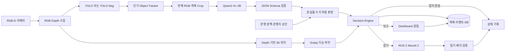
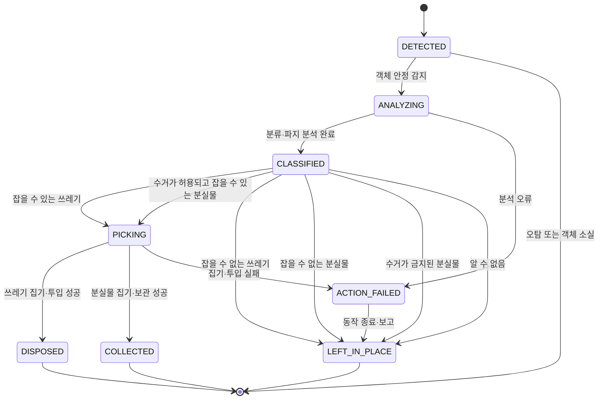
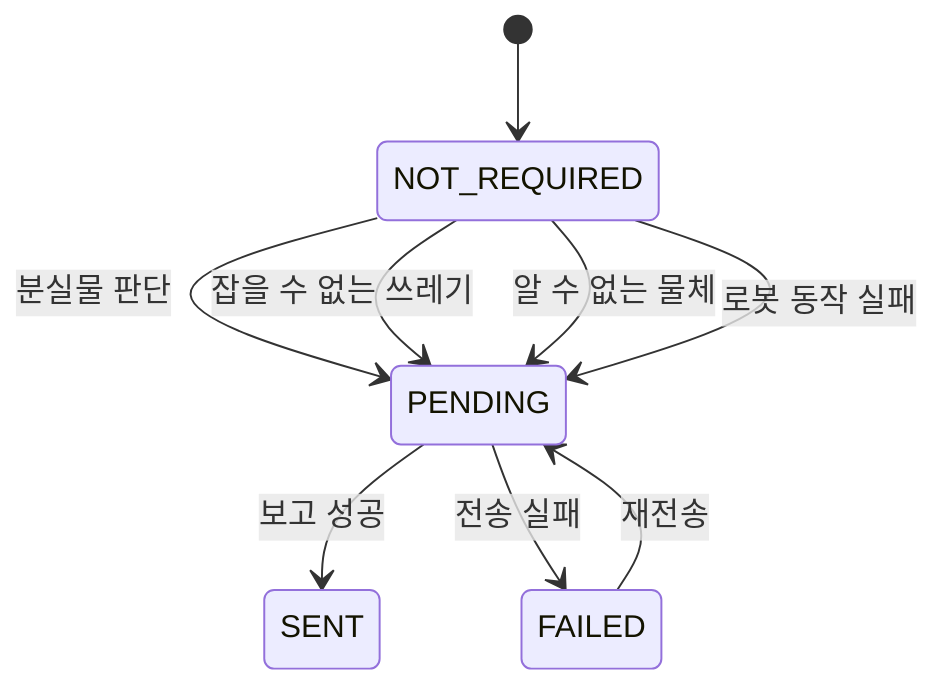

# 260727 - 객체 탐지·판단 시스템 MVP 아키텍처

## 1. 목표

RGB-D 카메라로 탐지한 객체를 쓰레기, 분실물, 알 수 없음으로 구분하고 안전한 처리 행동을 결정하는 MVP 시스템을 설계한다.

- 쓰레기와 수거가 허용된 분실물의 파지 가능 여부를 판단한다.
- 분실물의 수거 허용 여부를 운영 정책 또는 운영자 승인으로 결정한다.
- 분류·수거 허용·파지 결과를 결합해 폐기, 분실물 수거, 제자리 유지, 보고 중 하나를 선택한다.
- 불확실하거나 안전하게 처리할 수 없는 객체는 잡지 않고 운영자에게 보고한다.

## 2. 핵심 결론

- RGB-D와 YOLO·YOLO-Seg로 객체 위치와 영역을 탐지한다.
- Qwen2-VL-2B는 객체를 `TRASH`(쓰레기), `LOST_ITEM`(분실물), `UNKNOWN`(알 수 없음)으로 분류한다.
- Depth 모듈은 VLM과 분리해 3D 위치와 파지 가능성을 계산한다.
- Decision Engine은 객체 분류, 분실물 수거 허용 여부, 파지 가능성을 결합해 행동을 결정한다. VLM은 로봇을 직접 제어하지 않는다.
- 장기 Scene Memory는 제외하고 중복 VLM 요청 방지용 단기 Track Cache만 사용한다.

| 분류          | 처리 원칙                                         |
| ----------- | --------------------------------------------- |
| `TRASH`     | 잡을 수 있으면 폐기하고, 잡을 수 없으면 제자리에 두고 보고            |
| `LOST_ITEM` | 수거가 허용되고 잡을 수 있을 때만 별도 보관하고, 그 외에는 제자리에 두고 보고 |
| `UNKNOWN`   | 잡지 않고 제자리에 둔 뒤 보고                             |

분실물 수거 허용 여부는 운영 정책 또는 운영자가 결정하며, 확인되지 않으면 수거를 금지한다.
세부 필드와 상태 조합은 7.1절에서 정의한다.

## 3. MVP 아키텍처



## 4. 모듈별 결과

| 모듈                  | 책임                                               |
| ------------------- | ------------------------------------------------ |
| RGB-D Capture       | RGB, Depth, Camera Info 수집                       |
| YOLO·YOLO-Seg       | 객체 위치·class 탐지, Bounding Box·Mask 생성, 객체 Crop 생성 |
| 단기 Tracker          | Track ID 유지, 중복 VLM 요청 방지, Bounding Box 흔들림 완화   |
| Qwen2-VL-2B         | 쓰레기·분실물·알 수 없음 분류, 대표 이름·상세 설명·주의사항 생성           |
| Depth·Grasp         | 3D 위치, 객체 높이·크기, 도달성, 주변 충돌 여유, 파지 가능성 계산        |
| JSON Validator      | VLM 출력의 JSON parsing, 필수 필드와 Enum 검증             |
| Permission Resolver | 운영 정책·운영자 입력으로 분실물 수거 허용 여부 결정                   |
| Decision Engine     | 객체 분류·분실물 수거 허용 여부·파지 가능성을 결합해 행동·보고 결정          |
| Robot Control       | 승인된 쓰레기 폐기와 분실물 수거 수행                            |
| Report              | 분실물, 파지 불가 쓰레기, 알 수 없는 물체, 동작 실패 보고              |
| Event DB            | 객체 정보, 상태, 보고 결과, 감지·갱신 시각 저장                    |

## 5. VLM 입력과 출력

### 5.1 입력

Qwen2-VL-2B에는 아래 정보만 전달한다.

1. 책상 전체 RGB 이미지
2. 탐지된 객체 Crop 이미지
3. YOLO 탐지 class
4. YOLO confidence

Depth 이미지는 VLM에 직접 전달하지 않고 위치·파지 계산 모듈에서 사용한다. 감지 시각,
이동 정보, 사람 상호작용, 과거 VLM 판단, 장기 객체 이력도 VLM 입력에서 제외한다.
`detected_at`과 `last_updated_at`은 이벤트 DB에만 기록한다.

### 5.2 출력

아래는 필드 설명을 위한 JSONC 예시다. `//` 뒤의 한국어 주석은 문서 설명용이며 실제
JSON payload에서는 제거한다.

```jsonc
{
  "representative_name": "지갑", // 대표 객체명
  "detailed_description": "갈색 가죽 재질의 반지갑", // 눈에 보이는 상세 특징
  "category": "LOST_ITEM", // 객체 의미 분류: 분실물
  "cautions": [
    "개인 소유물일 가능성이 높음",
    "자동 폐기 금지"
  ], // 취급 시 주의사항
  "visible_evidence": [
    "접히는 형태의 가죽 물체",
    "카드 수납 형태가 보임"
  ] // 분류를 뒷받침하는 시각적 근거
}
```

허용 `category`는 아래 세 가지다.

| 상태          | 한국어 설명 | 다음 판단                             |
| ----------- | ------ | --------------------------------- |
| `TRASH`     | 쓰레기    | `grasp_state`를 평가한다.              |
| `LOST_ITEM` | 분실물    | `collection_permission`을 먼저 확인한다. |
| `UNKNOWN`   | 알 수 없음 | 잡지 않고 운영자에게 보고한다.                 |

VLM은 보이는 정보만 사용하고 소유권이나 물체 상태를 추정하지 않는다.
지갑, 열쇠, 카드, 전자기기, 문서는 `TRASH`로 분류하지 않는다.
일반 물체, 위험 물체, 판단 불가 물체는 폐기 또는 분실물로 확신할 수 없으면 `UNKNOWN`으로 보수적으로 분류한다.
파지 가능성, 분실물 수거 허용 여부, 로봇 행동은 VLM이 출력하지 않는다.

## 6. 단기 객체 관리

장기 객체 기억 대신 아래 필드만 갖는 휘발성 Track Cache를 사용한다.

| 필드                   | 한국어 설명                          |
| -------------------- | ------------------------------- |
| `track_id`           | 현재 실행 중인 Tracker가 부여한 임시 객체 ID  |
| `bbox`               | 이미지 안의 객체 영역을 나타내는 Bounding Box |
| `stable_frame_count` | 같은 객체가 안정적으로 감지된 연속 프레임 수       |
| `vlm_requested`      | 해당 객체에 VLM 분류를 이미 요청했는지 여부      |

Track Cache의 용도는 다음으로 제한한다.

- 동일 객체에 대한 중복 VLM 요청 방지
- Bounding Box 흔들림 완화
- 객체가 일정 프레임 이상 안정적으로 탐지됐는지 확인
- VLM 처리 중 동일 요청의 중복 생성 방지

애플리케이션이 재시작되면 Track Cache는 사라지며 과거 객체를 기억하지 않는다.

## 7. 객체 데이터 모델

| 구분  | 필드                             | 한국어 설명                     |
| --- | ------------------------------ | -------------------------- |
| 식별  | `object_id`                    | 객체 이벤트의 고유 ID              |
| 식별  | `track_id`                     | 현재 실행 중인 Tracker의 임시 객체 ID |
| 분류  | `category`                     | 객체 의미 분류: 쓰레기·분실물·알 수 없음   |
| 허용  | `collection_permission`        | 분실물 수거 허용 여부. 분실물에만 적용     |
| 허용  | `collection_permission_source` | 수거 허용 여부를 결정한 정책 또는 운영자 근거 |
| 표현  | `representative_name`          | 운영자가 확인할 대표 객체명            |
| 표현  | `detailed_description`         | 객체의 눈에 보이는 상세 특징           |
| 표현  | `cautions`                     | 취급 시 주의사항 목록               |
| 표현  | `visible_evidence`             | VLM 분류를 뒷받침하는 시각적 근거 목록    |
| 처리  | `lifecycle_state`              | 현재 물리적 처리 단계               |
| 보고  | `report_state`                 | 보고 필요 여부와 전송 결과            |
| 파지  | `grasp_state`                  | 실제로 잡을 수 있는지에 대한 평가 상태     |
| 파지  | `grasp_reason`                 | 파지 가능 또는 불가능 판단의 근거        |
| 위치  | `position_xyz`                 | RGB-D 카메라 좌표계 기준 3D 위치     |
| 시간  | `detected_at`                  | 객체가 최초 감지된 시각              |
| 시간  | `last_updated_at`              | 객체 상태가 마지막으로 변경된 시각        |

### 7.1 분류·수거 허용·파지 상태

판단 순서는 `category` → `collection_permission` → `grasp_state`다.
단, `collection_permission`은 분실물에만 적용하며 수거가 금지된 객체는 파지 가능성을 평가하지 않는다.

#### 객체 분류: `category`

| 상태        | 한국어 의미 | 다음 판단                                  |
| --------- | ------ | -------------------------------------- |
| `TRASH`   | 쓰레기    | 수거 허용 확인 없이 `grasp_state` 평가           |
| `LOST_ITEM` | 분실물    | `collection_permission` 확인 후 파지 평가 여부 결정 |
| `UNKNOWN` | 알 수 없음 | 파지하지 않고 운영자에게 보고                     |

#### 분실물 수거 허용: `collection_permission`

| 상태               | 한국어 의미       | 처리 방식                          |
| ---------------- | ------------ | ------------------------------ |
| `ALLOWED`        | 수거해도 됨      | `grasp_state` 평가 후 수거 여부 결정      |
| `PROHIBITED`     | 수거하면 안 됨    | `NOT_EVALUATED`로 기록하고 제자리에 둠     |
| `NOT_APPLICABLE` | 판단 대상이 아님   | 쓰레기 또는 알 수 없는 객체에 사용            |

분실물의 기본값은 `PROHIBITED`다. 명시적인 운영 정책 또는 운영자 승인으로 수거가 허용된 경우에만 `ALLOWED`로 바꾼다.
`TRASH`와 `UNKNOWN`에는 `NOT_APPLICABLE`을 기록한다.

#### 수거 허용 근거: `collection_permission_source`

| 상태               | 한국어 의미      | 적용 상황                       |
| ---------------- | ----------- | --------------------------- |
| `SITE_POLICY`    | 시설 운영 정책    | 사전에 정의된 시설 정책으로 허용 여부를 결정함 |
| `OPERATOR`       | 운영자 직접 판단   | 운영자가 해당 객체의 수거 여부를 승인함      |
| `DEFAULT_DENY`   | 기본 수거 금지    | 확인 가능한 허용 근거가 없음             |
| `NOT_APPLICABLE` | 판단 대상이 아님   | 분실물이 아닌 객체에 사용               |

#### 파지 상태: `grasp_state`

| 상태              | 한국어 의미 | 처리 방식                              |
| --------------- | ------ | ---------------------------------- |
| `GRASPABLE`     | 잡을 수 있음 | 쓰레기는 폐기하고, 수거 허용 분실물은 별도 보관함으로 이동 |
| `NOT_GRASPABLE` | 잡을 수 없음 | 제자리에 두고 운영자에게 보고                  |
| `NOT_EVALUATED` | 평가하지 않음 | 수거 금지 분실물 또는 알 수 없는 객체에 사용          |

### 7.2 객체 예시

| 구분                             | 잡을 수 있는 쓰레기      | 잡을 수 없는 쓰레기      | 수거 가능하고 잡을 수 있는 분실물 | 수거 금지 분실물       | 알 수 없음           |
| ------------------------------ | ---------------- | ---------------- | ------------------- | --------------- | ---------------- |
| 객체                             | 구겨진 휴지           | 표면에 밀착된 종이       | 운영자가 수거를 승인한 지갑     | 수거 승인 없는 카드     | 식별하기 어려운 액체 용기   |
| `category`                     | `TRASH`          | `TRASH`          | `LOST_ITEM`         | `LOST_ITEM`     | `UNKNOWN`        |
| `collection_permission`        | `NOT_APPLICABLE` | `NOT_APPLICABLE` | `ALLOWED`           | `PROHIBITED`    | `NOT_APPLICABLE` |
| `collection_permission_source` | `NOT_APPLICABLE` | `NOT_APPLICABLE` | `OPERATOR`          | `DEFAULT_DENY`  | `NOT_APPLICABLE` |
| `grasp_state`                  | `GRASPABLE`      | `NOT_GRASPABLE`  | `GRASPABLE`         | `NOT_EVALUATED` | `NOT_EVALUATED`  |
| `lifecycle_state`              | `CLASSIFIED`     | `LEFT_IN_PLACE`  | `CLASSIFIED`        | `LEFT_IN_PLACE` | `LEFT_IN_PLACE`  |
| `report_state`                 | `NOT_REQUIRED`   | `SENT`           | `SENT`              | `SENT`          | `SENT`           |
| 결과                             | 쓰레기통에 폐기         | 제자리 유지·보고        | 분실물 보관 장소로 수거·보고    | 제자리 유지·보고       | 제자리 유지·보고        |

### 7.3 처리 상태

```text
DETECTED          # 객체가 처음 감지됨
ANALYZING         # 의미 분류와 정책 입력을 분석 중
CLASSIFIED        # 분류·허용·파지 판단이 완료됨
PICKING           # 로봇이 객체 집기를 수행 중
DISPOSED          # 쓰레기통 투입이 완료됨
COLLECTED         # 분실물 보관 장소로 수거가 완료됨
LEFT_IN_PLACE     # 객체를 제자리에 둠
ACTION_FAILED     # 분석·집기·이동 동작이 실패함
```

`WAITING_APPROVAL`(운영자 승인 대기)는 수거 허용 입력이 별도 운영 시스템이므로 이 MVP 처리 상태에서 사용하지 않는다.

### 7.4 보고 상태

```text
NOT_REQUIRED # 보고가 필요하지 않음
PENDING      # 보고 전송 대기 중
SENT         # 보고 전송이 완료됨
FAILED       # 보고 전송이 실패함
```

## 8. 판단·보고 정책

| `category`  | `collection_permission` | `grasp_state`   | 행동               | 보고  |
| ----------- | ----------------------- | --------------- | ---------------- | --- |
| `TRASH`     | `NOT_APPLICABLE`        | `GRASPABLE`     | 잡아 쓰레기통에 버림      | 안 함 |
| `TRASH`     | `NOT_APPLICABLE`        | `NOT_GRASPABLE` | 제자리에 둠           | 보고  |
| `LOST_ITEM` | `ALLOWED`               | `GRASPABLE`     | 잡아 분실물 보관 장소로 옮김 | 보고  |
| `LOST_ITEM` | `ALLOWED`               | `NOT_GRASPABLE` | 제자리에 둠           | 보고  |
| `LOST_ITEM` | `PROHIBITED`            | `NOT_EVALUATED` | 제자리에 둠           | 보고  |
| `UNKNOWN`   | `NOT_APPLICABLE`        | `NOT_EVALUATED` | 제자리에 둠           | 보고  |

Decision 결과는 아래 네 필드로 구성한다.

| 필드              | 한국어 설명                 |
| --------------- | ---------------------- |
| `should_pick`   | 로봇이 객체 집기를 실행해야 하는지 여부 |
| `should_report` | 운영자에게 결과를 보고해야 하는지 여부  |
| `action`        | 정책 엔진이 선택한 최종 행동       |
| `reason`        | 해당 행동을 선택한 판단 근거       |

허용 `action` 상태는 다음과 같다.

```text
DISPOSE_TRASH     # 쓰레기를 잡아 쓰레기통에 버림
COLLECT_LOST_ITEM # 분실물을 잡아 별도 보관 장소로 옮김
LEAVE_IN_PLACE    # 객체를 잡지 않고 제자리에 둠
```

결정 규칙은 다음과 같다.

- `TRASH + GRASPABLE`: `DISPOSE_TRASH`, 잡아 폐기하고 보고하지 않음
- `TRASH + NOT_GRASPABLE`: `LEAVE_IN_PLACE`, 잡지 않고 보고
- `LOST_ITEM + ALLOWED + GRASPABLE`: `COLLECT_LOST_ITEM`, 별도 보관 장소로 옮기고 보고
- `LOST_ITEM + ALLOWED + NOT_GRASPABLE`: `LEAVE_IN_PLACE`, 잡지 않고 보고
- `LOST_ITEM + PROHIBITED`: `LEAVE_IN_PLACE`, 파지 판단 없이 보고
- `UNKNOWN`: `LEAVE_IN_PLACE`, 파지 판단 없이 보고

### 8.1 조합 정합성 규칙

아래 조합만 유효한 입력으로 허용한다. 이외 조합은 JSON 형식이 맞더라도 정책 검증 오류로 처리하고 `ACTION_FAILED`로 전이한 뒤 운영자에게 보고한다.

| `category`  | 허용되는 `collection_permission` | 허용되는 `grasp_state`           |
| ----------- | ---------------------------- | ---------------------------- |
| `TRASH`     | `NOT_APPLICABLE`             | `GRASPABLE`, `NOT_GRASPABLE` |
| `LOST_ITEM` | `ALLOWED`                    | `GRASPABLE`, `NOT_GRASPABLE` |
| `LOST_ITEM` | `PROHIBITED`                 | `NOT_EVALUATED`              |
| `UNKNOWN`   | `NOT_APPLICABLE`             | `NOT_EVALUATED`              |

수거 허용 근거가 없거나, 필드가 누락되거나, 정의되지 않은 상태가 들어오면 집지 않는 방향으로 실패 처리한다.
특히 VLM이 `collection_permission`이나 `action`을 직접 제안하더라도 Decision Engine 입력으로 채택하지 않는다.

## 9. 상태 전이

### 9.1 객체 처리 상태



### 9.2 보고 상태



## 10. 파지 가능성

파지 가능성은 `TRASH` 또는 `LOST_ITEM + ALLOWED`인 객체에만 평가한다.
아래 조건을 모두 만족하면 `GRASPABLE`, 하나라도 만족하지 않으면 `NOT_GRASPABLE`로 판단한다.
`LOST_ITEM + PROHIBITED`와 `UNKNOWN`은 `NOT_EVALUATED`로 기록한다.

```text
Depth 데이터가 유효함
AND 로봇 작업 영역 안에 있음
AND 객체 크기가 그리퍼 파지 폭 안에 있음
AND 객체 높이가 최소 높이 이상임
AND 주변 충돌 여유가 확보됨
AND 주의사항에 현재 로봇이 처리할 수 없는 위험이 없음
```

초기 예시값은 그리퍼 폭 5~80 mm, 최소 객체 높이 5 mm, 최소 충돌 여유 15 mm다.
실제 값은 RGB-D, 그리퍼, 작업 공간 실측으로 다시 정해야 한다.

## 11. 런타임·배포 검토 후보

아래 항목은 MVP 아키텍처를 위한 구현 후보이며 확정된 기준이 아니다.

- Jetson Orin NX 16GB의 CPU와 GPU가 메모리를 공유하므로 YOLO와 VLM을 무제한 병렬 실행하지 않는다.
- YOLO는 TensorRT FP16 또는 INT8을 검토한다.
- Qwen2-VL-2B는 이벤트가 발생할 때만 batch size 1로 실행한다.
- Qwen2-VL-2B-Instruct-AWQ 4-bit를 우선 검토하되 Jetson에서 직접 메모리·지연을 측정한다.
- VLM 요청 queue는 1~2로 제한한다.
- 전체 이미지와 객체 Crop의 해상도와 시각 토큰 수를 제한한다.
- VLM 장애가 발생해도 YOLO, 안전 제어, 로봇 정지는 동작해야 한다.
- 이벤트 이미지와 로그는 NVMe에 저장하는 방안을 검토한다.

## 12. 평가 기준 후보

```text
객체 탐지 Recall
쓰레기 판단 Precision·Recall
분실물 판단 Precision·Recall
알 수 없음 판단 Precision·Recall
분실물 수거 허용 정책 적용 정확도
파지 가능 판단 정확도
잘못 폐기한 물체 수
수거 금지 분실물을 이동한 수
중복 보고율
Track ID 변경 횟수
Pick 성공률
평균 판단 시간
최대 메모리 사용량
```

가장 중요한 안전 지표는 일반 정확도가 아니라 잘못된 자동 폐기율이다.
자동 폐기 대상은 좁게 시작하고, 검증 데이터에서 오폐기 사례가 없는 범위만 자동화한다.

## 13. 검토 필요 결론

- 분실물의 `ALLOWED`·`PROHIBITED`를 결정하는 운영 정책과 승인 주체를 확정해야 한다.
- 수거한 분실물의 보관 장소, 인계 절차, 보관 실패 시 폴백을 확정해야 한다.
- 위험 가능성이 있는 객체를 `UNKNOWN`으로 통합하는 기준과 동작 실패의 보고·재시도 정책을 확정해야 한다.
- 단기 Tracker를 MVP 필수 범위에 포함할지 확인해야 한다.
- 그리퍼 폭, 최소 객체 높이, 충돌 여유 등 파지 임계값을 실측해야 한다.
- Jetson Orin NX 16GB에서 YOLO와 Qwen2-VL-2B의 메모리, 지연, 처리량을 검증해야 한다.
- ROS 2·MoveIt 2, DeepStream, Dashboard, Event DB, 컨테이너 구성을 확정해야 한다.

## 14. 최종 처리 흐름

```text
RGB-D 프레임 수신
→ YOLO 객체 탐지
→ 단기 Tracker로 객체 안정화
→ 전체 RGB 이미지와 객체 Crop 생성
→ Qwen2-VL-2B가 TRASH·LOST_ITEM·UNKNOWN으로 객체 분류
→ LOST_ITEM이면 운영 정책에서 수거 허용 여부 확인
→ Depth 기반 3D 위치 계산
→ TRASH 또는 수거 허용 LOST_ITEM이면 파지 가능성 판단
→ Decision Engine 실행
→ 쓰레기 폐기·분실물 수거·제자리 유지·보고
```
