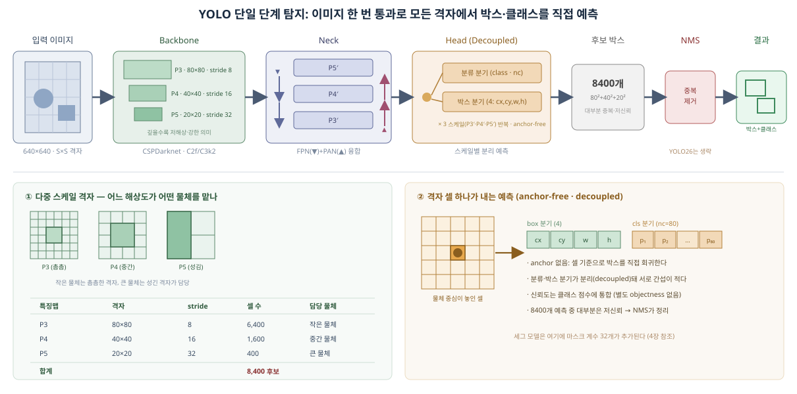
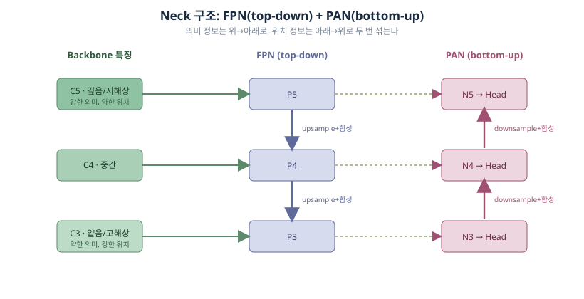
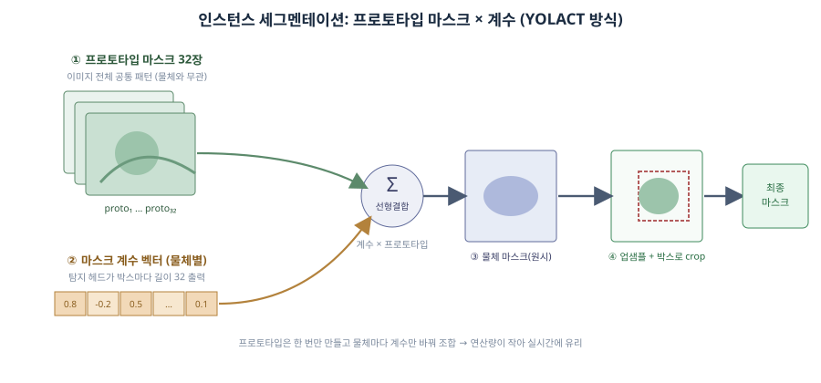

# 260722 - YOLO 방법론 정리 (탐지·세그멘테이션·NMS·버전 변천)

## 1. 목표 및 요약

이 문서는 `YOLO11n-seg`를 우선 선정안으로 정리한 「260720 - 객체 탐지·세그멘테이션 모델 비교」의 후속 자료다. 모델 이름과 표만으로는 판단하기 어려운 부분, 즉 YOLO가 어떻게 객체를 탐지하고 마스크를 만드는지, NMS가 무엇이고 왜 문제가 되는지, YOLOv8에서 YOLO11로 그리고 YOLO26으로 넘어오며 무엇이 바뀌었는지를 방법론 수준에서 정리한다.

핵심 요약은 다음과 같다. YOLO는 이미지를 한 번만 통과시켜 격자(grid) 위 각 위치에서 박스와 클래스를 직접 회귀하는 단일 단계(single-stage) 탐지기다. 인스턴스 세그멘테이션은 YOLACT 방식의 프로토타입 마스크와 마스크 계수의 선형결합으로 처리한다. YOLOv8·YOLO11은 여러 후보 박스를 만든 뒤 NMS로 중복을 제거하는 구조이며, YOLO26은 학습 단계에서 객체마다 예측을 하나로 수렴시키는 방식(one-to-one)으로 NMS 자체를 없앤 end-to-end 모델이다. NMS 제거는 Jetson·엣지 배포에서 후처리 지연과 이식성 문제를 줄여 주는 실질적 이점이 있으나, YOLO26-seg의 Orin NX 실측이 아직 없다는 점은 이전 문서의 판단과 동일하다.

이 문서의 수치는 공개 자료(Ultralytics 문서, arXiv 논문) 기반이며 끌리니 환경 실측이 아니다.

### 1.1 버전 한눈에 비교

| 버전     | 공개일        |   n 등급 mAP50-95 | n 등급 params(M) | 핵심 구조 변화                    | NMS |
| ------ | ---------- | --------------: | -------------: | --------------------------- | --- |
| YOLOv8 | 2023-01-10 |            37.3 |            3.2 | anchor-free split head 도입   | 필요  |
| YOLO11 | 2024-09-10 |            39.5 |            2.6 | C3k2·C2PSA·경량 분류분기          | 필요  |
| YOLO26 | 2026-01-14 | 40.9 (e2e 40.1) |            2.4 | DFL 제거·dual-head one-to-one | 불필요 |

세 버전 모두 anchor-free 단일 단계 계열이며, 큰 흐름은 "효율 개선(v8→11) → 추론 파이프라인 재설계(11→26)"다. 자세한 근거는 6장에서 다룬다.

## 2. 조사 범위

| 항목 | 다루는 내용 | 다루지 않는 내용 |
|---|---|---|
| 탐지 방법론 | YOLO의 단일 단계 탐지 원리, anchor-free, decoupled head | 2-stage(Faster R-CNN 계열) 상세 |
| 세그멘테이션 | 프로토타입 마스크 + 마스크 계수 방식 | 시맨틱 세그·파노프틱 상세 |
| NMS | 표준 NMS 알고리즘, IoU, 한계 | Soft-NMS 등 변형별 수식 상세 |
| 버전 변천 | YOLOv8 → YOLO11 → YOLO26 구조 변화 | YOLOv9·v10·v12 개별 심층 분석 |
| NMS-free 전환 | one-to-one 학습, dual-head, DFL 제거 | 원 논문 손실함수 유도 전개 |
| 장단점 | 각 방식의 이득과 리스크 | 끌리니 실측 벤치마크 |

## 3. YOLO 객체 탐지 방법론

YOLO의 탐지는 "이미지 한 번 통과 → 격자마다 박스·클래스 직접 예측 → 중복 정리"로 요약된다. 아래 도식이 전체 흐름이며, 각 단계는 3.1~3.5에서 자세히 다룬다.

### 3.1 단일 단계 탐지의 기본 아이디어

YOLO(You Only Look Once)는 이름 그대로 이미지를 신경망에 한 번만 통과시켜 탐지를 끝내는 단일 단계(single-stage) 방식이다. Faster R-CNN 같은 2-stage 방식은 먼저 물체가 있을 법한 후보 영역(region proposal)을 수백~수천 개 뽑고, 그 영역을 하나씩 다시 신경망에 넣어 분류·정밀화한다. 정확하지만 영역 개수만큼 연산이 반복돼 느리다.

YOLO는 이 두 단계를 하나로 합친다. 입력 이미지를 통과시키면 마지막 특징맵이 S×S 격자(grid)처럼 공간적으로 나뉘고, 각 격자 위치(정확히는 특징맵의 각 셀)가 "여기에 물체 중심이 있다면 그 박스와 클래스는 무엇인가"를 직접 회귀한다. 한 번의 순전파(forward pass)로 이미지 전체의 모든 후보를 동시에 예측하므로 빠르고, 실시간 추론에 적합하다.

출력은 개념적으로 격자 셀마다 다음 값을 담은 텐서다.

| 예측 항목 | 내용 |
|---|---|
| 박스 좌표 | 중심 x·y, 폭 w·높이 h (특징맵 위치를 기준으로 회귀) |
| 클래스 점수 | 각 클래스일 확률 (COCO 기본 80종) |
| 신뢰도 | 이 예측이 실제 물체일 가능성 |

YOLO는 이런 격자 예측을 한 해상도가 아니라 여러 해상도(P3·P4·P5)에서 동시에 수행한다. 작은 물체는 촘촘한 고해상 격자가, 큰 물체는 성긴 저해상 격자가 담당하도록 나누는 것이 다중 스케일 탐지의 핵심이다.

### 3.2 백본·넥·헤드 3단 구조

내부는 세 부분으로 나뉜다. 백본(backbone)은 이미지에서 특징을 여러 단계로 추출하고, 넥(neck)은 서로 다른 해상도의 특징을 섞어 다양한 크기의 물체에 대응하며, 헤드(head)는 최종적으로 박스·클래스(세그 모델은 마스크까지)를 출력한다.

| 구성       | 역할                                | YOLOv8/YOLO11에서의 형태                |
| -------- | --------------------------------- | ---------------------------------- |
| Backbone | 이미지에서 계층적 특징 추출 (P3·P4·P5 다중 해상도) | CSPDarknet 계열, C2f(v8)/C3k2(11) 블록 |
| Neck     | 여러 해상도 특징을 상·하향으로 융합              | FPN + PAN                          |
| Head     | 스케일별로 위치·클래스·마스크 예측               | Decoupled head (분류·회귀 분리)          |

여기서 P3·P4·P5는 입력 대비 각각 1/8, 1/16, 1/32로 줄어든 해상도의 특징맵을 뜻한다. 얕은 P3는 해상도가 높아 위치 정보(작은 물체 경계)가 강하지만 의미 정보가 약하고, 깊은 P5는 반대로 의미(무엇인지)가 강하지만 위치가 뭉개진다. 이 상보성을 넥에서 결합한다.

### 3.3 Neck 상세: FPN + PAN

넥은 백본이 뽑은 P3·P4·P5를 그대로 헤드에 넘기지 않고, 두 방향으로 두 번 섞는다.

첫째, FPN(Feature Pyramid Network)의 top-down 경로다. 가장 깊은 P5의 강한 의미 정보를 위로 업샘플링해 P4·P3에 더한다. 이렇게 하면 고해상 특징맵도 "이게 무슨 물체인지"에 대한 의미 정보를 갖게 되어, 작은 물체의 분류 정확도가 올라간다.

둘째, PAN(Path Aggregation Network)의 bottom-up 경로다. FPN을 거친 뒤 다시 얕은 층의 강한 위치 정보를 아래에서 위로 다운샘플링해 더한다. 깊은 특징맵도 정확한 경계 정보를 되찾아, 큰 물체의 위치 정밀도가 올라간다.

정리하면 FPN은 의미를 위→아래로, PAN은 위치를 아래→위로 흘려보내며, 두 번의 융합을 거친 P3'·P4'·P5'가 각각 헤드로 들어간다. 서로 다른 크기의 물체를 각 해상도가 나눠 맡되, 모든 해상도가 의미와 위치 정보를 함께 갖도록 만드는 것이 넥의 목적이다. 물체가 크기·거리별로 다양하게 등장하는 끌리니 환경에서 이 다중 스케일 융합은 특히 중요하다.

### 3.4 Anchor-free 방식

과거 YOLO(v3~v5)는 미리 정의한 여러 크기의 기준 박스(anchor)를 각 격자 위치에 여러 개 두고, 실제 박스와 anchor의 차이(offset)를 학습했다. 이 방식은 데이터셋마다 anchor 크기를 군집화(k-means 등)로 미리 정해야 하고, 한 위치에 anchor가 여러 개라 후보가 크게 늘며 라벨 매칭이 복잡했다.

YOLOv8부터는 anchor-free로 전환했다. 각 위치에서 anchor에 대한 보정값이 아니라 박스 파라미터(중심까지의 거리, 폭·높이)를 직접 예측한다. 이로써 데이터셋별 anchor 튜닝이 사라지고, 위치당 후보 수가 줄어 라벨 할당이 단순해지며, 작거나 겹치거나 형태가 불규칙한 물체에 더 견고해진다. 끌리니처럼 대상 물체(컵·캔·휴지 등)의 크기·형태가 다양한 환경에서 유리한 성질이다.

### 3.5 Decoupled head와 손실

YOLOv8·YOLO11의 헤드는 분류(classification)와 박스 회귀(regression)를 별도 분기로 분리한 decoupled head다. 하나의 분기가 두 일을 겸하면 "무엇인지"와 "어디인지"의 학습 신호(그래디언트)가 서로 간섭한다. 두 분기를 나누면 이 간섭이 줄어 수렴이 안정되고 신뢰도 보정(calibration)이 개선된다.

학습 시 어떤 예측을 정답에 매칭할지는 TAL(Task-Aligned Assigner)이 분류 점수와 박스 IoU를 함께 보고 정한다. 박스 회귀 손실로는 CIoU와 DFL(Distribution Focal Loss)을 함께 쓴다. DFL은 박스 좌표를 하나의 값이 아니라 가능한 위치들의 확률 분포로 예측해 위치 정확도를 높이는 기법이다. 뒤에서 보듯 이 DFL은 YOLO26에서 제거되는데(7.2 참조), NMS-free 전환과 엣지 이식성 때문이다.

## 4. 인스턴스 세그멘테이션 방법론 (프로토타입 마스크)

### 4.1 인스턴스 세그멘테이션이란, 그리고 왜 이 방식인가

세그멘테이션에는 두 종류가 있다. 시맨틱 세그멘테이션은 픽셀마다 클래스만 칠해 "이 픽셀은 컵"이라고 하지만 컵이 두 개여도 하나의 덩어리로 본다. 인스턴스 세그멘테이션은 물체 하나하나를 구분해, 컵 두 개면 박스 2개·마스크 2개·신뢰도 2개를 따로 낸다. 끌리니처럼 물체를 개별로 집어야 하는 작업에는 인스턴스 세그멘테이션이 필요하다.

문제는 속도다. Mask R-CNN 계열은 탐지된 각 물체 영역을 잘라(RoI) 작은 마스크 신경망을 물체 수만큼 반복 실행한다. 정확하지만 물체가 많으면 느려 실시간이 어렵다. YOLO 계열은 YOLACT가 제안한 방식을 채택해 이 반복을 없앤다. 핵심 아이디어는 마스크를 물체마다 새로 그리지 않고, 이미지 전체에 공통인 "프로토타입 마스크" 몇 장을 한 번만 만든 뒤 물체별 계수로 조합하는 것이다.

### 4.2 두 갈래 처리와 결합

세그멘테이션 헤드는 두 갈래로 나뉜다. 한 갈래는 이미지 전체에 대한 프로토타입 마스크를, 다른 갈래는 물체별 계수를 만든다.

첫째, 프로토타입 마스크 생성(proto 모듈). 백본·넥이 만든 특징에서 이미지 크기(정확히는 입력의 1/4 해상도)의 프로토타입 마스크 N장을 만든다(YOLOv8·YOLO11 기준 N=32). 이 프로토타입들은 특정 물체에 묶이지 않은 범용 패턴이다. 예를 들어 어떤 장은 "왼쪽 위 영역", 어떤 장은 "둥근 경계", 어떤 장은 "세로 줄무늬" 같은 조각을 담당한다. 물체가 몇 개든 이 32장은 이미지당 한 번만 계산한다.

둘째, 마스크 계수 예측. 탐지 헤드는 박스·클래스와 함께, 물체(박스)마다 프로토타입 개수와 같은 길이의 계수 벡터(길이 32)를 추가로 출력한다. 이 계수는 "어느 프로토타입을 얼마만큼(양수/음수로) 섞을지"를 지정한다. 즉 물체의 개성은 32개의 숫자로 압축된다.

셋째, 결합. 계수 벡터와 32장의 프로토타입을 행렬 곱(선형결합)하면 그 물체만의 마스크가 하나 나온다. 계수가 큰 프로토타입은 강하게, 음수인 프로토타입은 빼는 방향으로 작용해 물체 모양을 만든다.

넷째, 후처리. 만들어진 마스크를 원본 해상도로 업샘플링하고, 그 물체의 박스 바깥 영역을 잘라내(crop) 최종 인스턴스 마스크를 얻는다. 박스로 자르기 때문에 프로토타입이 이미지 다른 곳에 남긴 잔여 반응이 제거된다.

| 단계 | 출력 | 계산 빈도 | 비고 |
|---|---|---|---|
| 프로토타입 생성 | 1/4 해상도 마스크 N장 (N=32) | 이미지당 1회 | 물체와 무관한 공통 패턴 |
| 계수 예측 | 물체마다 길이 32 계수 벡터 | 물체당 1회(가벼움) | 탐지 헤드에 마스크 분기 추가 |
| 선형결합 | 계수 × 프로토타입 = 물체별 마스크 | 물체당 행렬 곱 1회 | 연산량이 작아 실시간 가능 |
| 후처리 | 업샘플 후 박스로 crop | 물체당 1회 | 박스 밖 잔여 반응 제거 |

물체가 늘어도 무거운 프로토타입 생성은 1회로 고정이고 물체마다 32개 계수의 선형결합만 추가되므로, 물체 수에 따른 비용 증가가 완만하다. 이것이 실시간 인스턴스 세그멘테이션이 가능한 이유다.

단점은 표현력의 한계다. 모든 물체를 공통 프로토타입 32장의 조합으로만 표현하므로, 프로토타입 해상도가 1/4로 제한돼 매우 작거나 얇은 물체(영수증 가장자리 등)나 아주 복잡한 경계에서 마스크가 뭉개질 수 있다. 서로 겹쳐 계수 패턴이 비슷해지는 물체들도 마스크가 새어 나올 수 있다. 끌리니 대상 중 얇은 쓰레기류·겹쳐 쌓인 물체에서 이 한계를 실측으로 확인해야 한다. (YOLO26은 멀티스케일 proto 모듈로 이 마스크 품질을 개선했다고 보고한다 — 6.4 참조.)

## 5. NMS (Non-Maximum Suppression)

### 5.1 왜 필요한가

단일 단계 탐지기는 구조적으로 같은 물체에 대해 여러 개의 겹치는 박스를 만든다. 이유는 세 가지다. 여러 위치·여러 스케일에서 동시에 예측하므로 인접 위치가 같은 물체를 각자 잡고, anchor 기반이면 위치마다 후보 박스가 많으며, 격자 경계에 걸친 물체는 여러 격자 셀이 동시에 예측한다. 그래서 모델의 원시 출력(raw output)에는 물체 하나에 박스가 수십~수천 개 들어 있다. 이를 물체당 하나로 정리하는 후처리가 NMS다.

### 5.2 표준 NMS 알고리즘

IoU(Intersection over Union)는 두 박스의 교집합 면적을 합집합 면적으로 나눈 값으로, 두 박스가 얼마나 겹치는지를 0~1로 나타낸다. NMS는 이 IoU를 기준으로 중복을 제거한다.

| 순서 | 단계 | 내용 |
|---:|---|---|
| 1 | 신뢰도 필터링 | 신뢰도가 임계값(예: 0.25) 미만인 박스 제거 |
| 2 | 정렬 | 남은 박스를 신뢰도 내림차순 정렬 |
| 3 | 선택 | 신뢰도가 가장 높은 박스를 확정 |
| 4 | 비교 | 확정 박스와 나머지 박스의 IoU 계산 |
| 5 | 억제 | IoU가 임계값(예: 0.45) 초과인 박스는 중복으로 보고 제거 |
| 6 | 반복 | 후보가 없어질 때까지 3~5 반복 |

IoU 임계값은 핵심 하이퍼파라미터다(보통 0.45~0.65). 너무 낮으면 가까이 붙은 서로 다른 물체를 하나로 합쳐 놓치고, 너무 높으면 중복이 남는다. 끌리니처럼 물체가 겹쳐 쌓이는 상황에서는 이 값이 성능에 직접 영향을 준다.

### 5.3 NMS의 한계 (배포 관점)

Ultralytics가 정리한 NMS의 배포상 문제는 다음과 같다.

| 문제 | 내용 | 엣지·Jetson 영향 |
|---|---|---|
| 연산 부담 | 추론 후 박스 간 IoU 비교를 반복, 병렬화가 어려움 | CPU·엣지에서 지연 증가 |
| 배포 복잡성 | 모델 외부의 별도 후처리 코드로 구현해야 함 | 런타임·플랫폼마다 구현이 달라 유지보수 부담 |
| 하드웨어 최적화 | AI 가속기 연산에 깔끔히 매핑되지 않음 | 모델이 빨라도 NMS가 병목 |
| 파라미터 튜닝 | 신뢰도·IoU 임계값을 수동 조정해야 함 | 데이터·환경마다 재튜닝, 결과 예측성 저하 |
| 지연 변동성 | 물체 수에 따라 처리 시간이 달라짐 | 실시간 시스템의 지연 분산 증가 |

## 6. 버전 변천: YOLOv8 → YOLO11 → YOLO26

이 장은 세 버전의 구조 변화와 공개 성능을 한곳에 모은다. 요약 비교는 1.1을, NMS-free 전환의 상세 방법론은 7장을 참조한다.

### 6.1 YOLOv8 → YOLO11: 구조 변화

YOLO11은 YOLOv8의 anchor-free·decoupled head 기반을 유지하면서 구조를 세 가지로 정련했다.

| 변경 위치 | YOLOv8 | YOLO11 | 효과 |
|---|---|---|---|
| 백본·넥 블록 | C2f | C3k2 (작은 커널 CSP 분기) | FLOPs 감소, 특징 융합 효율화 |
| 백본 어텐션 | 없음 | SPPF 뒤 C2PSA(공간 어텐션) 삽입 | 중요한 영역에 집중, 작은 물체 탐지 개선 |
| 분류 분기 | 표준 conv | depthwise-separable conv로 경량화 | 연산량 절감 |

YOLO11m은 YOLOv8m보다 파라미터가 약 22% 적으면서 COCO mAP는 약 1.3 높다(공개 수치). 즉 같은 정확도를 더 적은 연산으로 얻는 방향의 개선이다. YOLO11은 탐지·인스턴스 세그·분류·포즈·OBB를 모두 지원한다. 다만 YOLO11도 추론 파이프라인은 여전히 "다수 후보 → NMS" 구조라는 점은 YOLOv8과 같다.

### 6.2 YOLO11 → YOLO26: 구조 변화

YOLO26(2026-01-14 공개, arXiv:2606.03748)은 정확도·속도 개선을 넘어 추론 파이프라인 자체를 다시 설계한 버전이다. Ultralytics는 네 가지 설계 영역을 제시한다.

| 설계 영역 | 내용 |
|---|---|
| Native end-to-end 추론 | 기본 헤드(one-to-one)가 NMS 없이 최종 예측을 직접 출력 |
| 경량 박스 회귀 | DFL 제거, 회귀를 단순·직접 방식으로 재설계 |
| 학습 레시피 | MuSGD(Muon+SGD) 옵티마이저, Progressive Loss, STAL(작은 물체 라벨 할당) |
| 태스크별 헤드·손실 | 세그·시맨틱세그·포즈·OBB 전용 설계, 단일 파이프라인 유지 |

전환 방법론(one-to-one 학습, dual-head, DFL 제거)의 상세는 7장에서 다룬다.

### 6.3 공개 성능: detection (COCO, 640px)

속도 기준 하드웨어가 버전마다 다르므로 주의한다. YOLOv8은 A100 TensorRT, YOLO11·YOLO26은 T4 TensorRT10 기준이다. 따라서 mAP·params는 세 버전 직접 비교가 가능하지만, TensorRT 절대 지연은 YOLO11↔YOLO26만 동일 조건 비교가 가능하다. 모든 수치는 공개 벤치마크이며 Orin NX 실측이 아니다.

**YOLOv8** (A100 TensorRT 기준)

| 모델 | mAP50-95 | CPU ONNX (ms) | A100 TensorRT (ms) | params(M) | FLOPs(B) |
|---|---:|---:|---:|---:|---:|
| YOLOv8n | 37.3 | 80.4 | 0.99 | 3.2 | 8.7 |
| YOLOv8s | 44.9 | 128.4 | 1.20 | 11.2 | 28.6 |
| YOLOv8m | 50.2 | 234.7 | 1.83 | 25.9 | 78.9 |
| YOLOv8l | 52.9 | 375.2 | 2.39 | 43.7 | 165.2 |
| YOLOv8x | 53.9 | 479.1 | 3.53 | 68.2 | 257.8 |

**YOLO11** (T4 TensorRT10 기준, YOLO26 표와 동일 조건)

| 모델 | mAP50-95 | CPU ONNX (ms) | T4 TensorRT10 (ms) | params(M) | FLOPs(B) |
|---|---:|---:|---:|---:|---:|
| YOLO11n | 39.5 | 56.1 ± 0.8 | 1.5 | 2.6 | 6.5 |
| YOLO11s | 47.0 | 90.0 ± 1.2 | 2.5 | 9.4 | 21.5 |
| YOLO11m | 51.5 | 183.2 ± 2.0 | 4.7 | 20.1 | 68.0 |
| YOLO11l | 53.4 | 238.6 ± 1.4 | 6.2 | 25.3 | 86.9 |
| YOLO11x | 54.7 | 462.8 ± 6.7 | 11.3 | 56.9 | 194.9 |

**YOLO26** (T4 TensorRT10 기준. e2e 열은 NMS-free one-to-one 헤드 mAP)

| 모델 | mAP50-95 | mAP50-95 (e2e) | CPU ONNX (ms) | T4 TensorRT10 (ms) | params(M) | FLOPs(B) |
|---|---:|---:|---:|---:|---:|---:|
| YOLO26n | 40.9 | 40.1 | 38.9 ± 0.7 | 1.7 | 2.4 | 5.4 |
| YOLO26s | 48.6 | 47.8 | 87.2 ± 0.9 | 2.5 | 9.5 | 20.7 |
| YOLO26m | 53.1 | 52.5 | 220.0 ± 1.4 | 4.7 | 20.4 | 68.2 |
| YOLO26l | 55.0 | 54.4 | 286.2 ± 2.0 | 6.2 | 24.8 | 86.4 |
| YOLO26x | 57.5 | 56.9 | 525.8 ± 4.0 | 11.8 | 55.7 | 193.9 |

Ultralytics는 YOLO26n이 YOLO11n 대비 CPU ONNX 추론이 최대 43% 빠르다고 보고한다(Intel Xeon @ 2.00GHz 기준). n 등급 기준 mAP는 v8 37.3 → 11 39.5 → 26 40.9로 오르는 동시에 params는 3.2M → 2.6M → 2.4M로 줄어, 정확도와 효율이 함께 개선되는 흐름을 보인다.

### 6.4 공개 성능: 인스턴스 세그멘테이션 (COCO-Seg, 640px)

box/mask는 COCO mAP50-95 기준이다. detection과 마찬가지로 속도 기준 하드웨어가 달라(YOLOv8=A100, YOLO11·YOLO26=T4), TensorRT 절대 지연은 YOLO11↔YOLO26만 동일 조건 비교가 가능하다. YOLO26-seg는 기본 NMS-free(e2e) 헤드 기준이다.

**YOLOv8-seg** (A100 TensorRT 기준)

| 모델 | box mAP50-95 | mask mAP50-95 | CPU ONNX (ms) | A100 TensorRT (ms) | params(M) | FLOPs(B) |
|---|---:|---:|---:|---:|---:|---:|
| YOLOv8n-seg | 36.7 | 30.5 | 96.1 | 1.21 | 3.4 | 12.6 |
| YOLOv8s-seg | 44.6 | 36.8 | 155.7 | 1.47 | 11.8 | 42.6 |
| YOLOv8m-seg | 49.9 | 40.8 | 317.0 | 2.18 | 27.3 | 110.2 |
| YOLOv8l-seg | 52.3 | 42.6 | 572.4 | 2.79 | 46.0 | 220.5 |
| YOLOv8x-seg | 53.4 | 43.4 | 712.1 | 4.02 | 71.8 | 344.1 |

**YOLO11-seg** (T4 TensorRT10 기준)

| 모델 | box mAP50-95 | mask mAP50-95 | CPU ONNX (ms) | T4 TensorRT10 (ms) | params(M) | FLOPs(B) |
|---|---:|---:|---:|---:|---:|---:|
| YOLO11n-seg | 38.9 | 32.0 | 65.9 ± 1.1 | 1.8 | 2.9 | 9.7 |
| YOLO11s-seg | 46.6 | 37.8 | 117.6 ± 4.9 | 2.9 | 10.1 | 33.0 |
| YOLO11m-seg | 51.5 | 41.5 | 281.6 ± 1.2 | 6.3 | 22.4 | 113.2 |
| YOLO11l-seg | 53.4 | 42.9 | 344.2 ± 3.2 | 7.8 | 27.6 | 132.2 |
| YOLO11x-seg | 54.7 | 43.8 | 664.5 ± 3.2 | 15.8 | 62.1 | 296.4 |

**YOLO26-seg** (T4 TensorRT10 기준, NMS-free e2e)

| 모델 | box mAP50-95 | mask mAP50-95 | CPU ONNX (ms) | T4 TensorRT10 (ms) | params(M) | FLOPs(B) |
|---|---:|---:|---:|---:|---:|---:|
| YOLO26n-seg | 39.6 | 33.9 | 53.3 ± 0.5 | 2.1 | 2.7 | 9.1 |
| YOLO26s-seg | 47.3 | 40.0 | 118.4 ± 0.9 | 3.3 | 10.4 | 34.2 |
| YOLO26m-seg | 52.5 | 44.1 | 328.2 ± 2.4 | 6.7 | 23.6 | 121.5 |
| YOLO26l-seg | 54.4 | 45.5 | 387.0 ± 3.7 | 8.0 | 28.0 | 139.8 |
| YOLO26x-seg | 56.5 | 47.0 | 787.0 ± 6.8 | 16.4 | 62.8 | 313.5 |

n 등급을 비교하면 mask mAP가 YOLOv8n-seg 30.5 → YOLO11n-seg 32.0 → YOLO26n-seg 33.9로 오르고, box mAP도 36.7 → 38.9 → 39.6으로 개선된다. YOLO11n-seg는 YOLOv8n-seg보다 box +2.2·mask +1.5 높으면서 파라미터가 더 적어(2.9M vs 3.4M) 우선 선정안 근거와 일치한다. YOLO26n-seg는 여기서 다시 box +0.7·mask +1.9를 더하지만(멀티스케일 proto 모듈·시맨틱 세그 손실 효과), 파라미터·FLOPs는 소폭 늘고 무엇보다 Orin NX 세그 실측이 없어 이 문서에서는 우열을 확정하지 않는다.

## 7. NMS-free 전환 (방법론)

YOLO26가 NMS를 없앤 방식은 "출력 뒤에서 중복을 지우는" 대신 "애초에 중복을 만들지 않도록 학습"하는 것이다. 세 가지 요소가 맞물린다.

### 7.1 One-to-one 학습과 dual-head

과거 YOLO는 학습 시 물체 하나에 여러 예측을 양성(positive)으로 할당하는 one-to-many 방식을 썼다. 풍부한 학습 신호를 주지만 추론에서 중복이 생겨 NMS가 필요했다. YOLO26은 물체 하나에 예측 하나를 맞추는 one-to-one 할당을 도입해, 추론 시 물체마다 단 하나의 예측만 남게 한다. one-to-one이면 중복이 없으므로 NMS가 불필요하다.

이를 위해 YOLO26 탐지 모델은 두 개의 헤드를 함께 학습하는 dual-head 구조를 쓴다(YOLOv10이 제시한 consistent dual assignment 계열 접근).

| 헤드 | 학습·추론 | 출력 형태 | 용도 |
|---|---|---|---|
| One-to-many head | 학습 시 백본·넥에 풍부한 지도 신호 제공 | `(N, nc+4, 8400)` | NMS 필요, 정확도 소폭 유리 |
| One-to-one head (기본) | 추론 시 사용, NMS 불필요 | `(N, 300, 6)`, 이미지당 최대 300개 | end-to-end, 빠르고 단순 |

학습 중에는 두 헤드를 함께 최적화해 백본·넥이 one-to-many의 풍부한 신호로 잘 학습되게 하고, 추론에서는 one-to-many 헤드를 버리고 one-to-one 헤드만 쓴다. `model.fuse()` 시 학습 전용 one-to-many 헤드가 제거된다. Ultralytics API에서는 `end2end=False`로 one-to-many(NMS) 경로를 선택할 수도 있어, 최고 속도(기본 one-to-one)와 최고 정확도(one-to-many) 사이에서 배포별로 선택 가능하다.

일관된 매칭(consistent matching)과 학습 가능한 쿼리 기반 탐지가 one-to-one 수렴을 강화한다는 것이 Ultralytics의 설명이다.

### 7.2 DFL 제거가 전제였던 이유

DFL은 박스 좌표를 분포로 예측해 위치 정확도를 높였지만, 추가 연산과 고정된 회귀 범위를 도입했다. 이 고정 범위가 깔끔한 one-to-one 할당 학습을 방해하고 후처리 의존을 키웠다. YOLO26은 DFL을 제거하고 박스 좌표를 직접 예측하는 단순·무제약 회귀로 바꿨다. 이로써 중복 예측이 근원에서 줄고, 헤드가 가벼워져 ONNX·TensorRT·CoreML·OpenVINO 등으로의 export가 단순해진다. 즉 DFL 제거는 단순 경량화가 아니라 NMS-free 전환의 전제 조건에 가깝다.

### 7.3 학습 레시피 보강

one-to-one은 양성 샘플이 적어 학습 신호가 약해지기 쉽다. 특히 작은 물체가 불리하다. YOLO26은 이를 보완하려고 Progressive Loss(추론용 헤드 쪽으로 학습 강조를 이동), STAL(작은 물체의 양성 라벨 커버리지 확보), MuSGD(Muon+SGD 하이브리드 옵티마이저)를 함께 쓴다. 작은 물체 인식 개선은 이 조합의 효과로 보고된다.

## 8. 방식별 장단점 정리

| 관점          | NMS 기반 (v8·11)         | NMS-free (YOLO26)                 |
| ----------- | ---------------------- | --------------------------------- |
| 추론 파이프라인    | 다수 후보 → NMS 후처리        | 모델이 최종 예측 직접 출력                   |
| 지연(latency) | 물체 수에 따라 후처리 시간 변동     | 후처리 병목 제거, 지연 분산 감소               |
| Export      | NMS가 모델 밖이라 변환 시 별도 처리 | 모델 자체가 완결, export·이식 단순           |
| 하드웨어 이식성    | 런타임·가속기마다 NMS 구현 상이    | 프레임워크·하드웨어 간 동작 일관                |
| 파라미터 튜닝     | 신뢰도·IoU 임계값 수동 튜닝      | NMS 임계값 튜닝 부담 감소                  |
| 정확도         | 성숙, 실측 사례 풍부           | one-to-many 헤드 대비 소폭 낮을 수 있음(문서상) |
| 성숙도·검증      | 팀 경험·변환 경로 확립          | 신규, Orin NX 세그 실측 부재              |

## 9. 프로젝트 관련성

- 우선 선정안 `YOLO11n-seg`의 세그 방식(프로토타입 32장 + 계수)과 NMS 의존성을 방법론으로 확인했다. 끌리니 파이프라인에서 NMS 임계값(신뢰도·IoU)은 튜닝 대상 파라미터로 관리해야 한다.
- 겹쳐 쌓인 물체가 많은 끌리니 환경에서 NMS IoU 임계값과 프로토타입 마스크 해상도가 성능 리스크 지점이다.
- YOLO26의 NMS-free·DFL 제거는 엣지 배포 이점이 뚜렷하므로, 세그 실측이 확보되면 재평가할 후보로 유지한다.

## 10. 결정 후보

| 결정 후보 | 유형 | 신뢰도 | 근거 |
|---|---|---|---|
| YOLO11n-seg 유지, YOLO26-seg는 실측 확보 시 재평가 | technical | medium | 공개 수치·배포 이점은 있으나 Orin NX 세그 실측 부재 |
| NMS 임계값(신뢰도·IoU)을 튜닝 대상 파라미터로 문서화 | technical | high | NMS 기반 모델 선정 시 필수 튜닝 요소 |
| 세그 마스크 품질 검증에 얇은/작은 물체 케이스 포함 | planning | medium | 프로토타입 방식의 구조적 한계 지점 |

## 11. 후속 작업

| 작업 | 완료 조건 | 우선순위 |
|---|---|---|
| YOLO11n-seg NMS 임계값 튜닝 범위 정의 | 신뢰도·IoU 기본값과 탐색 범위 기록 | 높음 |
| 프로토타입 마스크 품질 케이스 정의 | 얇은/작은/겹친 물체 검증 셋 확정 | 중간 |
| YOLO26-seg 실측 조건 정의 | Orin NX FP16 세그 벤치 프로토콜 작성 | 중간 |
| 기술 문서 반영 | 방법론 요약을 20_TECHNICAL 초안에 연결 | 후속 |

## 12. 참고자료

- [Ultralytics YOLO26](https://docs.ultralytics.com/models/yolo26)
- [Why Ultralytics YOLO26 removes NMS and how that changes deployment](https://www.ultralytics.com/blog/why-ultralytics-yolo26-removes-nms-and-how-that-changes-deployment)
- [Ultralytics YOLO26: Unified Real-Time End-to-End Vision Models (arXiv:2606.03748)](https://arxiv.org/abs/2606.03748)
- [YOLO11 vs YOLOv8 Comparison](https://docs.ultralytics.com/compare/yolo11-vs-yolov8)
- [Ultralytics YOLO11](https://docs.ultralytics.com/models/yolo11)
- [Ultralytics YOLOv8](https://docs.ultralytics.com/models/yolov8)
- [YOLOv10: NMS-Free Object Detection](https://docs.ultralytics.com/models/yolov10)
- [Instance Segmentation (Ultralytics Tasks)](https://docs.ultralytics.com/tasks/segment)
- [YOLACT: Real-time Instance Segmentation (arXiv:1904.02689)](https://arxiv.org/abs/1904.02689)
- [What is Non-Maximum Suppression (NMS)? (Ultralytics Glossary)](https://www.ultralytics.com/glossary/non-maximum-suppression-nms)
- [YOLO Architecture Explained (Ultralytics Guides)](https://docs.ultralytics.com/guides/yolo-architecture)
